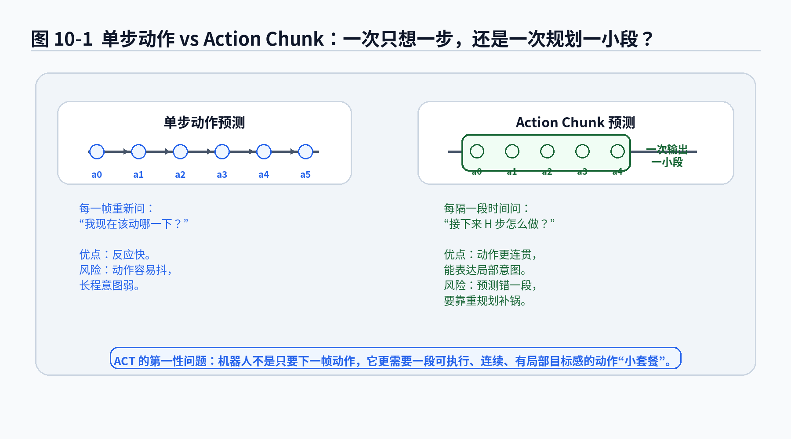
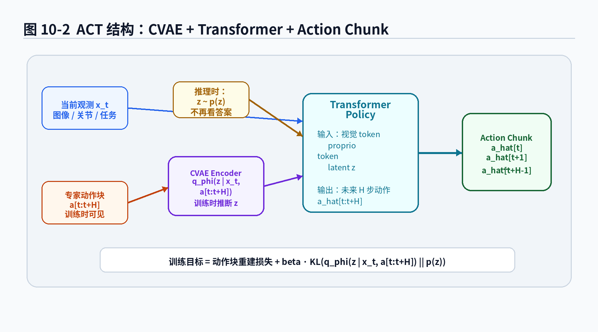
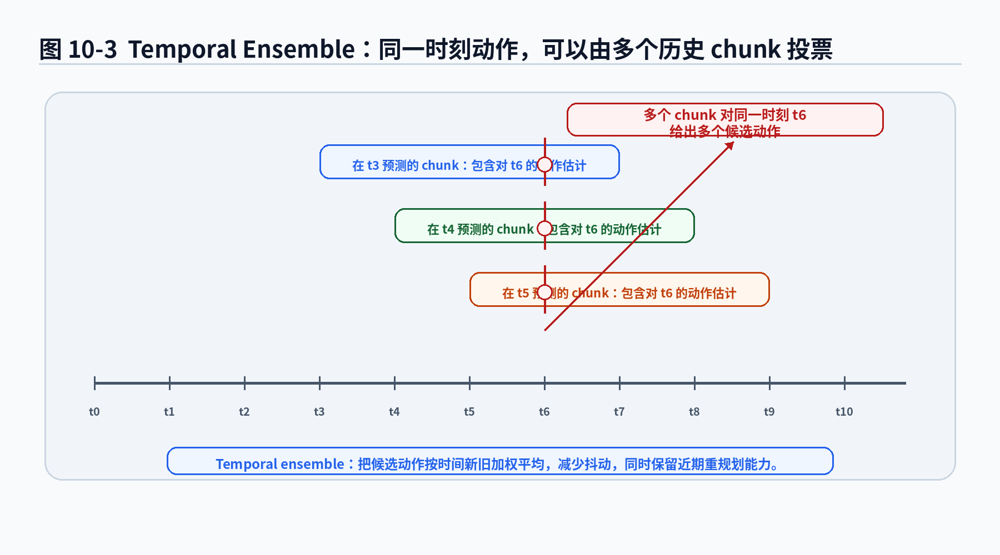
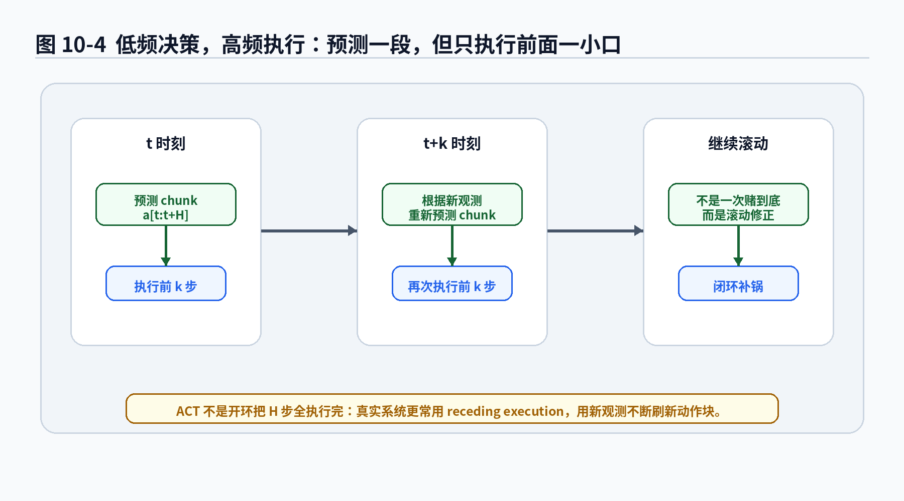

# 第10章 ACT：一次别只想一步，机器人也需要动作小套餐

> **统一公式编号说明**：本章（或本附录）中的展示公式统一采用按章节编号的方式。章节正文使用“（章号.序号）”，附录使用“（附录字母.序号）”。

> 本章继续遵守 v2.0 总控文档：先讲动机，再给公式；公式不仅写出来，还要解释动机、符号、直觉、工程含义和常见误解。第 9 章我们讲了 CVAE：训练时用 encoder 推断隐藏风格，推理时从 prior 采样 latent，再由 decoder 生成动作。本章进入 ACT。ACT 的核心变化不是“又换了一个更酷的网络名字”，而是把动作从单步预测扩展成 action chunk：一次预测一小段动作，让机器人不要每一帧都像选择困难症一样重新纠结。

---

## 1. 本章开场：为什么机器人不要只预测下一步？

前面几章，我们一直在写类似这样的策略：

\[
\pi_\theta(a_t\mid x_t) \tag{10.1}\]

或者加上 latent：

\[
p_\theta(a_t\mid x_t,z) \tag{10.2}\]

这里的重点是“当前条件下的当前动作”。如果你做的是非常简单的控制任务，这个形式已经能工作。比如机械臂末端离目标还有一点点距离，模型输出一个小的位移；自动驾驶车道保持，模型输出当前方向盘角度；泊车低速调整，模型输出当前速度和转角。

但真实机器人操作经常不是“一步一步凑出来”的。很多任务具有明显的局部过程：

- 拉开拉链，不是下一帧往哪动一下，而是沿着拉链方向连续移动一段；
- 插线，不是每一帧重新问“我该去哪”，而是接近、对准、插入、微调这几步要连起来；
- 抓取后精准摆入治具，不是只要下一步动作，而是需要一段平滑、低抖动、有接近方向约束的轨迹；
- 双臂整理物体时，两只手的动作要在一小段时间内协调，否则就会出现“左手刚想扶住，右手已经把东西扒拉飞”的喜剧现场。

单步预测的问题在于：它看起来很灵活，但容易短视。

每一帧都重新预测动作，像一个人每走一步都打开导航，问：“我现在该抬左脚还是右脚？”理论上也能走路，现实中大概率会把自己走成 Windows 更新进度条。

ACT，Action Chunking with Transformers，想解决的核心问题是：

> 与其每次只预测一个动作，不如一次预测未来一小段动作序列，让策略具备局部时间结构。

这个小段动作序列就叫 action chunk。

---

## 2. 本章要解决的核心问题

本章围绕 10 个问题展开：

1. 什么是 action chunk？它和单步动作有什么区别？
2. 为什么 action chunk 能提升机器人操作的稳定性？
3. ACT 为什么要把 CVAE 和 Transformer 结合起来？
4. 公式 \\(a_{t:t+H}\\) 到底表示什么？边界是否包含 \\(t+H\\)？
5. 为什么 ACT 可以写成 \\(p_\theta(a_{t:t+H}\mid x_t,z)\\)？
6. ACT 的训练损失和第 9 章 CVAE 损失有什么关系？
7. temporal ensemble 到底在平均什么？为什么它能减少动作抖动？
8. action chunk 是不是预测出来就全部执行完？为什么还要 receding execution？
9. ACT 适合哪些机器人任务？不适合哪些任务？
10. 从工程角度看，ACT 可能在哪些地方翻车？

本章会用到这些公式：

\[
a_{t:t+H}=(a_t,a_{t+1},\dots,a_{t+H-1}) \tag{10.3}\]

\[
p_\theta(a_{t:t+H}\mid x_t,z) \tag{10.4}\]

\[
q_\phi(z\mid x_t,a_{t:t+H}) \tag{10.5}\]

\[
\mathcal L_{\mathrm{ACT}}
=
\underbrace{\mathcal L_{\mathrm{chunk}}(a_{t:t+H},\hat a_{t:t+H})}_{\text{动作块重建损失}}
+
\beta
\underbrace{D_{\mathrm{KL}}(q_\phi(z\mid x_t,a_{t:t+H})\|p(z))}_{\text{latent 约束}} \tag{10.6}\]

以及 temporal ensemble 的加权平均形式：

\[
\bar a_t
=
\frac{\sum_{i=0}^{K-1}w_i\hat a_t^{(t-i)}}{\sum_{i=0}^{K-1}w_i} \tag{10.7}\]

这些公式看起来比单步 BC 多了一些下标，但本质不复杂。它们只是在说：

> 不要只学“这一帧怎么动”，还要学“接下来一小段怎么连贯地动”。

---

### 主线定位与统一例子

为了让本章不变成孤立知识点，读本章时请始终把公式落回两个统一例子：

- **二维点机器人跟随专家轨迹**：状态可写成位置/速度，动作可写成二维控制量，适合观察状态分布、轨迹分布和误差累积。
- **机械臂末端运动/抓取轨迹模仿**：观测包含图像或本体状态，动作包含末端位姿增量或关节控制量，适合理解连续动作、多模态动作、动作块和实机闭环。

- **承接前文**：承接第9章 CVAE。
- **本章推进**：把动作建模从单步扩展到 action chunk，解释短期意图和执行平滑。
- **铺垫后文**：为第11章 Diffusion Policy 继续把动作块作为生成对象做准备。
- **公式阅读抓手**：动作块不是简单多预测几帧，而是让策略输出一段局部一致的短期计划。
- **建议同步回看**：附录 G、H。

## 3. 从单步动作到 action chunk

### 3.1 单步动作的写法

最基础的行为克隆通常把数据写成：

\[
\mathcal D=\{(x_t,a_t)\}_{t=1}^N \tag{10.8}\]

训练目标是让模型在看到 \\(x_t\\) 时预测专家动作 \\(a_t\\)。如果是连续动作，可以写成：

\[
\hat a_t=f_\theta(x_t) \tag{10.9}\]

\[
\mathcal L_{\mathrm{step}}(\theta)
=
\frac{1}{N}\sum_{t=1}^{N}\|a_t-\hat a_t\|^2 \tag{10.10}\]

这个形式适合把模仿学习当成监督学习。但第 3 章到第 6 章已经反复提醒过：机器人活在时间里。动作不是孤立发生的。

一个动作 \\(a_t\\) 之后，会改变状态、改变观测、改变下一步可行空间。你今天往左偏了一点，明天不是简单地重新开始；你已经在左边的坑里了。

### 3.2 action chunk 的定义

ACT 把训练目标从单个动作扩展为一段动作：

\[
a_{t:t+H}=(a_t,a_{t+1},\dots,a_{t+H-1}) \tag{10.11}\]

这里有一个很容易让人踩坑的小细节：

\[
a_{t:t+H} \tag{10.12}\]

在本书中表示从 \\(t\\) 开始、长度为 \\(H\\) 的动作块，也就是包含：

\[
a_t,a_{t+1},\dots,a_{t+H-1} \tag{10.13}\]

不包含 \\(a_{t+H}\\)。这种写法和 Python 切片 \\([t:t+H]\\) 的习惯一致：左闭右开。

如果你在代码里把它写成包含 \\(a_{t+H}\\)，动作长度就会多一帧。模型训练时可能不报错，但维度、对齐和评测会悄悄错位。真实工程里的 bug 很多不是红色报错，而是“看起来能跑，但是越跑越怪”。

### 公式拆解：\\(a_{t:t+H}=(a_t,a_{t+1},\dots,a_{t+H-1})\\)

**1. 这个公式要解决什么问题？**

它把动作学习的基本单位从“一个动作”改成“一段动作”。这样模型不只预测下一步，还预测接下来一小段局部执行过程。

**2. 符号解释**

- \\(t\\)：当前时间步；
- \\(H\\)：动作块长度，也叫 horizon 或 chunk size；
- \\(a_t\\)：当前时间步的专家动作；
- \\(a_{t:t+H}\\)：从 \\(t\\) 开始的 \\(H\\) 个动作组成的序列；
- \\(a_{t+H-1}\\)：这个动作块的最后一个动作。

**3. 直觉解释**

单步动作像“下一秒方向盘打多少”；action chunk 像“接下来 1 秒内方向盘、油门、刹车应该怎么连续变化”。

机械臂里，单步动作像“末端下一帧往右 2 毫米”；action chunk 像“接下来 20 帧沿着插孔方向慢慢推进”。

**4. 工程含义**

如果控制频率是 50Hz，\\(H=25\\)，那么 action chunk 覆盖约 0.5 秒动作。如果 \\(H=100\\)，覆盖约 2 秒动作。

\\(H\\) 不是越大越好。太小，模型仍然短视；太大，远期动作预测难度上升，并且环境一变化，后半段动作可能变成“过期食品”。

**5. 常见误解**

不要把 action chunk 理解成开环一次执行到底。ACT 常配合滚动执行和 temporal ensemble。它预测一段，但真实系统可以只执行其中一部分，然后根据新观测重新预测。

**图10-1 说明**：
- 单步动作预测每一帧只输出一个动作，灵活但容易抖动；
- action chunk 一次输出未来一段动作，能表达局部时间结构；
- action chunk 不是让机器人“闭眼冲到底”，而是给策略一个短期计划。

---

## 4. 为什么 action chunk 对机器人操作很重要？

### 4.1 机器人动作需要连续性

很多机器人任务对动作连续性非常敏感。比如插线、穿孔、开拉链、折叠衣物、拧瓶盖、夹取薄片、把工件放入变形托盘槽口。这些任务不是“每一帧都对就行”，而是要求一段动作整体连贯。

单步预测有一个典型问题：局部看都对，连起来很奇怪。

比如模型每一帧都预测一个看似合理的末端位移，但方向在小范围内来回抖动。人眼看像抽风，夹爪看像喝多了，工件看了想报警。

action chunk 的优势是：它把未来一段动作一起输出。模型在训练时看到的是一个动作序列，因此更有机会学到局部速度、方向和节奏。

### 4.2 action chunk 能表达短期意图

单步动作只告诉你下一下怎么动，action chunk 则可以表达短期意图。

举个机械臂精准摆入治具的例子。假设工件要放入一个槽口，但托盘位置有轻微偏差。一个合理动作过程可能是：

1. 接近槽口上方；
2. 沿着槽口方向微调；
3. 低速下探；
4. 接触后轻微释放；
5. 遇到阻力时停止或回退。

如果每一步都独立预测，模型可能在第 2 步和第 3 步之间来回犹豫。action chunk 则更像把“接近并下探”作为一个局部动作意图来生成。

### 4.3 action chunk 缓解高频控制噪声

真实机器人控制通常有高频执行和低频感知决策之间的矛盾。

视觉模型可能 10Hz 或 20Hz 运行，底层控制可能 50Hz、100Hz 甚至更高。每个控制周期都重新跑一次复杂策略并不现实。action chunk 可以让高层策略低频输出一段动作，再由底层控制器高频执行。

这就像厨师不会每切一刀都重新读菜谱，而是先理解“接下来切丝”，然后连续执行一小段。否则一盘土豆丝能切出软件需求评审的节奏。

---

## 5. ACT 的策略形式：从单步分布到动作块分布

第 9 章的 CVAE 可以写成：

\[
p_\theta(a\mid x,z) \tag{10.14}\]

ACT 把单个动作 \\(a\\) 换成动作块 \\(a_{t:t+H}\\)：

\[
p_\theta(a_{t:t+H}\mid x_t,z) \tag{10.15}\]

这里 \\(x_t\\) 表示当前时刻策略可见的条件信息。它可以包含：

- 当前图像观测；
- 当前关节角和末端位姿；
- 历史观测；
- 任务目标；
- 语言指令编码；
- 双臂状态；
- 触觉或力反馈特征。

本章先采用简化写法 \\(x_t\\)，避免每个公式都写成一辆信息大货车。

### 公式拆解：\\(p_\theta(a_{t:t+H}\mid x_t,z)\\)

**1. 这个公式要解决什么问题？**

它表示：在当前条件 \\(x_t\\) 和 latent \\(z\\) 给定时，模型生成未来 \\(H\\) 步动作的条件分布。

注意，这里生成的不是一个动作，而是一段动作序列。

**2. 符号解释**

- \\(x_t\\)：当前时刻可用输入，可以是观测、状态、历史和任务上下文；
- \\(z\\)：隐变量，表示动作块背后的风格或模式；
- \\(a_{t:t+H}\\)：未来 \\(H\\) 步动作组成的 action chunk；
- \\(p_\theta(\cdot)\\)：由模型参数 \\(\theta\\) 定义的条件分布；
- \\(\theta\\)：策略网络、Transformer、decoder 等参数集合。

**3. 直觉解释**

这个公式像是在说：

> 当前看到环境 \\(x_t\\)，再选一个动作风格 \\(z\\)，然后生成接下来一小段操作。

比如同样是拿起拉链头，\\(z\\) 可以对应“从左手辅助右手拉”“右手单独拉”“先调整姿态再拉”。每个 \\(z\\) 对应的是一段动作，而不是一个孤立动作。

**4. 工程含义**

实现时，模型通常不会显式输出完整概率密度，而是输出动作块的均值：

\[
\hat a_{t:t+H}=f_\theta(x_t,z) \tag{10.16}\]

如果动作维度是 \\(d_a\\)，chunk 长度是 \\(H\\)，那么输出形状通常是：

\[
H\times d_a \tag{10.17}\]

比如单臂 7 维动作，\\(H=50\\)，输出就是 \\(50\times 7\\)。如果是双臂，每只手 7 维，输出可能是 \\(50\times 14\\)。维度一上来，模型训练就不再是“小动作回归”，而是“动作序列生成”。

**5. 常见误解**

不要把 \\(p_\theta(a_{t:t+H}\mid x_t,z)\\) 理解成“预测未来真实世界一定会发生什么”。它预测的是“策略打算执行的一段动作”。环境可能变化，接触可能提前发生，物体可能滑动，所以后续仍要闭环修正。

---

## 6. ACT 为什么还需要 CVAE？

第 8 章和第 9 章反复讲过一个问题：同一个条件下，合理动作可能不止一个。到了 action chunk，这个问题更严重。

因为多模态不只发生在单个动作上，也发生在整段操作方式上。

同一个“打开抽屉”任务，可能有多种 action chunk：

- 先接近把手，再沿水平方向拉；
- 先调整手腕角度，再扣住把手；
- 双臂任务中，一只手固定抽屉，另一只手拉；
- 如果把手位置偏了，先探索接触，再拉动。

如果直接对动作块做 MSE，模型可能把多种动作块平均。单步平均已经很糟糕，动作块平均更像把三个人的舞蹈动作逐帧平均，最后得到一种没有民族、没有节奏、没有膝盖健康的动作。

所以 ACT 继承了 CVAE 的思想：训练时用 encoder 看专家动作块，推断 latent；推理时从 prior 采样 latent，再生成动作块。

训练阶段的 encoder 写成：

\[
q_\phi(z\mid x_t,a_{t:t+H}) \tag{10.18}\]

decoder 或 policy 写成：

\[
p_\theta(a_{t:t+H}\mid x_t,z) \tag{10.19}\]

这和第 9 章的 CVAE 结构完全对应，只是把 \\(a\\) 换成了 \\(a_{t:t+H}\\)。

### 公式拆解：\\(q_\phi(z\mid x_t,a_{t:t+H})\\)

**1. 这个公式要解决什么问题？**

训练数据里没有显式标注动作块属于哪种风格，所以 encoder 根据当前条件和专家动作块，反推一个 latent \\(z\\)。

**2. 符号解释**

- \\(q_\phi\\)：近似后验，也就是 encoder；
- \\(z\\)：隐藏动作模式；
- \\(x_t\\)：当前条件；
- \\(a_{t:t+H}\\)：专家示范动作块；
- \\(\phi\\)：encoder 参数。

**3. 直觉解释**

encoder 像一个动作分析师。它看着当前场景和老师傅接下来一段操作，判断老师傅用了哪种操作套路。

它不是为了推理部署时直接使用，而是为了训练 decoder 学会“不同套路生成不同动作块”。

**4. 工程含义**

如果 encoder 输出高斯分布：

\[
q_\phi(z\mid x_t,a_{t:t+H})
=
\mathcal N(z;\mu_\phi(x_t,a_{t:t+H}),\mathrm{diag}(\sigma_\phi^2(x_t,a_{t:t+H}))) \tag{10.20}\]

那么训练时可以用重参数化技巧：

\[
z=\mu_\phi(x_t,a_{t:t+H})+
\sigma_\phi(x_t,a_{t:t+H})\odot\epsilon,
\quad
\epsilon\sim\mathcal N(0,I) \tag{10.21}\]

这和第 9 章 CVAE 完全一致，只是输入动作从单步变成了 chunk。

**5. 常见误解**

不要在部署时把未来专家动作块输入 encoder。部署时没有专家动作块。评测时如果这么做，就相当于考试时把标准答案塞给模型，然后夸它“推理能力很强”。这不是强，这是开卷还装闭卷。

**图10-2 说明**：
- ACT 可以理解为把 CVAE 的动作生成对象从单步动作扩展为 action chunk；
- Transformer 负责处理观测、机器人状态和 latent，输出未来一段动作；
- 训练时 encoder 可以看专家 action chunk，推理时只能从 prior 采样 latent。

---

## 7. Transformer 在 ACT 中做什么？

ACT 名字里的 T 是 Transformer。这里的 Transformer 不应被理解成“把模型换成 Transformer，效果就会自动变好”。Transformer 的作用要放在机器人动作序列建模里理解。

### 7.1 输入不是一个向量，而是一组 token

现代机器人策略的输入常常是多源信息：

- 图像特征；
- 关节状态；
- 末端位姿；
- 双臂状态；
- 历史动作；
- latent \\(z\\)；
- 任务条件。

这些信息可以被编码成 token，让 Transformer 通过 attention 建模它们之间的关系。

比如：

\[
h_t=\mathrm{Transformer}_\theta(\mathrm{tokens}(x_t),z) \tag{10.22}\]

再由输出头生成动作块：

\[
\hat a_{t:t+H}=g_\theta(h_t) \tag{10.23}\]

### 公式拆解：\\(\hat a_{t:t+H}=g_\theta(\mathrm{Transformer}_\theta(\mathrm{tokens}(x_t),z))\\)

**1. 这个公式要解决什么问题？**

它描述 ACT 的一个工程实现直觉：先把观测和状态编码成 token，再让 Transformer 融合信息，最后输出动作块。

**2. 符号解释**

- \\(\mathrm{tokens}(x_t)\\)：把当前输入转成 token 序列；
- \\(z\\)：CVAE latent；
- \\(\mathrm{Transformer}_\theta\\)：序列建模网络；
- \\(h_t\\)：Transformer 输出的上下文表示；
- \\(g_\theta\\)：动作预测头；
- \\(\hat a_{t:t+H}\\)：预测动作块。

**3. 直觉解释**

Transformer 像一个会议主持人，把视觉、关节、目标、latent 都叫到会议室里，让它们互相看一眼，然后决定接下来一小段动作。

如果没有这种融合，模型可能只看图像不看关节，或者只看当前末端位置不看任务目标，最后输出一个“看着很神经网络，其实很冒失”的动作。

**4. 工程含义**

ACT 中的 Transformer 通常不是为了做长文本推理，而是为了处理多 token 输入和动作序列输出。对于小数据机器人任务，Transformer 的容量、正则、数据增强和训练稳定性都很重要。

**5. 常见误解**

Transformer 不是魔法棒。数据质量差、动作标定错、相机外参飘、控制延迟大，Transformer 不会自动替你把工程债还清。它最多把这些债编码得更高维、更难查。

---

## 8. ACT 的训练目标

有了 CVAE 和 action chunk，ACT 的训练目标可以写成：

\[
\mathcal L_{\mathrm{ACT}}
=
\mathcal L_{\mathrm{chunk}}
+
\beta\mathcal L_{\mathrm{KL}} \tag{10.24}\]

更具体地：

\[
\mathcal L_{\mathrm{ACT}}
=
\underbrace{\mathcal L_{\mathrm{chunk}}(a_{t:t+H},\hat a_{t:t+H})}_{\text{动作块重建损失}}
+
\beta
\underbrace{D_{\mathrm{KL}}(q_\phi(z\mid x_t,a_{t:t+H})\|p(z))}_{\text{latent 约束}} \tag{10.25}\]

这里第一项负责让预测动作块接近专家动作块，第二项负责让 encoder 推出的 latent 不要离 prior 太远。

### 8.1 动作块重建损失

动作块重建损失可以用 L1、MSE 或高斯 NLL 等形式。比如 MSE 形式：

\[
\mathcal L_{\mathrm{chunk}}
=
\sum_{j=0}^{H-1}\|a_{t+j}-\hat a_{t+j}\|^2 \tag{10.26}\]

如果使用平均形式：

\[
\mathcal L_{\mathrm{chunk}}
=
\frac{1}{H}\sum_{j=0}^{H-1}\|a_{t+j}-\hat a_{t+j}\|^2 \tag{10.27}\]

两者差别在于尺度。前者随 \\(H\\) 增大而增大，后者对不同 chunk 长度更容易比较。

### 公式拆解：\\(\mathcal L_{\mathrm{chunk}}=\frac1H\sum_{j=0}^{H-1}\|a_{t+j}-\hat a_{t+j}\|^2\\)

**1. 这个公式要解决什么问题？**

它衡量预测动作块和专家动作块之间的差异。不是只看当前动作，而是把未来 \\(H\\) 步都纳入训练目标。

**2. 符号解释**

- \\(H\\)：动作块长度；
- \\(j\\)：动作块内部的偏移；
- \\(a_{t+j}\\)：专家在第 \\(t+j\\) 步的动作；
- \\(\hat a_{t+j}\\)：模型预测的第 \\(t+j\\) 步动作；
- \\(\|\cdot\|^2\\)：平方误差；
- \\(\frac1H\\)：对 chunk 长度做平均。

**3. 直觉解释**

这个损失像在比较两段舞蹈动作：不仅第一拍要像，后面每一拍也要对上节奏。

**4. 工程含义**

如果不同动作维度尺度差异很大，比如位置单位是米，旋转单位是弧度，夹爪开合又是另一个范围，直接 MSE 可能让某些维度主导训练。实际工程中经常要做动作归一化、维度加权或 separate loss。

**5. 常见误解**

chunk loss 低不代表闭环成功。它仍然是 open-loop imitation loss。模型可能在数据集动作块上拟合很好，但真实执行时遇到偏差就滚进第 3 章那个老坑：分布偏移。

### 8.2 KL 约束项

KL 项继承自 CVAE：

\[
\mathcal L_{\mathrm{KL}}
=
D_{\mathrm{KL}}(q_\phi(z\mid x_t,a_{t:t+H})\|p(z)) \tag{10.28}\]

它的作用是约束 encoder 推出的 latent 分布接近 prior。否则训练时 decoder 总是收到 posterior 产生的 \\(z\\)，推理时却从 prior 采样，二者对不上。

这就是第 9 章说过的 prior mismatch。到了 ACT，prior mismatch 的后果更明显，因为一次生成的是一段动作。latent 采样稍微不靠谱，可能不是一个动作偏一点，而是一整段动作都开始自由发挥。

### 8.3 \\(\beta\\) 的作用

完整损失中常有一个系数 \\(\beta\\)：

\[
\mathcal L_{\mathrm{ACT}}
=
\mathcal L_{\mathrm{chunk}}+
\beta\mathcal L_{\mathrm{KL}} \tag{10.29}\]

\\(\beta\\) 控制重建质量和 latent 规整之间的平衡。

- \\(\beta\\) 太小：encoder 可以把很多细节塞进 \\(z\\)，训练重建很好，但推理从 prior 采样时可能接不上；
- \\(\beta\\) 太大：latent 被压得太狠，decoder 可能忽略 \\(z\\)，多模态能力下降；
- \\(\beta\\) 合适：latent 既携带动作风格，又能和 prior 保持可采样关系。

这不是玄学调参，而是在平衡“训练时解释数据”和“推理时可生成”。

---

## 9. Temporal Ensemble：多个 chunk 对同一动作投票

ACT 中另一个重要技巧是 temporal ensemble。它解决的问题很朴素：

> 如果模型每个时刻都会预测一个未来动作块，那么同一个未来时刻的动作，可能会被多个历史 chunk 预测到。我们该用哪个？

比如：

- 在 \\(t-2\\) 时刻预测的 chunk 里，包含了对 \\(a_t\\) 的预测；
- 在 \\(t-1\\) 时刻预测的 chunk 里，也包含了对 \\(a_t\\) 的预测；
- 在 \\(t\\) 时刻重新预测的 chunk 中，也直接给出了 \\(a_t\\)。

这些预测可能不完全一样。如果每次只用最新预测，动作可能抖动；如果完全相信旧预测，又可能反应迟钝。temporal ensemble 用加权平均在二者之间折中。

### 9.1 temporal ensemble 的基本公式

假设对当前时刻 \\(t\\) 的动作有 \\(K\\) 个预测：

\[
\hat a_t^{(t)},
\hat a_t^{(t-1)},
\dots,
\hat a_t^{(t-K+1)} \tag{10.30}\]

其中 \\(\hat a_t^{(t-i)}\\) 表示在 \\(t-i\\) 时刻预测出的 action chunk 中，对当前 \\(t\\) 时刻动作的估计。

加权平均可以写成：

\[
\bar a_t
=
\frac{\sum_{i=0}^{K-1}w_i\hat a_t^{(t-i)}}{\sum_{i=0}^{K-1}w_i} \tag{10.31}\]

常见权重可以让新预测权重大、旧预测权重小，比如：

\[
w_i=\exp(-\lambda i) \tag{10.32}\]

其中 \\(\lambda>0\\)。\\(i\\) 越大，预测越旧，权重越小。

### 公式拆解：\\(\bar a_t=\frac{\sum_iw_i\hat a_t^{(t-i)}}{\sum_iw_i}\\)

**1. 这个公式要解决什么问题？**

它把多个 chunk 对同一时刻动作的预测融合成一个最终执行动作，减少高频抖动。

**2. 符号解释**

- \\(\bar a_t\\)：最终要执行的动作；
- \\(\hat a_t^{(t-i)}\\)：在 \\(t-i\\) 时刻预测的 chunk 中，对 \\(t\\) 时刻动作的估计；
- \\(w_i\\)：该预测的权重；
- \\(K\\)：参与融合的预测数量；
- 分母 \\(\sum_iw_i\\)：归一化权重，避免动作尺度被放大或缩小。

**3. 直觉解释**

这像多个导航建议对当前方向进行投票。最新导航最重要，但刚才的规划也不完全扔掉。否则方向盘会在每次重新规划时猛地抽一下。

**4. 工程含义**

temporal ensemble 本质是平滑器，但它不是万能滤波器。它能减少抖动，也可能引入延迟。对于接触丰富、变化很快的任务，过度平滑可能让机器人反应慢半拍。

**5. 常见误解**

不要把 temporal ensemble 当成“把模型错的动作平均一下就对了”。如果多个 chunk 都错，平均只会得到一个更稳定的错误。稳定地错，在机器人里并不值得骄傲。

**图10-3 说明**：
- 多个历史 action chunk 可能都覆盖当前时刻；
- temporal ensemble 将这些候选动作按权重融合；
- 它主要缓解抖动，不直接解决分布偏移或任务理解错误。

---

## 10. Receding Execution：预测一段，但别一口吃完

action chunk 容易带来一个误解：模型预测了未来 \\(H\\) 步动作，是不是就把这 \\(H\\) 步全部执行完？

在真实机器人系统中，这通常不是好主意。

原因很简单：环境会变。

- 物体可能滑动；
- 抓取接触可能提前发生；
- 夹爪可能没完全夹住；
- 人可能伸手进入工作空间；
- 视觉观测可能突然更新；
- 底层控制误差可能积累。

如果机器人预测了 2 秒动作，然后闭着眼睛执行完，结果可能非常有论文视频感：前半段还行，后半段像失恋后随缘。

所以更合理的做法是 receding execution：

> 每次预测一个 action chunk，但只执行前面一小部分，然后根据新观测重新预测。

这和 MPC 的滚动优化有相似直觉：计划一段，执行一小段，再重新计划。

### 10.1 低频决策，高频执行

假设策略每 \\(k\\) 步运行一次，每次输出长度为 \\(H\\) 的动作块：

\[
\hat a_{t:t+H}=f_\theta(x_t,z) \tag{10.33}\]

系统只执行前 \\(k\\) 步：

\[
\hat a_{t:t+k} \tag{10.34}\]

到 \\(t+k\\) 时刻，拿到新观测 \\(x_{t+k}\\)，再预测：

\[
\hat a_{t+k:t+k+H}=f_\theta(x_{t+k},z') \tag{10.35}\]

这里 \\(k\le H\\)。如果 \\(k=1\\)，每一步都重新预测 chunk；如果 \\(k\\) 较大，决策频率降低，执行更像开环。

### 公式拆解：\\(\hat a_{t+k:t+k+H}=f_\theta(x_{t+k},z')\\)

**1. 这个公式要解决什么问题？**

它表达滚动执行：执行一小段后，用新观测重新生成新的 action chunk。

**2. 符号解释**

- \\(t+k\\)：下一次策略更新的时间；
- \\(x_{t+k}\\)：执行前一小段动作后得到的新观测；
- \\(z'\\)：新一轮采样或选择的 latent；
- \\(\hat a_{t+k:t+k+H}\\)：新生成的动作块。

**3. 直觉解释**

机器人像开车一样：导航可以规划 500 米，但你不会 500 米都不看路。你会走一小段，看新路况，再调整。

**4. 工程含义**

\\(H\\) 和 \\(k\\) 的选择很关键：

- \\(H\\) 太短：局部意图弱；
- \\(H\\) 太长：远期预测不可靠；
- \\(k\\) 太小：计算压力大，动作可能频繁变化；
- \\(k\\) 太大：闭环修正慢，遇到接触变化容易翻车。

**5. 常见误解**

ACT 不是替代底层控制器。action chunk 通常仍需要底层位置控制、速度控制、阻抗控制或安全控制器执行。策略给的是高层动作序列，不是让电机直接听神经网络讲相声。

**图10-4 说明**：
- 每次预测未来一段动作；
- 实际只执行前面一小部分；
- 根据新观测继续滚动预测，避免开环一把梭。

---

## 11. ACT 与第 9 章 CVAE 的关系

第 9 章讲 CVAE 时，我们使用的是一般形式：

\[
q_\phi(z\mid x,a) \tag{10.36}\]

\[
p_\theta(a\mid x,z) \tag{10.37}\]

ACT 的对应关系是：

\[
q_\phi(z\mid x_t,a_{t:t+H}) \tag{10.38}\]

\[
p_\theta(a_{t:t+H}\mid x_t,z) \tag{10.39}\]

也就是说，ACT 没有推翻 CVAE，而是把 CVAE 用到了动作块上。

你可以把第 9 章的 CVAE 看成“学一个动作的多模态生成”，把第 10 章的 ACT 看成“学一段动作的多模态生成”。

这个变化看起来只是在 \\(a\\) 上多了几个下标，但工程意义很大：

1. 输出维度变大；
2. 时间一致性更重要；
3. 数据对齐更敏感；
4. 控制频率和策略频率要协调；
5. 评测不能只看单步误差；
6. 部署时必须考虑滚动执行和安全检查。

数学符号多了一截，工程坑也多了一排。公式不会白白变长，它通常是在提醒你：现实也变复杂了。

---

## 12. ACT 适合什么任务？

ACT 尤其适合具有以下特点的任务。

### 12.1 动作有局部连续结构

比如：

- 拉链；
- 插线；
- 折叠；
- 推拉抽屉；
- 整理物体；
- 双臂协作；
- 精准摆放；
- 轻接触操作。

这些任务中，一段动作通常比单步动作更有意义。

### 12.2 示范数据包含多种合理风格

如果同一个任务有多种操作方式，CVAE latent 可以帮助表达风格差异。比如同一个插线任务，有人先对准再插，有人边对准边插；同一个整理任务，有人从左往右，有人从右往左。

ACT 可以把这种差异表达为不同 action chunk 模式。

### 12.3 高频控制需要平滑

机械臂执行时，动作抖动会带来关节冲击、接触不稳定和安全风险。temporal ensemble 和 chunk 输出可以帮助平滑动作。

不过要注意：平滑不等于正确。把错误动作平滑成丝滑错误，仍然是错误。

### 12.4 感知决策频率低于控制频率

如果视觉策略计算较慢，但底层控制需要高频动作，action chunk 可以作为桥梁。高层策略低频输出一段动作，底层控制器高频跟踪。

这在真实系统中很常见。神经网络不是每一毫秒都能优雅登场，硬件也不会因为你用了 Transformer 就自动涨算力。

---

## 13. ACT 不适合什么任务？

### 13.1 环境变化极快的任务

如果环境在很短时间内剧烈变化，长 action chunk 可能过期。比如高速避障、快速动态抓取、多人协作空间中的突然干扰。此时需要更强的闭环反应和安全控制。

### 13.2 接触反馈非常关键但观测不足

如果任务强依赖力觉、触觉，而输入里没有相关信息，ACT 可能只能凭视觉和关节状态猜。猜得准时像智能，猜不准时像算命。

比如插孔、卡扣、柔性物体操作，如果没有力反馈或接触状态建模，action chunk 可能在接触发生后仍按原计划推进，导致卡住或损坏。

### 13.3 数据里动作模式混乱

如果示范数据质量差，动作风格不稳定，标定延迟严重，ACT 会学习这些混乱。动作块模型不是数据净化器。

比如同一个任务，有些示范是高手稳定操作，有些是新手犹豫乱动，有些夹爪延迟一拍，有些图像时间戳对不上。模型可能把这些差异当成 latent 风格学进去。

### 13.4 安全边界很硬的任务

对于自动驾驶、泊车、工业机械臂安全区，人机共域等任务，ACT 输出动作块后必须经过安全约束。不能因为模型输出了一段动作，就绕过碰撞检测、速度限制、关节限位和 emergency stop。

策略负责建议，安全系统负责兜底。不要让神经网络同时扮演司机、交警、保险公司和事故鉴定中心。

---

## 14. 从自动驾驶和泊车视角理解 ACT

虽然 ACT 常出现在机器人操作任务中，但它的思想对自动驾驶和泊车也有启发。

自动驾驶里，单步控制量预测可能写成：

\[
\hat u_t=f_\theta(x_t) \tag{10.40}\]

其中 \\(u_t\\) 可能是方向盘角、加速度或轨迹点控制量。

但更常见的规划形式其实是输出未来一段轨迹或控制序列：

\[
\hat u_{t:t+H}=f_\theta(x_t) \tag{10.41}\]

或者输出未来轨迹点：

\[
\hat y_{t:t+H}=f_\theta(x_t) \tag{10.42}\]

这和 action chunk 的思想很接近：不要只问下一步怎么打方向，而是问接下来一小段路径应该怎么走。

在自动泊车中，这个思想更直观。泊车不是每一帧孤立输出转角，而是有局部 maneuver：

- 倒车入库第一把；
- 回正；
- 二次调整；
- 贴边微调；
- 停止。

如果策略只预测当前控制量，很容易局部抖动；如果预测一个短期控制序列或轨迹片段，就能表达“这一把要往哪个方向修”。

当然，泊车和机械臂 ACT 仍有差异。车辆有强运动学约束、碰撞约束、法规和安全边界，通常不能只靠模仿学习动作块直接执行。更合理的方式是把 action chunk 思想用于候选轨迹生成、轨迹补全、局部策略辅助，再接入传统规划、安全检查和控制器。

换句话说：ACT 的思想可以借鉴，但不要把机械臂论文里的动作块直接塞进车辆域控，然后期待车位线感动到自己对齐。

---

## 15. 从“抓取 + 精准摆入治具”理解 ACT

前面章节多次提到“抓取 + 精准摆入治具”这个任务。它很适合解释 ACT 的价值。

这个任务的难点不一定是抓起工件，而是把工件稳定放入有偏差、可能变形、位置不完全准确的治具槽口中。

传统视觉方案通常做：

1. 相机定位治具；
2. 估计纠正量；
3. 机械臂执行修正后的轨迹；
4. 如果放不进去，再靠人工或规则补救。

这里面有很多工程坑：

- 相机支架震动；
- 治具变形；
- 光照变化；
- 标定误差；
- 接触不确定；
- 工件姿态微偏；
- 托盘重复使用导致尺寸漂移。

ACT 的思路不是完全替代传统几何，而是可能学习一段“接近—对准—轻放—微调”的局部操作策略。

动作块可以表达：

\[
\text{approach} \rightarrow \text{align} \rightarrow \text{insert} \rightarrow \text{release} \tag{10.43}\]

如果输入包含视觉、末端位姿、夹爪状态，甚至力觉信息，模型有机会学习到老师傅在这些微小偏差下如何连续调整。

但这里必须强调边界：

- 没有足够异常数据，ACT 不会自动处理所有变形治具；
- 没有安全约束，动作块可能把工件硬怼进去；
- 没有接触反馈，插入阶段容易猜错；
- 没有传统几何和工装约束，策略泛化会很难。

所以更合理的工程结构是：

> 传统几何提供粗定位和安全边界，ACT 学习局部柔顺操作和短期动作模式，底层控制器保证执行稳定。

这比“全靠神经网络端到端”更像工程，也更像能活到验收的方案。

---

## 16. ACT 的数据组织方式

### 16.1 从轨迹中切出 action chunk

假设一条专家轨迹是：

\[
\tau=(x_0,a_0,x_1,a_1,\dots,x_T,a_T) \tag{10.44}\]

我们可以从中构造训练样本：

\[
(x_t,a_{t:t+H}) \tag{10.45}\]

对多个时间步滑窗，可以得到：

\[
\mathcal D_{\mathrm{chunk}}
=
\{(x_t,a_{t:t+H})\}_{t=0}^{T-H} \tag{10.46}\]

### 公式拆解：\\(\mathcal D_{\mathrm{chunk}}=\{(x_t,a_{t:t+H})\}_{t=0}^{T-H}\\)

**1. 这个公式要解决什么问题？**

它说明如何从专家轨迹中构造 ACT 的监督学习数据：每个当前输入配一段未来专家动作。

**2. 符号解释**

- \\(\tau\\)：一条专家轨迹；
- \\(T\\)：轨迹长度；
- \\(H\\)：chunk 长度；
- \\(x_t\\)：当前输入；
- \\(a_{t:t+H}\\)：从当前开始的未来动作块；
- \\(T-H\\)：保证动作块不会越过轨迹末尾。

**3. 直觉解释**

这就是滑窗切片。像把一部长视频切成很多小片段，每个片段都从某个当前画面开始，包含后面一小段动作。

**4. 工程含义**

数据构造时必须处理轨迹尾部。如果 \\(t\\) 太靠近终点，后面不够 \\(H\\) 步，可以选择丢弃、padding 或缩短。不同处理会影响训练稳定性。

**5. 常见误解**

不要把不同 episode 的动作强行拼接成一个 chunk。轨迹边界必须保留。否则模型会学到一种很神奇的动作：上一秒还在拿杯子，下一秒突然开始拉拉链。这不是多任务学习，这是数据集穿越。

### 16.2 时间对齐很重要

ACT 对时间对齐非常敏感。因为它不是只预测单步，而是预测一段动作。如果图像和动作延迟 3 帧，单步 BC 已经会受影响，ACT 会把这个延迟扩展到整个 chunk。

需要特别检查：

- 相机时间戳；
- 机器人状态时间戳；
- 动作命令时间戳；
- 示教设备延迟；
- 控制器执行延迟；
- 数据保存线程是否丢帧。

很多机器人学习问题最后不是模型结构问题，而是时间戳问题。你以为自己在调 Transformer，其实是在和日志系统斗法。

---

## 17. ACT 的评测方式

ACT 不能只看训练 loss。至少要从三个层次评测。

### 17.1 open-loop chunk loss

这是最直接的评测：在验证集上输入 \\(x_t\\)，预测 \\(\hat a_{t:t+H}\\)，和专家动作块比较。

可以看：

\[
\frac1H\sum_{j=0}^{H-1}\|a_{t+j}-\hat a_{t+j}\|^2 \tag{10.47}\]

也可以分不同 horizon 看误差：

\[
\ell_j=\|a_{t+j}-\hat a_{t+j}\|^2 \tag{10.48}\]

如果 \\(j\\) 越大误差越大，说明模型短期预测还行，远期预测不稳。这很常见，也很正常。远期动作本来就更依赖未来观测。

### 17.2 closed-loop success rate

最终还是要闭环执行。成功率可以按任务定义：

- 是否成功抓取；
- 是否插入；
- 是否打开拉链；
- 是否放入治具；
- 是否完成整理；
- 是否无碰撞完成；
- 是否在限定时间内完成。

第 6 章已经讲过，open-loop loss 和 closed-loop success 不一定一致。ACT 也逃不出这条规律。

### 17.3 动作平滑性和安全指标

ACT 还应评估动作是否平滑、安全：

\[
\mathcal L_{\mathrm{smooth}}
=
\sum_t\|a_t-a_{t-1}\|^2 \tag{10.49}\]

如果动作表示速度或位置增量，还可以看加速度、jerk、关节限位、碰撞距离、接触力等指标。

动作块很漂亮，不代表硬件喜欢。硬件喜欢的是可执行、平滑、安全、不过载。

---

## 18. 常见误区

### 误区一：action chunk 越长越好

chunk 太短，局部意图不够；chunk 太长，预测难度上升，后半段容易过期。\\(H\\) 要结合控制频率、任务时间尺度和闭环刷新频率选择。

### 误区二：ACT 可以替代所有规划和控制

ACT 是策略模型，不是完整机器人系统。它不能自动替代碰撞检测、轨迹约束、底层控制、急停、人机安全和异常恢复。

### 误区三：temporal ensemble 一定提升效果

temporal ensemble 能降低抖动，也可能带来延迟。如果任务需要快速接触反馈，过度平均会让动作慢半拍。

### 误区四：Transformer 是效果来源的全部

ACT 的效果来自多方面：action chunk、CVAE latent、Transformer 表达能力、数据质量、temporal ensemble 和任务设置。把功劳全给 Transformer，就像公司项目成了只夸 PPT 模板。

### 误区五：训练 loss 低就能部署

训练 loss 是离线指标，部署需要闭环成功率、安全边界、异常恢复和长期稳定性。机器人不会因为你 validation loss 很好就少撞一下桌子。

### 误区六：多模态一定需要随机采样

有些任务需要多模态，有些任务只需要稳定确定策略。比如安全关键场景中，随机采样动作必须被严格约束。多样性不是放飞自我。

### 误区七：数据越多越能解决时间对齐问题

时间戳错位不是靠更多错位数据自动解决的。更多错位数据只会让模型更认真地学错。

---

## 19. 方法边界与工程风险

### 19.1 horizon mismatch

训练时使用 \\(H\\) 步动作块，部署时策略刷新频率、控制频率或执行窗口变了，可能导致行为不一致。比如训练时每 20ms 一个动作，部署时实际 30ms 执行一次，整个动作块时间尺度就变了。

### 19.2 stale chunk

如果执行了过长的旧 chunk，环境已经变化，动作仍按旧计划推进。这在接触任务里很危险。

### 19.3 chunk boundary artifact

动作块之间可能在边界处不连续。temporal ensemble 可以缓解，但如果模型每次预测的 chunk 差异很大，边界仍可能抖动。

### 19.4 latent collapse

和 CVAE 一样，ACT 也可能出现 latent collapse：不同 \\(z\\) 输出的动作块几乎一样。此时多模态能力消失，模型退化为普通 action chunk 回归器。

### 19.5 demonstration inconsistency

如果示范者动作风格不稳定，ACT 会把这些不稳定学进动作块。尤其是长 chunk，会放大示范中的迟疑、抖动和修正。

### 19.6 safety gap

ACT 输出的动作块可能在 open-loop 看着合理，但闭环执行中违反安全约束。必须加入碰撞检测、关节限位、速度限制、力限制、工作空间限制和 fallback 策略。

---

## 20. 本章小结

本章从第 9 章 CVAE 出发，进入 ACT：Action Chunking with Transformers。

最核心的变化是把动作预测对象从单步动作：

\[
a_t \tag{10.50}\]

扩展成动作块：

\[
a_{t:t+H}=(a_t,a_{t+1},\dots,a_{t+H-1}) \tag{10.51}\]

ACT 可以写成一个条件动作块生成模型：

\[
p_\theta(a_{t:t+H}\mid x_t,z) \tag{10.52}\]

训练时使用 CVAE encoder：

\[
q_\phi(z\mid x_t,a_{t:t+H}) \tag{10.53}\]

整体损失包括动作块重建损失和 KL 约束：

\[
\mathcal L_{\mathrm{ACT}}
=
\mathcal L_{\mathrm{chunk}}
+
\beta D_{\mathrm{KL}}(q_\phi(z\mid x_t,a_{t:t+H})\|p(z)) \tag{10.54}\]

为了减少动作抖动，ACT 还可以使用 temporal ensemble：

\[
\bar a_t
=
\frac{\sum_{i=0}^{K-1}w_i\hat a_t^{(t-i)}}{\sum_{i=0}^{K-1}w_i} \tag{10.55}\]

本章最重要的几句话是：

1. ACT 的核心不是“Transformer 很强”，而是“把动作建模成 chunk”；
2. action chunk 让策略学到局部时间结构和短期操作意图；
3. CVAE latent 让 ACT 能表达多种合理动作块；
4. temporal ensemble 可以减少动作抖动，但不保证动作正确；
5. action chunk 通常应滚动执行，而不是开环一口气执行到底；
6. ACT 适合精细操作、双臂协作、接触操作和局部连续动作明显的任务；
7. ACT 仍然需要安全约束、底层控制、闭环评测和数据质量保障。

下一章我们进入 Diffusion Policy。它和 ACT 一样关注动作序列，但生成方式不同：ACT 更像通过 Transformer/CVAE 一次吐出动作块，Diffusion Policy 则把动作生成看成从噪声中逐步去噪。一个像点套餐，一个像慢慢把菜搓出来。听起来都能吃，但厨房原理不一样。

---

## 21. 本章公式索引

| 公式 | 名称 | 作用 |
|---|---|---|
| \\(a_t\\) | 单步动作 | 当前时间步的动作 |
| \\(a_{t:t+H}=(a_t,a_{t+1},\dots,a_{t+H-1})\\) | action chunk | 从当前开始的长度为 \\(H\\) 的动作块 |
| \\(\hat a_{t:t+H}=f_\theta(x_t,z)\\) | 动作块预测 | 给定当前条件和 latent 输出未来动作序列 |
| \\(p_\theta(a_{t:t+H}\mid x_t,z)\\) | 条件动作块分布 | ACT 的动作生成分布形式 |
| \\(q_\phi(z\mid x_t,a_{t:t+H})\\) | ACT encoder / posterior | 训练时根据条件和专家动作块推断 latent |
| \\(q_\phi(z\mid x_t,a_{t:t+H})=\mathcal N(z;\mu_\phi,\mathrm{diag}(\sigma_\phi^2))\\) | 高斯 posterior | encoder 输出 latent 均值和方差 |
| \\(z=\mu_\phi+\sigma_\phi\odot\epsilon\\) | 重参数化技巧 | 让 latent 采样可反向传播 |
| \\(\epsilon\sim\mathcal N(0,I)\\) | 标准高斯噪声 | 重参数化中的随机源 |
| \\(\mathcal L_{\mathrm{chunk}}=\sum_{j=0}^{H-1}\|a_{t+j}-\hat a_{t+j}\|^2\\) | 动作块重建损失 | 衡量预测 chunk 与专家 chunk 的差异 |
| \\(\mathcal L_{\mathrm{chunk}}=\frac1H\sum_{j=0}^{H-1}\|a_{t+j}-\hat a_{t+j}\|^2\\) | 平均动作块损失 | 对不同 chunk 长度更方便比较 |
| \\(\mathcal L_{\mathrm{KL}}=D_{\mathrm{KL}}(q_\phi(z\mid x_t,a_{t:t+H})\|p(z))\\) | KL 约束 | 对齐 posterior 与 prior |
| \\(\mathcal L_{\mathrm{ACT}}=\mathcal L_{\mathrm{chunk}}+\beta\mathcal L_{\mathrm{KL}}\\) | ACT 损失 | 同时约束动作块重建和 latent 空间 |
| \\(\hat a_t^{(t-i)}\\) | 历史 chunk 对当前动作的预测 | 表示 \\(t-i\\) 时刻预测出的当前动作 |
| \\(\bar a_t=\frac{\sum_{i=0}^{K-1}w_i\hat a_t^{(t-i)}}{\sum_{i=0}^{K-1}w_i}\\) | temporal ensemble | 融合多个 chunk 对当前动作的预测 |
| \\(w_i=\exp(-\lambda i)\\) | 指数衰减权重 | 让更新的预测权重更大 |
| \\(\hat a_{t+k:t+k+H}=f_\theta(x_{t+k},z')\\) | receding execution | 执行一小段后根据新观测重新预测 |
| \\(\mathcal D_{\mathrm{chunk}}=\{(x_t,a_{t:t+H})\}_{t=0}^{T-H}\\) | chunk 数据集 | 从专家轨迹滑窗构造训练样本 |
| \\(\mathcal L_{\mathrm{smooth}}=\sum_t\|a_t-a_{t-1}\|^2\\) | 动作平滑指标 | 衡量执行动作是否抖动 |

---

## 22. 建议阅读的附录条目

建议配合阅读以下附录：

1. **附录 A：数学符号与公式阅读方法**
   重点复习切片符号、求和符号、下标和序列记号。本章大量使用 \\(a_{t:t+H}\\)、\\(a_{t+j}\\)、\\(\hat a_t^{(t-i)}\\)。

2. **附录 B：概率论最小生存包**
   重点复习条件概率和采样符号。ACT 中的 \\(p_\theta(a_{t:t+H}\mid x_t,z)\\) 和 \\(z\sim p(z)\\) 都依赖这些基础。

3. **附录 C：最大似然、负对数似然、交叉熵与 KL**
   重点复习 KL 散度和负对数似然。ACT 的 CVAE 部分继承了第 9 章的 KL 约束。

4. **附录 D：高斯分布与连续变量基础**
   重点复习高斯分布、对角协方差、MSE 与高斯 NLL 的关系。动作块重建损失常可从高斯 NLL 角度理解。

5. **附录 E：优化基础与重参数化直觉**
   重点复习梯度传播和重参数化技巧。ACT 的 latent 训练仍然需要 \\(z=\mu+\sigma\odot\epsilon\\)。

6. **附录 F：MDP、序列决策与 occupancy measure 入门**
   重点复习序列决策、策略诱导分布和闭环执行。action chunk 本质上仍在序列决策系统里执行。

7. **附录 G：隐变量、VAE、CVAE 与 ELBO**
   重点复习 CVAE encoder、decoder、prior、posterior、ELBO 和 KL annealing。ACT 是 CVAE 在动作块生成中的应用。

8. **附录 H：训练、评测与 rollout 基础**
   重点复习 open-loop loss、closed-loop success rate、rollout、temporal ensemble 和安全评测。本章的训练 loss 与部署成功之间仍有差距。

---

## 23. 思考题

1. 用自己的话解释 action chunk 和单步动作的区别。
2. 如果控制频率是 50Hz，\\(H=25\\) 表示多长时间的动作块？如果改成 \\(H=100\\)，会带来什么好处和风险？
3. 为什么 \\(a_{t:t+H}\\) 在本书中表示 \\(a_t\\) 到 \\(a_{t+H-1}\\)，而不是包含 \\(a_{t+H}\\)？这个边界在代码中为什么重要？
4. 用一个机械臂插线任务解释 \\(p_\theta(a_{t:t+H}\mid x_t,z)\\) 中 \\(x_t\\)、\\(z\\)、\\(a_{t:t+H}\\) 分别是什么。
5. ACT 为什么仍然需要 CVAE latent？如果不用 latent，直接对动作块做 MSE，可能出现什么问题？
6. 写出 ACT 的训练损失，并解释动作块重建项和 KL 项分别在约束什么。
7. \\(\beta\\) 太大和太小分别可能导致什么问题？请结合第 9 章的 posterior collapse 和 prior mismatch 解释。
8. 什么是 temporal ensemble？它为什么能缓解动作抖动？它可能带来什么副作用？
9. 请解释 \\(\hat a_t^{(t-i)}\\) 这个符号。为什么同一个 \\(a_t\\) 会被多个历史 chunk 预测到？
10. 为什么 ACT 通常不应该预测 \\(H\\) 步后就全部开环执行？receding execution 的意义是什么？
11. 如果一个任务环境变化很快，应该增大还是减小 \\(H\\)？为什么？
12. 如果 ACT 的 open-loop chunk loss 很低，但闭环成功率很差，你会从哪些方向排查？至少列出 8 项。
13. 在“抓取 + 精准摆入治具”任务中，ACT 可能学习哪些局部动作模式？哪些部分仍应交给传统几何或安全控制？
14. 对自动泊车任务，action chunk 思想可以如何借鉴？为什么不能简单照搬机械臂 ACT？
15. 如果 temporal ensemble 后动作很平滑，但任务成功率下降，你会如何分析？
16. 如何检查 ACT 是否发生 latent collapse？请给出至少 4 个现象。
17. 在数据构造时，为什么不能跨 episode 拼接 action chunk？
18. 图像和动作时间戳错位会如何影响 ACT？为什么它比单步 BC 更敏感？
19. 如果 action chunk 边界处动作跳变明显，你会尝试哪些工程处理？
20. 第 11 章将进入 Diffusion Policy。你认为 Diffusion Policy 和 ACT 都生成动作序列，它们的主要区别可能是什么？

---

## 24. 本章配图清单

本章新增 4 张概念讲解图：

1. **图10-1 单步动作 vs action chunk 对比**：解释单步预测和动作块预测的差异，以及 action chunk 为什么能表达短期意图；
2. **图10-2 ACT 结构图：CVAE + Transformer + Action Chunk**：展示训练时 encoder、推理时 prior、Transformer policy 和 action chunk 输出之间的关系；
3. **图10-3 temporal ensemble 图解**：说明多个历史 action chunk 如何对同一时刻动作进行加权融合；
4. **图10-4 低频决策高频执行示意图**：解释 receding execution，强调 ACT 不是预测完一段就开环执行到底。

---
