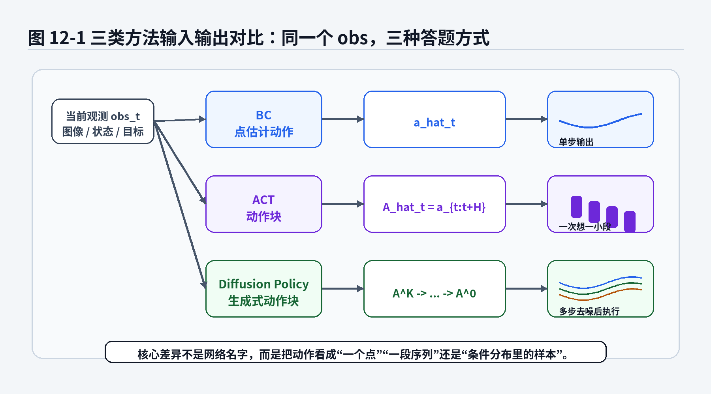
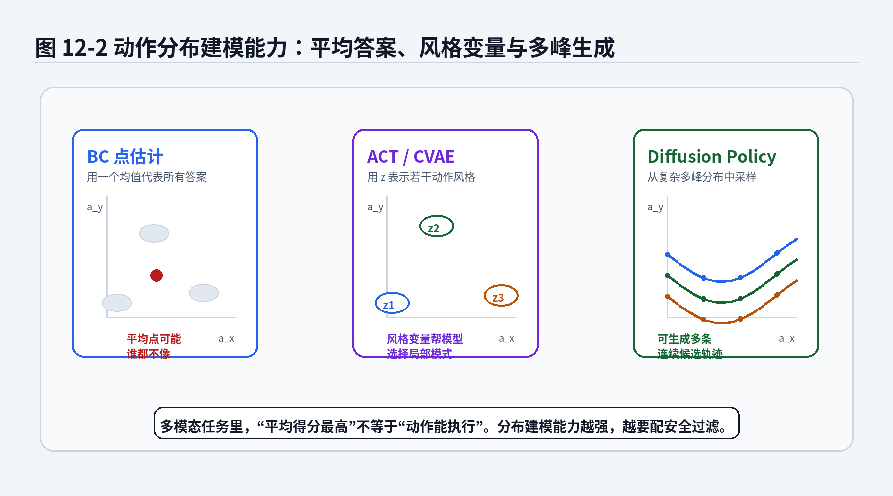
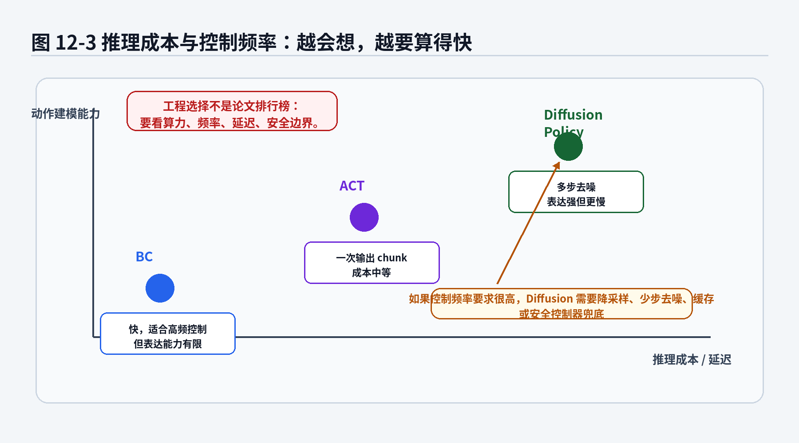
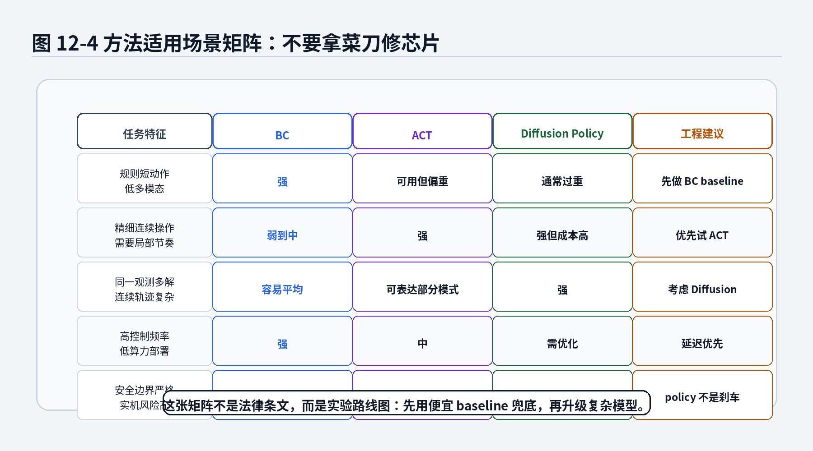

# 第12章 BC、ACT、Diffusion Policy 对比：从回归动作到生成动作

> **统一公式编号说明**：本章（或本附录）中的展示公式统一采用按章节编号的方式。章节正文使用“（章号.序号）”，附录使用“（附录字母.序号）”。


> 本章是前三章生成式策略学习内容的阶段性收束。第 10 章讲 ACT：一次预测动作小套餐；第 11 章讲 Diffusion Policy：从噪声里慢慢搓出动作块。本章不再急着介绍新模型，而是把 BC、ACT、Diffusion Policy 放到同一张桌子上审问：它们到底在预测什么？优化目标有什么区别？多模态动作谁更能打？工程上什么时候该用朴素 BC，什么时候该升级到 ACT，什么时候才值得请 Diffusion Policy 这位“慢工出细活”的选手出场？

---

## 1. 本章开场：不是模型越新越适合你的机器人

做机器人学习时，工程师很容易被一个问题诱惑：

> 既然 Diffusion Policy 看起来更先进，那是不是以后都不用 BC 和 ACT 了？

这句话听起来像技术进步，实际上可能是项目经理听了会沉默、实机工程师听了会打开安全急停按钮的危险想法。

模型不是越复杂越好。模型复杂度就像厨具：

- 切葱用菜刀就够，不需要上五轴加工中心；
- 做双臂穿线任务，单步菜刀可能不够，需要一套组合工具；
- 做多接触、多路径、多解连续控制，才可能需要 diffusion 这种“先打草稿再修动作”的方法。

模仿学习也是这样。

BC、ACT、Diffusion Policy 不是简单的“旧方法、新方法、更新方法”关系，而是三种不同的动作建模视角：

1. **BC**：把动作当成一个要回归或分类的答案；
2. **ACT**：把未来一小段动作当成序列，一次性预测 action chunk；
3. **Diffusion Policy**：把动作块当成条件生成对象，从噪声中迭代生成。

如果任务本身动作非常规则、周期很短、数据分布也比较单一，BC 可能就是性价比最高的 baseline。你非要上 diffusion，相当于给电动车装火箭发动机：看起来很酷，验收时可能先被安全部门请去喝茶。

但如果任务存在明显多解，比如同一个物体可以从左边抓、右边抓、先推再抓，动作轨迹是连续且多模态的，那么单纯 MSE 回归很可能把几条正确路线平均成一条“数学上折中、物理上尴尬”的路线。这时 ACT 或 Diffusion Policy 的优势才会出现。

所以，本章的核心不是给三类方法排座次，而是建立一套工程判断框架：

> 先看任务，再选模型；先做 baseline，再谈升级；先保证闭环安全，再追求论文效果。

---

## 2. 本章要解决的核心问题

本章围绕以下 14 个问题展开：

1. BC、ACT、Diffusion Policy 在数学上分别建模什么对象？
2. 为什么 BC 常常可以看成 point estimate，也就是点估计？
3. 为什么 MSE 会把多模态动作平均掉？
4. ACT 的 action chunk 相比单步动作多了什么表达能力？
5. ACT 中的 latent variable 与多模态动作有什么关系？
6. Diffusion Policy 的 denoising objective 和 BC 的 likelihood objective 有什么区别？
7. 三类方法在动作 horizon 上有什么不同？
8. 三类方法的推理成本和控制频率如何权衡？
9. 为什么“能生成多模态动作”不等于“实机一定安全”？
10. 短周期规则抓取是否真的需要复杂策略？
11. 双臂精细操作为什么更适合 action chunk？
12. 多模态连续控制为什么可能需要 diffusion？
13. 自动驾驶轨迹预测与机器人动作生成有什么相似点？
14. 工程项目中如何从 BC baseline 逐步升级到 ACT 或 Diffusion Policy？

本章会反复使用以下符号：

- 当前观测：\(o_t\) 或 \(obs_t\)；
- 当前动作：\(a_t\)；
- 动作块：\(A_t=a_{t:t+H-1}\)；
- 学习策略：\(\pi_\theta\)；
- 点估计模型：\(f_\theta(o_t)\)；
- ACT 的隐变量：\(z\)；
- Diffusion 的带噪动作块：\(A^{(k)}\)；
- Diffusion 的噪声预测网络：\(\epsilon_\theta(A^{(k)},k,obs_t)\)。



**图12-1 说明**：
- BC 通常从当前观测直接输出一个动作，适合短周期、低多模态任务；
- ACT 从当前观测和隐变量生成一段动作块，重点补上局部时间结构；
- Diffusion Policy 从随机动作块开始多步去噪，输出的是条件分布中的一个动作序列样本；
- 三者区别不是“网络名字不同”，而是动作建模对象不同。

---


### 主线定位与统一例子

为了让本章不变成孤立知识点，读本章时请始终把公式落回两个统一例子：

- **二维点机器人跟随专家轨迹**：状态可写成位置/速度，动作可写成二维控制量，适合观察状态分布、轨迹分布和误差累积。
- **机械臂末端运动/抓取轨迹模仿**：观测包含图像或本体状态，动作包含末端位姿增量或关节控制量，适合理解连续动作、多模态动作、动作块和实机闭环。

- **承接前文**：承接第2、10、11章。
- **本章推进**：把 BC、ACT、Diffusion Policy 放到同一套条件分布与动作 horizon 语言中比较。
- **铺垫后文**：为第13章从单步/动作块生成过渡到行为分布匹配做准备。
- **公式阅读抓手**：比较方法时先问：它学的是点估计、条件密度、动作块分布，还是生成过程。
- **建议同步回看**：附录 C、D、G、I。

## 3. 直觉解释：先不写公式，先把三类方法讲成人话

### 3.1 BC：老师怎么做，我就回归什么

Behavior Cloning 的想法非常朴素：

> 专家在观测 \(o_t\) 下做了动作 \(a_t\)，那我就训练模型看到 \(o_t\) 时输出 \(a_t\)。

如果动作是连续的，常用 MSE；如果动作是离散类别，常用交叉熵或负对数似然。第 2 章已经讲过，BC 的训练形态非常像监督学习。

BC 的优点很明确：

- 数据格式简单；
- 训练稳定；
- 推理快；
- 容易部署；
- 很适合作为所有复杂方法之前的 baseline。

但 BC 的弱点也很直接：

- 它常常输出一个“平均动作”；
- 对多模态动作不友好；
- 对闭环分布偏移敏感；
- 单步预测不理解未来一小段动作节奏。

用机械臂例子说，如果一个杯子可以从左侧抓，也可以从右侧抓，专家数据里两种方式都有。MSE 训练出来的模型可能输出一个介于左抓和右抓之间的动作，最后夹爪对准杯子中间的空气。模型不是没努力，它只是把数学平均当成了物理正确。

### 3.2 ACT：别只想下一步，先想一小段

ACT 的核心是 action chunk：

> 不要只预测当前一步 \(a_t\)，而是预测未来一段 \(A_t=a_{t:t+H-1}\)。

这对机器人很重要。很多操作不是单步动作能表达的，而是有局部节奏：接近、对齐、接触、推进、停止。单步模型像每 20 毫秒问一次“你现在想干什么”，而 action chunk 更像让机器人先规划一个短句子，而不是一个字一个字蹦。

ACT 的优势主要在两点：

1. **时间结构更强**：动作块里包含短期计划；
2. **执行更稳定**：temporal ensemble 可以平滑多个重叠动作块的输出。

ACT 里经常结合 CVAE，用隐变量 \(z\) 表示不同动作风格。例如同一个拉拉链任务，有人先拉紧布料再拉，有人直接拉，有人手腕角度不同。隐变量不是魔法，而是给模型一个“这次采用哪种局部风格”的旋钮。

### 3.3 Diffusion Policy：动作不是答案，而是条件分布中的样本

Diffusion Policy 更进一步：它不直接回归动作块，而是学习一个从噪声动作块到专家动作块的条件去噪过程。

它的直觉是：

> 当前观测给出任务约束，随机噪声提供候选起点，去噪网络一步步把候选动作修成像专家会做的动作。

这非常适合复杂连续控制中的多模态问题。比如推方块到目标位置，合理轨迹可能有很多条。Diffusion Policy 不必把所有路线压成一个均值，而是可以从分布中生成某一条完整候选。

但它也有代价：

- 推理需要多步去噪；
- 延迟更高；
- 工程部署更复杂；
- 生成的动作仍然必须经过安全过滤；
- 如果数据质量差，生成模型可能只是更优雅地学会数据里的坏习惯。

### 3.4 三者最核心的一句话差异

可以用三句话记住：

- **BC**：给我观测，我给你一个动作；
- **ACT**：给我观测，我给你一段动作；
- **Diffusion Policy**：给我观测和一团噪声，我慢慢生成一段动作。

它们都在模仿专家，但模仿的数学对象越来越丰富：


action point \(\rightarrow\) action chunk \(\rightarrow\) conditional action distribution。

---

## 4. 数学建模：三类方法到底在学什么对象

### 4.1 BC 的对象：从观测到动作的条件映射

最常见的 BC 写法是：

\[
\hat a_t=f_\theta(o_t) \tag{12.1}\]

其中：

- \(o_t\)：第 \(t\) 时刻观测，可以是图像、点云、状态向量或多传感器特征；
- \(a_t\)：专家动作；
- \(\hat a_t\)：模型预测动作；
- \(f_\theta\)：参数为 \(\theta\) 的神经网络。

如果我们把策略写成条件概率形式，则是：

\[
\pi_\theta(a_t|o_t) \tag{12.2}\]

这表示：在观测 \(o_t\) 下，模型给动作 \(a_t\) 分配的概率。

对于连续动作，如果使用固定方差高斯策略，均值由神经网络输出：

\[
\pi_\theta(a_t|o_t)
=
\mathcal N
\left(
 a_t;
 \mu_\theta(o_t),
 \sigma^2 I
\right) \tag{12.3}\]

此时最大化专家动作的似然，等价于最小化 MSE 的主要项。第 2 章和附录 D 已经讲过这个关系，本章只用它来比较方法。

### 公式拆解：BC 的 MSE 目标为什么容易变成点估计？

公式：

\[
\mathcal L_{\mathrm{BC\text{-}MSE}}(\theta)
=
\mathbb E_{(o,a)\sim\mathcal D}
\left[
\|a-f_\theta(o)\|^2
\right] \tag{12.4}\]

它要解决的问题：

训练一个函数 \(f_\theta\)，让它在专家数据集 \(\mathcal D\) 上尽量输出接近专家动作的预测值。

符号解释：

- \(\mathcal L_{\mathrm{BC\text{-}MSE}}\)：行为克隆的均方误差损失；
- \(\theta\)：模型参数；
- \((o,a)\sim\mathcal D\)：从专家数据集中抽取一个观测—动作样本；
- \(f_\theta(o)\)：模型在观测 \(o\) 下预测的动作；
- \(\|a-f_\theta(o)\|^2\)：预测动作和专家动作之间的平方距离；
- \(\mathbb E\)：对数据分布中的样本取平均。

直觉理解：

MSE 会惩罚“离专家动作远”的预测。若同一个观测附近存在多种专家动作，MSE 的最优预测倾向于落在这些动作的平均位置。

在理想函数空间中，对于固定观测 \(o\)，MSE 的最优点估计可以写成：

\[
f^*(o)
=
\mathbb E[A|O=o] \tag{12.5}\]

这个式子的含义是：如果只允许模型输出一个点，并且损失是平方误差，那么最优答案是条件均值。

机器人案例：

机械臂看到同一个杯子，有两种专家抓取方式：左侧抓和右侧抓。若两类样本数量接近，条件均值可能落在杯子正前方。这个位置在数学上离两种专家动作都不算太远，但在物理上可能既不是左抓，也不是右抓。

常见误解：

很多人看到训练 loss 很低，就以为模型学到了专家策略。更准确地说，MSE 下模型可能学到的是专家动作条件均值，而不是专家行为分布。对于单峰动作任务，这通常够用；对于多峰动作任务，条件均值可能是坏答案。

### 4.2 BC 的概率写法：条件密度估计

更一般地，BC 可以写成条件密度估计：

\[
\theta^*
=
\arg\max_\theta
\sum_{(o,a)\in\mathcal D}
\log \pi_\theta(a|o) \tag{12.6}\]

或最小化负对数似然：

\[
\mathcal L_{\mathrm{BC\text{-}NLL}}(\theta)
=
-
\mathbb E_{(o,a)\sim\mathcal D}
\left[
\log \pi_\theta(a|o)
\right] \tag{12.7}\]

从这个角度看，BC 并不必然只能是点估计。若 \(\pi_\theta(a|o)\) 是一个足够灵活的分布，比如 mixture density network 或 flow model，它也可以表达多模态动作。

但在很多工程实现中，BC 被简化成“网络输出一个连续动作，然后用 MSE 训练”。因此本书比较三类方法时，会把“朴素 BC”主要理解为单步点估计或固定高斯条件分布。

### 4.3 ACT 的对象：条件动作块分布

ACT 把动作对象从单步 \(a_t\) 扩展为动作块：

\[
A_t
=
a_{t:t+H-1}
=
(a_t,a_{t+1},\dots,a_{t+H-1}) \tag{12.8}\]

如果每个动作维度为 \(d_a\)，动作块可以看成：

\[
A_t\in\mathbb R^{H\times d_a} \tag{12.9}\]

ACT 希望学习的是：

\[
p_\theta(A_t|o_{\le t},z) \tag{12.10}\]

其中：

- \(o_{\le t}\)：当前及历史观测；
- \(A_t\)：未来动作块；
- \(z\)：隐变量，用来表示动作风格或未观测因素；
- \(p_\theta\)：动作块生成分布。

ACT 的训练常常带有 CVAE 结构。训练时，encoder 可以看到真实动作块 \(A_t\)，学习后验：

\[
q_\phi(z|o_{\le t},A_t) \tag{12.11}\]

decoder 根据观测和 \(z\) 重构动作块：

\[
\hat A_t
=
f_\theta(o_{\le t},z) \tag{12.12}\]

一个典型训练目标可以写成：

\[
\mathcal L_{\mathrm{ACT}}(\theta,\phi)
=
\mathbb E
\left[
\|A_t-f_\theta(o_{\le t},z)\|^2
\right]
+
\beta
D_{\mathrm{KL}}
\left(
q_\phi(z|o_{\le t},A_t)
\|p(z)
\right) \tag{12.13}\]

这不是 ACT 论文所有实现细节的唯一写法，而是本章用于理解的简化数学骨架。它表达了两个目标：动作块要重构好，隐变量分布不要乱飞。

### 公式拆解：ACT 的 action chunk 目标在补什么短板？

公式：

\[
A_t=a_{t:t+H-1} \tag{12.14}\]

\[
\mathcal L_{\mathrm{chunk}}(\theta)
=
\mathbb E
\left[
\|A_t-\hat A_t\|^2
\right] \tag{12.15}\]

它要解决的问题：

单步 BC 只关心当前动作是否像专家，ACT 希望模型直接学习一段短期动作结构。

符号解释：

- \(A_t\)：从当前时刻开始的专家动作块；
- \(H\)：动作块长度，也称 action horizon；
- \(\hat A_t\)：模型预测的动作块；
- \(\mathcal L_{\mathrm{chunk}}\)：动作块重构损失。

直觉理解：

如果单步动作像一个字，动作块就像一句短句。很多机器人任务不是靠一个字表达，而是靠一段连贯动作表达。ACT 让模型从“逐字预测”升级为“短句预测”。

机器人案例：

双臂拉开拉链时，左手固定布料，右手沿拉链方向移动。这个过程的关键不是某一帧动作，而是两只手在一段时间内的协调。action chunk 能让模型一次性表达这种局部协作。

常见误解：

action chunk 不是越长越好。chunk 太短，时间结构不够；chunk 太长，模型需要预测太远的未来，误差和环境不确定性会变大。工程里通常还要配合 receding horizon execution：生成一段，只执行前几步，然后重新观测。

### 4.4 Diffusion Policy 的对象：条件动作块生成过程

Diffusion Policy 同样生成动作块 \(A_t\)，但它不直接输出 \(\hat A_t\)，而是学习从带噪动作块到干净动作块的反向过程。

训练时先对专家动作块加噪：

\[
A^{(k)}
=
\sqrt{\bar\alpha_k}A^{(0)}
+
\sqrt{1-\bar\alpha_k}\,\epsilon,
\quad
\epsilon\sim\mathcal N(0,I) \tag{12.16}\]

其中：

- \(A^{(0)}\)：干净专家动作块；
- \(A^{(k)}\)：加噪到第 \(k\) 步的动作块；
- \(\epsilon\)：标准高斯噪声；
- \(\bar\alpha_k\)：由噪声调度决定的累计保留系数。

模型学习预测噪声：

\[
\epsilon_\theta(A^{(k)},k,obs_t) \tag{12.17}\]

训练目标是：

\[
\mathcal L_{\mathrm{diffusion}}(\theta)
=
\mathbb E_{A^{(0)},\epsilon,k,obs_t}
\left[
\left\|
\epsilon-
\epsilon_\theta(A^{(k)},k,obs_t)
\right\|^2
\right] \tag{12.18}\]

### 公式拆解：Diffusion 的 denoising objective 和 BC 的 NLL 差在哪里？

公式：

\[
\mathcal L_{\mathrm{diffusion}}(\theta)
=
\mathbb E
\left[
\left\|
\epsilon-
\epsilon_\theta(A^{(k)},k,obs_t)
\right\|^2
\right] \tag{12.19}\]

它要解决的问题：

训练一个条件去噪网络，使它能在不同噪声等级 \(k\) 下，根据观测 \(obs_t\) 判断动作块里混入了什么噪声。

符号解释：

- \(A^{(0)}\)：专家动作块；
- \(A^{(k)}\)：带噪动作块；
- \(k\)：diffusion 加噪 / 去噪步；
- \(obs_t\)：当前观测条件；
- \(\epsilon\)：真实加入的噪声；
- \(\epsilon_\theta\)：网络预测的噪声；
- \(\|\epsilon-\epsilon_\theta\|^2\)：噪声预测误差。

直觉理解：

BC 直接问：“专家动作是什么？”

Diffusion Policy 问：“这份带噪动作里，哪些部分不像专家动作？我该怎么把它修回去？”

机器人案例：

推方块时，同一个起点到目标有多条合理轨迹。Diffusion Policy 可以从随机候选轨迹开始，在观测条件下逐步修出一条可行轨迹，而不是一开始就被迫输出一个平均轨迹。

常见误解：

Diffusion Policy 不是让机器人在真实世界里随机试动作。噪声和去噪发生在模型内部，真实机器人只执行最终生成并经过约束检查的动作。



**图12-2 说明**：
- 朴素 BC 在 MSE 训练下倾向输出条件均值，可能落在多个专家模式之间；
- ACT / CVAE 通过隐变量 \(z\) 表示若干动作风格，但生成结构仍相对直接；
- Diffusion Policy 通过迭代去噪表达复杂连续多峰分布；
- 分布建模能力越强，越需要工程侧做安全筛选和约束检查。

---

## 5. 核心公式拆解：把三类方法放到同一张公式表上

### 5.1 三类方法的统一视角

我们可以把三类方法统一写成：

\[
\text{model input} \longrightarrow \text{action object} \tag{12.20}\]

但 action object 不同。

BC：

\[
o_t \longrightarrow a_t \tag{12.21}\]

ACT：

\[
o_{\le t} \longrightarrow A_t=a_{t:t+H-1} \tag{12.22}\]

Diffusion Policy：

\[
(obs_t,A^{(K)})
\longrightarrow
A^{(K-1)}
\longrightarrow
\cdots
\longrightarrow
A^{(0)} \tag{12.23}\]

也就是说，BC 输出的是单步动作，ACT 输出的是动作块，Diffusion Policy 输出的是经过生成过程得到的动作块样本。

### 5.2 公式拆解：point estimate 与 conditional distribution

先看一个重要区别：点估计和条件分布。

点估计写作：

\[
\hat a=f_\theta(o) \tag{12.24}\]

条件分布写作：

\[
a\sim p_\theta(a|o) \tag{12.25}\]

动作块条件分布写作：

\[
A\sim p_\theta(A|obs) \tag{12.26}\]

它要解决的问题：

同一个观测下，如果只有一个合理动作，点估计通常足够。如果同一个观测下存在多种合理动作，就需要建模条件分布。

符号解释：

- \(\hat a\)：模型输出的单个动作点；
- \(p_\theta(a|o)\)：观测条件下动作的概率分布；
- \(A\)：动作块；
- \(p_\theta(A|obs)\)：观测条件下动作块的概率分布。

直觉理解：

点估计像让学生只能交一个答案；条件分布像承认“这道题可能有多个正确做法”。机器人世界里，多解是常态，不是异常。尤其是接触操作、绕障、抓取姿态选择和自动驾驶轨迹规划。

工程案例：

自动驾驶轨迹预测中，前车慢行时，人类驾驶员可能选择跟车、轻微变道、等待空隙后变道。若模型输出一条平均轨迹，可能既不跟车，也不变道，而是在两条车道中间思考人生。多模态轨迹预测的思想与多模态机器人动作生成高度相似。

常见误解：

条件分布不是越宽越好。一个很宽的动作分布可能只是模型不确定，甚至是没学会。真正有价值的是：分布覆盖合理动作模式，同时排除危险动作区域。

### 5.3 公式拆解：三类训练目标的核心差异

BC NLL：

\[
\mathcal L_{\mathrm{BC\text{-}NLL}}
=
-
\mathbb E_{(o,a)\sim\mathcal D}
\left[
\log \pi_\theta(a|o)
\right] \tag{12.27}\]

ACT 重构 + KL：

\[
\mathcal L_{\mathrm{ACT}}
=
\mathbb E
\left[
\|A-f_\theta(o,z)\|^2
\right]
+
\beta D_{\mathrm{KL}}
\left(q_\phi(z|o,A)\|p(z)\right) \tag{12.28}\]

Diffusion 去噪：

\[
\mathcal L_{\mathrm{diffusion}}
=
\mathbb E
\left[
\|\epsilon-\epsilon_\theta(A^{(k)},k,obs)\|^2
\right] \tag{12.29}\]

它们要解决的问题：

- BC NLL：让模型给专家动作更高概率；
- ACT 目标：让模型能重构专家动作块，同时让隐变量分布可采样；
- Diffusion 目标：让模型学会在观测条件下从带噪动作块中估计噪声。

直觉理解：

- BC 像直接批改最终答案；
- ACT 像批改一小段动作作业，并检查学生的“风格变量”不要乱写；
- Diffusion 像批改草稿修改能力：给你一份被污染的动作，让你指出哪里是噪声。

机器人案例：

在精准摆入治具任务中，如果工件位置固定、托盘槽口稳定，BC 可能足够。如果托盘有轻微变形、对齐过程需要连续微调，ACT 的动作块更合适。如果存在多种接触调整方式，比如先碰左边定位、再滑入，或者先碰右边定位、再旋转进入，Diffusion Policy 的多模态生成能力才可能体现价值。

常见误解：

不要把三类损失的数值直接横向比较。BC 的 MSE、ACT 的重构损失和 Diffusion 的噪声预测损失不是同一个物理量。真正要比较的是闭环成功率、失败类型、延迟、安全性和数据效率。

### 5.4 action horizon：动作想多远？

BC 的 horizon 通常是 1：

\[
H_{\mathrm{BC}}=1 \tag{12.30}\]

ACT 和 Diffusion Policy 通常生成长度为 \(H\) 的动作块：

\[
A_t=a_{t:t+H-1} \tag{12.31}\]

但执行时未必执行完整个动作块。常见做法是只执行前 \(H_e\) 步：

\[
H_e\le H \tag{12.32}\]

然后重新观测、重新生成动作块。这就是 receding horizon execution。

### 公式拆解：为什么生成 H 步，却只执行 H_e 步？

公式：

\[
A_t=a_{t:t+H-1},
\quad
\text{execute } a_{t:t+H_e-1},
\quad
H_e\le H \tag{12.33}\]

它要解决的问题：

动作块提供短期计划，但真实环境会变化。只执行前几步，可以保留计划结构，同时避免长期开环执行带来的风险。

符号解释：

- \(H\)：模型生成的动作块长度；
- \(H_e\)：实际执行长度；
- \(a_{t:t+H_e-1}\)：真正发送给控制器执行的前段动作。

直觉理解：

模型先想一小段，但不要闭着眼把整段走完。走几步，看一眼，再重新规划。像倒车入库时，老司机不是一次打死方向盘然后祈祷，而是边看边修。

工程案例：

机械臂插孔时，模型可以生成 16 步动作块，但实际只执行前 2 到 4 步。因为孔位、接触状态和摩擦会变化，后半段动作需要基于新观测更新。

常见误解：

action chunk 不是 open-loop 执行许可证。chunk 只是让模型表达局部时间结构，不代表可以忽视反馈控制。

### 5.5 推理成本：模型会不会拖慢控制循环？

从推理角度看，三类方法的成本也不同。

BC 通常一次前向：

\[
C_{\mathrm{BC}}\approx C_f \tag{12.34}\]

ACT 通常也是一次前向，但输出更长序列：

\[
C_{\mathrm{ACT}}\approx C_g \tag{12.35}\]

Diffusion Policy 需要 \(K\) 步去噪：

\[
C_{\mathrm{diffusion}}
\approx
K\,C_\epsilon \tag{12.36}\]

其中：

- \(C_f\)：BC 单次网络前向成本；
- \(C_g\)：ACT 单次网络前向成本；
- \(C_\epsilon\)：Diffusion 去噪网络单次前向成本；
- \(K\)：去噪步数。

这个式子不追求精确硬件计时，只提醒一个工程事实：Diffusion Policy 的表达能力通常伴随更高推理成本。



**图12-3 说明**：
- BC 推理快，适合高频、算力紧张的控制环；
- ACT 输出动作块，成本中等，但仍通常比多步 diffusion 更易部署；
- Diffusion Policy 表达能力强，但多步去噪会增加延迟；
- 实机部署时要同时考虑模型延迟、控制频率、执行安全和 fallback。

---

## 6. 算法流程：从 BC baseline 到生成式策略

### 6.1 BC 训练与推理流程

BC 的流程最直接。

训练：

1. 收集专家数据 \(\mathcal D=\{(o_t,a_t)\}\)；
2. 送入神经网络 \(f_\theta(o_t)\)；
3. 计算 MSE 或 NLL；
4. 反向传播更新 \(\theta\)。

推理：

1. 读取当前观测 \(o_t\)；
2. 输出动作 \(\hat a_t=f_\theta(o_t)\)；
3. 发送给控制器；
4. 下一帧重新观测。

BC 的工程价值在于：它是最便宜的试金石。如果 BC 在开环和闭环都完全没有起色，直接上更复杂模型不一定能救项目，可能只是把问题包装得更高级。

### 6.2 ACT 训练与推理流程

ACT 训练：

1. 把专家轨迹切成动作块 \(A_t=a_{t:t+H-1}\)；
2. 用观测历史 \(o_{\le t}\) 和动作块训练 encoder；
3. 从 \(q_\phi(z|o_{\le t},A_t)\) 采样隐变量；
4. decoder 预测动作块 \(\hat A_t\)；
5. 计算重构损失和 KL 正则；
6. 更新参数。

ACT 推理：

1. 当前观测进入模型；
2. 从 prior 采样或使用固定 \(z\)；
3. decoder 输出动作块；
4. 只执行前几步；
5. 多个重叠动作块可用 temporal ensemble 融合。

ACT 的核心价值是补上“局部时间结构”。它适合需要连续协调动作的任务，尤其是双臂操作和精细接触操作。

### 6.3 Diffusion Policy 训练与推理流程

Diffusion Policy 训练：

1. 从专家数据中取动作块 \(A^{(0)}\)；
2. 随机采样 diffusion 步 \(k\)；
3. 采样噪声 \(\epsilon\sim\mathcal N(0,I)\)；
4. 构造带噪动作块 \(A^{(k)}\)；
5. 网络根据 \(A^{(k)}, k, obs\) 预测噪声；
6. 用噪声预测损失训练。

Diffusion Policy 推理：

1. 从随机动作块 \(A^{(K)}\sim\mathcal N(0,I)\) 开始；
2. 在当前观测条件下逐步去噪；
3. 得到 \(A^{(0)}\)；
4. 执行前几步；
5. 重新观测并滚动生成。

Diffusion Policy 的核心价值是复杂连续动作分布建模。但它不是免费午餐，推理延迟、动作过滤和安全约束都要认真设计。

---

## 7. Python 风格伪代码

下面用伪代码把三类方法放在同一个工程接口里。它不是可直接运行代码，而是帮助读者理解训练和推理对象。

### 7.1 BC：单步动作预测

```python
class BCPolicy:
    def __init__(self, model):
        self.model = model

    def training_step(self, batch):
        obs = batch["obs"]          # [B, obs_dim] 或图像特征
        action = batch["action"]    # [B, action_dim]

        pred_action = self.model(obs)
        loss = mse(pred_action, action)
        return loss

    def act(self, obs):
        action = self.model(obs)
        return safety_filter(action)
```

关键点：

- 输入是当前观测；
- 输出是单步动作；
- 训练最便宜；
- 必须做闭环验证，不要只看 open-loop MSE。

### 7.2 ACT：动作块预测

```python
class ACTPolicy:
    def __init__(self, encoder, decoder, horizon, execute_steps):
        self.encoder = encoder
        self.decoder = decoder
        self.horizon = horizon
        self.execute_steps = execute_steps

    def training_step(self, batch):
        obs_hist = batch["obs_hist"]          # [B, T_obs, ...]
        action_chunk = batch["action_chunk"]  # [B, H, action_dim]

        z_dist = self.encoder(obs_hist, action_chunk)
        z = z_dist.sample()
        pred_chunk = self.decoder(obs_hist, z)

        recon_loss = mse(pred_chunk, action_chunk)
        kl_loss = kl_divergence(z_dist, standard_normal())
        loss = recon_loss + beta * kl_loss
        return loss

    def act(self, obs_hist):
        z = sample_standard_normal()
        action_chunk = self.decoder(obs_hist, z)
        action_chunk = chunk_safety_filter(action_chunk)
        return action_chunk[:self.execute_steps]
```

关键点：

- 训练对象是动作块；
- 隐变量 \(z\) 帮助表示动作风格；
- 执行时通常只执行前几步；
- temporal ensemble 可以进一步平滑动作。

### 7.3 Diffusion Policy：条件去噪生成动作块

```python
class DiffusionPolicy:
    def __init__(self, denoiser, noise_schedule, horizon, denoise_steps, execute_steps):
        self.denoiser = denoiser
        self.noise_schedule = noise_schedule
        self.horizon = horizon
        self.denoise_steps = denoise_steps
        self.execute_steps = execute_steps

    def training_step(self, batch):
        obs = batch["obs"]
        clean_chunk = batch["action_chunk"]       # A^(0)

        k = sample_diffusion_step()
        eps = sample_gaussian_like(clean_chunk)
        noisy_chunk = add_noise(clean_chunk, eps, k, self.noise_schedule)

        pred_eps = self.denoiser(noisy_chunk, k, obs)
        loss = mse(pred_eps, eps)
        return loss

    def act(self, obs):
        chunk = sample_gaussian(shape=[self.horizon, action_dim])  # A^(K)

        for k in reversed(range(self.denoise_steps)):
            pred_eps = self.denoiser(chunk, k, obs)
            chunk = denoise_one_step(chunk, pred_eps, k, self.noise_schedule)

        chunk = chunk_safety_filter(chunk)
        return chunk[:self.execute_steps]
```

关键点：

- 训练时学预测噪声；
- 推理时多步去噪；
- 输出仍是动作块；
- 实机执行前必须经过动作范围、速度、加速度、碰撞和任务约束检查。

### 7.4 选择方法的伪代码

工程上可以先用非常朴素的判断逻辑：

```python
def choose_policy(task):
    if task.is_short_horizon and task.is_low_multimodal and task.requires_high_frequency:
        return "Start with BC baseline"

    if task.needs_local_temporal_structure and task.has_demonstration_chunks:
        return "Try ACT"

    if task.has_complex_multimodal_continuous_actions and task.can_afford_inference_cost:
        return "Consider Diffusion Policy"

    return "Build stronger data pipeline and evaluation before changing model"
```

这段伪代码最重要的是最后一行：很多时候问题不是模型不高级，而是数据、标注、观测、控制器、评测和安全约束没有准备好。

---

## 8. 工程实践案例

### 8.1 案例一：短周期规则抓取，BC baseline 往往值得先做

假设任务是：机械臂从固定料盘中抓取规则工件，工件姿态变化不大，夹具设计合理，相机稳定，抓取动作短且重复。

这种任务的特点是：

- 动作模式少；
- 多模态不强；
- 控制频率要求较高；
- 失败原因可能更多来自定位误差、夹具设计、标定漂移，而不是策略表达能力不足。

这时先做 BC baseline 很合理：

\[
\hat a_t=f_\theta(o_t) \tag{12.37}\]

如果 BC 已经能稳定完成任务，就没有必要为了“生成式策略”而增加复杂度。工程里最怕的是把一个本来可以用传统视觉 + 简单策略解决的问题，改造成一个需要收集海量示教、训练大模型、部署高算力、最后还要靠规则兜底的系统。

但 BC baseline 也不是随便做做。至少要检查：

1. open-loop 动作误差；
2. closed-loop 成功率；
3. 失败样本分布；
4. 对光照、位置扰动、夹爪磨损的鲁棒性；
5. 是否出现分布偏移后的连续补锅失败。

### 8.2 案例二：双臂精细操作，ACT 的 action chunk 更自然

考虑双臂操作：一只手固定布料，另一只手拉拉链，或者一只手扶住工件，另一只手插入连接器。

这类任务的关键不是“当前这一帧动作是否正确”，而是一段时间内两只手的协调：

- 谁先动；
- 谁保持；
- 接触后速度如何变化；
- 力和位姿如何配合；
- 失败时是否能局部调整。

单步 BC 很容易抖动，因为每一帧都像重新做一次局部决策。ACT 用 action chunk 可以表达局部动作节奏：

\[
A_t=(a_t,a_{t+1},\dots,a_{t+H-1}) \tag{12.38}\]

在推理时，temporal ensemble 可以融合多个重叠动作块，让执行更平滑。这个机制对真实机器人很有意义，因为机械臂不是在数学纸面上移动，任何高频抖动都可能变成夹爪颤抖、接触异常或控制器报警。

### 8.3 案例三：多模态连续控制，Diffusion Policy 才有发挥空间

考虑推方块任务：方块在桌面上，目标区域在另一侧，中间可能有障碍。专家可能有多种策略：

- 从左侧推过去；
- 从右侧绕过去；
- 先把方块调整角度，再向目标推；
- 先短距离接触，再连续推进。

这就是典型多模态连续控制。朴素 MSE 可能输出一条夹在多种轨迹之间的平均轨迹，实际执行时碰不到正确接触点。ACT 可以通过 \(z\) 表示部分风格，但如果动作分布形状很复杂，Diffusion Policy 的迭代生成能力会更有优势。

这里适合学习：

\[
A\sim p_\theta(A|obs) \tag{12.39}\]

而不是只学习：

\[
\hat A=f_\theta(obs) \tag{12.40}\]

但工程上要补三件事：

1. 生成动作的范围约束；
2. 与碰撞检测或任务约束结合；
3. 对生成失败样本做回收和再训练。

Diffusion Policy 可以更好地表达候选动作，不代表它自动知道工厂安全规范。策略模型负责“想怎么做”，安全系统负责“哪些事情不能做”。这两者不能互相甩锅。

### 8.4 案例四：自动驾驶轨迹预测的类比

自动驾驶里，多模态轨迹预测是老问题。一个路口场景中，车辆可能直行、左转、右转、减速等待。若模型输出平均轨迹，车辆可能朝着路口中间走出一条谁也不会开的路线。

这和机器人动作生成非常像：

- 观测条件：道路 / 障碍物 / 交通规则，对应机器人中的图像 / 状态 / 任务条件；
- 多模态输出：多条可行轨迹，对应机器人中的多种操作方式；
- 安全约束：车道线 / 碰撞 / 舒适性，对应机器人中的关节限位 / 碰撞 / 力控边界。

所以，从自动驾驶经验看机器人策略时，要特别警惕“平均轨迹”。在泊车、绕障、低速操作中，多解不是异常情况，而是算法必须面对的现实。



**图12-4 说明**：
- 规则短动作优先用 BC baseline，先确认数据和控制链路是否成立；
- 需要局部时间结构的精细操作，ACT 通常是很好的中间方案；
- 多解、连续、多接触任务更适合考虑 Diffusion Policy；
- 安全边界严格时，复杂策略更需要外部约束，而不是更少约束。

---

## 9. 方法边界与工程风险

### 9.1 BC 的边界：快，但容易平均和分布偏移

BC 的边界主要有三类。

第一，多模态动作被平均。

当 \(p(a|o)\) 有多个峰时，MSE 点估计可能落在峰之间。这个问题在第 7 章已经讲过，本章再次强调，因为它是从 BC 升级到生成式策略的核心动机之一。

第二，闭环分布偏移。

训练时数据来自专家分布 \(d^{\pi_E}\)，执行时状态来自模型自己的分布 \(d^{\pi_\theta}\)。如果模型犯了一点错，就可能进入专家数据没有覆盖的区域。

第三，单步动作缺少短期计划。

对于接触操作，单步预测可能导致动作抖动或前后不一致。

但 BC 的优点也不能忽视：快、稳、便宜、容易 debug。工程中一个好 BC baseline 是非常有价值的参照物。

### 9.2 ACT 的边界：chunk 不是万能药

ACT 解决了单步动作的局部时间结构问题，但它也有边界。

第一，chunk 长度难选。

\(H\) 太短，模型仍然像短视学生；\(H\) 太长，模型预测未来太多不确定内容。

第二，动作块可能与闭环反馈冲突。

如果执行太长的 chunk，中间环境已经变化，后半段动作可能过期。

第三，隐变量 \(z\) 的解释性有限。

我们希望 \(z\) 表示动作风格，但模型实际学到的 latent 空间未必按人类想象排列。某个维度不一定就是“左抓 / 右抓”，可能混合了速度、姿态、数据采集者习惯和场景偏差。

第四，ACT 仍然可能覆盖不了复杂多峰分布。

如果任务的多模态结构很复杂，单个 latent 或直接 chunk decoder 可能表达不足。

### 9.3 Diffusion Policy 的边界：强表达不等于强安全

Diffusion Policy 的风险更像“能力越大，安全检查越不能少”。

第一，推理延迟。

如果控制环要求 50Hz 或 100Hz，多步去噪可能成为瓶颈。需要减少去噪步数、使用更快网络、异步推理、动作缓存或低层控制器兜底。

第二，动作可行性。

生成模型可能输出数据分布中看似合理、但在当前机器人硬件上不可行的动作。关节限位、速度、加速度、碰撞和接触力都必须检查。

第三，数据质量。

Diffusion Policy 能拟合复杂分布，但不会自动区分专家数据里的好习惯和坏习惯。如果示教数据中有犹豫、抖动、错误恢复不当，模型也可能学进去。

第四，调参复杂。

噪声步数、噪声调度、动作归一化、观测编码、horizon、执行步长都会影响效果。比起 BC，它更像一台精密设备，能做细活，但维护成本也更高。

### 9.4 三类方法共同的工程风险

无论选哪种方法，都绕不开这些问题：

1. 观测是否稳定；
2. 标定是否可靠；
3. 数据是否覆盖失败和边界状态；
4. action representation 是否适合控制器；
5. open-loop 指标是否能预测 closed-loop 成功；
6. 是否有安全约束、fallback 和人工接管机制；
7. 是否有失败数据回流再训练流程。

如果这些基础没有做好，换模型就像给漏水的屋顶换更贵的窗帘：看起来投入很大，问题还是从头顶滴下来。

---

## 10. 常见误区

### 10.1 误区一：Diffusion Policy 一定比 ACT 好

不一定。

Diffusion Policy 通常有更强的复杂分布表达能力，但 ACT 在推理速度、结构清晰度和工程实现上可能更有优势。对于需要高频控制、动作模式不太复杂的任务，ACT 甚至 BC 可能更合适。

评价方法不能只看论文任务成功率，还要看：

- 你的数据规模；
- 你的机器人频率；
- 你的部署算力；
- 你的安全边界；
- 你的任务是否真的多模态。

### 10.2 误区二：BC 太老了，不值得做

BC 不但值得做，而且应该优先做。

一个可靠的 BC baseline 可以回答很多问题：

- 数据是否能支撑任务；
- observation 是否包含足够信息；
- action 表示是否合理；
- 训练和评测管线是否打通；
- 闭环主要失败来自模型表达，还是来自感知、标定、控制。

没有 baseline 直接上复杂模型，后面失败时很难定位问题。你不知道是 diffusion 不行，还是相机标定在偷偷打摆子。

### 10.3 误区三：action chunk 越长越智能

chunk 长度不是智商测试。

长 chunk 可以表达更长计划，但也会承担更多未来不确定性。真实世界不是训练集里的静态表格，物体可能滑动、夹爪可能打滑、传感器可能延迟、工件可能变形。

工程上常见策略是：生成 \(H\) 步，只执行 \(H_e\) 步，并且 \(H_e\le H\)。这是一种在计划和反馈之间做折中的方式。

### 10.4 误区四：多模态生成等于多随机试几次

多模态生成不是让机器人随机抽奖。

真正可用的多模态策略需要：

1. 生成多个合理候选；
2. 能根据任务约束筛选候选；
3. 能避免危险动作；
4. 能在失败后恢复或重新规划。

如果只是每次随机出一条轨迹，没有约束、没有评分、没有安全过滤，那不是多模态智能，而是高维摇骰子。

### 10.5 误区五：open-loop loss 最低的方法就是最好方法

open-loop loss 只说明模型在数据集上预测得像不像，不代表闭环执行一定成功。

尤其是 Diffusion Policy，训练 loss 是噪声预测误差，不是直接的任务成功率。ACT 的重构 loss 也不等于插孔成功率。BC 的 MSE 更不等于机器人不会夹空气。

最终仍然要看：

- closed-loop success rate；
- 失败恢复能力；
- 动作平滑性；
- 安全违规次数；
- 延迟和吞吐；
- 对扰动的鲁棒性。

---

## 11. 本章小结：从“预测答案”到“生成候选”

本章把 BC、ACT、Diffusion Policy 放到统一框架下比较。

BC 的核心是单步动作预测。它简单、快速、便宜，非常适合作为 baseline。但在多模态动作、闭环分布偏移和局部时间结构上容易遇到问题。

ACT 的核心是 action chunk。它让模型一次预测未来一小段动作，并可结合 CVAE 隐变量表示动作风格。它适合双臂操作、精细接触、需要局部时间节奏的任务。

Diffusion Policy 的核心是条件去噪生成。它把动作块看成生成对象，通过多步去噪表达复杂连续多模态动作分布。它适合多解、连续、多接触任务，但推理成本、安全过滤和数据质量要求更高。

最重要的是，三类方法不是线性替代关系，而是工程工具箱里的不同工具。成熟的实验路线通常不是一上来就用最复杂模型，而是：

1. 先做 BC baseline，确认数据和闭环链路；
2. 如果单步动作不稳定，升级到 action chunk / ACT；
3. 如果任务多模态复杂，考虑 Diffusion Policy；
4. 无论模型多强，都保留安全约束、评测体系和失败数据闭环。

一句话收束本章：

> 机器人学习不是模型选美比赛，而是任务、数据、控制、算力和安全约束之间的工程谈判。

---

## 12. 本章公式索引

### 12.1 BC 单步动作预测

\[
\hat a_t=f_\theta(o_t) \tag{12.41}\]

含义：给定当前观测，输出一个动作点估计。

---

### 12.2 BC 条件概率策略

\[
\pi_\theta(a_t|o_t) \tag{12.42}\]

含义：给定观测 \(o_t\)，模型对动作 \(a_t\) 的条件概率。

---

### 12.3 BC 负对数似然

\[
\mathcal L_{\mathrm{BC\text{-}NLL}}(\theta)
=
-
\mathbb E_{(o,a)\sim\mathcal D}
\left[
\log \pi_\theta(a|o)
\right] \tag{12.43}\]

含义：让模型给专家动作更高概率。

---

### 12.4 BC MSE 损失

\[
\mathcal L_{\mathrm{BC\text{-}MSE}}(\theta)
=
\mathbb E_{(o,a)\sim\mathcal D}
\left[
\|a-f_\theta(o)\|^2
\right] \tag{12.44}\]

含义：让模型输出接近专家动作的点估计。

---

### 12.5 MSE 下的条件均值直觉

\[
f^*(o)=\mathbb E[A|O=o] \tag{12.45}\]

含义：平方误差下，单点预测倾向于条件均值；多模态任务中条件均值可能不是可执行动作。

---

### 12.6 ACT 动作块

\[
A_t=a_{t:t+H-1} \tag{12.46}\]

含义：从当前时刻开始的未来 \(H\) 步动作序列。

---

### 12.7 ACT 条件动作块生成

\[
p_\theta(A_t|o_{\le t},z) \tag{12.47}\]

含义：在观测历史和隐变量条件下生成动作块。

---

### 12.8 ACT 简化训练目标

\[
\mathcal L_{\mathrm{ACT}}
=
\mathbb E
\left[
\|A-f_\theta(o,z)\|^2
\right]
+
\beta D_{\mathrm{KL}}
\left(q_\phi(z|o,A)\|p(z)\right) \tag{12.48}\]

含义：动作块重构损失加隐变量 KL 正则。

---

### 12.9 Diffusion 加噪动作块

\[
A^{(k)}
=
\sqrt{\bar\alpha_k}A^{(0)}
+
\sqrt{1-\bar\alpha_k}\,\epsilon \tag{12.49}\]

含义：把干净动作块加噪到第 \(k\) 个 diffusion 步。

---

### 12.10 Diffusion 去噪训练目标

\[
\mathcal L_{\mathrm{diffusion}}(\theta)
=
\mathbb E
\left[
\|\epsilon-\epsilon_\theta(A^{(k)},k,obs)\|^2
\right] \tag{12.50}\]

含义：训练网络预测带噪动作块中的噪声。

---

### 12.11 执行步长与生成 horizon

\[
A_t=a_{t:t+H-1},
\quad
\text{execute } a_{t:t+H_e-1},
\quad
H_e\le H \tag{12.51}\]

含义：生成一段动作，但只执行前几步，然后重新观测。

---

### 12.12 推理成本粗略比较

\[
C_{\mathrm{BC}}\approx C_f,
\quad
C_{\mathrm{ACT}}\approx C_g,
\quad
C_{\mathrm{diffusion}}\approx K C_\epsilon \tag{12.52}\]

含义：Diffusion Policy 多步去噪通常带来更高推理成本。

---

## 13. 建议阅读的附录条目

本章建议配合以下附录阅读：

1. **附录 C：最大似然、负对数似然、交叉熵与 KL 散度**  
   用于理解 BC NLL、ACT 中的 KL 项，以及为什么不同训练目标不能直接用数值大小横向比较。

2. **附录 D：高斯分布、MSE 与连续动作回归**  
   用于理解 BC 中 MSE 与固定方差高斯策略之间的关系，以及为什么 MSE 会倾向条件均值。

3. **附录 G：生成模型基础**  
   用于复习 CVAE、隐变量、ELBO、Diffusion 正向加噪和反向去噪。

4. **附录 H：实验与代码基础**  
   用于理解 open-loop 评估、closed-loop rollout、成功率、动作平滑性和实验记录方式。

5. **附录 F：强化学习与序列决策基础**  
   用于回顾 rollout、策略诱导分布和闭环执行中的状态分布变化。

---

## 14. 本章核心概念回顾

1. **point estimate**：只输出一个动作点，常见于朴素 BC。
2. **conditional density estimation**：学习观测条件下动作的完整分布。
3. **action chunk**：从当前时刻开始的一段未来动作序列。
4. **action horizon**：模型一次生成的动作长度 \(H\)。
5. **execute horizon**：实际执行的前几步 \(H_e\)。
6. **multimodal distribution**：同一观测下存在多种合理动作模式。
7. **likelihood objective**：让模型给专家数据更高概率，如 BC NLL。
8. **reconstruction + KL**：ACT / CVAE 常见训练骨架。
9. **denoising objective**：Diffusion Policy 训练噪声预测网络。
10. **inference cost**：推理延迟和控制频率之间的工程约束。
11. **baseline-first**：先做 BC baseline，再判断是否需要复杂方法。
12. **safety filter**：生成策略必须经过动作范围、碰撞、速度和任务约束检查。

---

## 15. 思考题

1. 对于一个固定位置抓取任务，如果 BC 的 closed-loop 成功率已经达到 98%，你还会考虑 ACT 或 Diffusion Policy 吗？请说明理由。

2. 某个任务中，同一观测下专家有左抓和右抓两种模式。请用 \(f^*(o)=\mathbb E[A|O=o]\) 解释为什么 MSE 可能输出坏动作。

3. ACT 的 action chunk 长度 \(H\) 变大时，可能带来哪些好处和风险？如何通过 \(H_e\le H\) 缓解风险？

4. Diffusion Policy 的训练 loss 是噪声预测误差。为什么这个 loss 不能直接等价于实机成功率？

5. 如果你的机器人控制频率要求 100Hz，而 diffusion 推理需要 80ms，你有哪些工程改造思路？

6. 在自动泊车任务中，哪些部分适合用 BC？哪些部分可能需要多模态轨迹生成？请结合泊车入库、避障和路径修正分析。

7. 如果一个 ACT 模型 open-loop 重构误差很低，但闭环执行抖动严重，你会优先排查哪些问题？

8. 请为一个“抓取 + 精准摆入治具”任务设计三阶段实验：BC baseline、ACT 升级、Diffusion Policy 升级。每阶段分别记录哪些指标？

9. 为什么生成式策略更需要安全过滤，而不是更少需要安全过滤？

10. 请用自己的话解释：BC、ACT、Diffusion Policy 不是线性替代关系，而是工具箱关系。

---

## 16. 本章配图清单

1. **图12-1 三类方法输入输出对比**  
   解释 BC、ACT、Diffusion Policy 在输入输出对象上的差异。

2. **图12-2 动作分布建模能力对比**  
   解释点估计、隐变量风格和复杂多峰生成之间的区别。

3. **图12-3 推理成本与控制频率对比**  
   解释表达能力、推理延迟和控制频率之间的工程权衡。

4. **图12-4 方法适用场景矩阵**  
   给出规则短动作、精细连续操作、多模态连续控制、高频部署和安全约束下的选型建议。

---

## 17. 下一章预告：从模仿动作到理解目标

到目前为止，我们主要讨论的是“如何让策略输出像专家一样的动作”。BC、ACT、Diffusion Policy 虽然建模能力不同，但它们基本都在围绕专家动作分布做文章。

下一章开始，我们进入另一条路线：

> 如果不直接模仿动作，而是学习专家背后的目标或奖励，会发生什么？

第 13 章将介绍 GAIL。它会把判别器请进模仿学习现场，让模型不只看某个动作像不像专家，而是比较整条行为分布是否像专家。这一步会把我们从“动作监督学习”推进到“占用度量、对抗训练和隐式奖励”的世界。

别紧张，判别器不会咬人。它只是会让公式看起来更像在开会。
