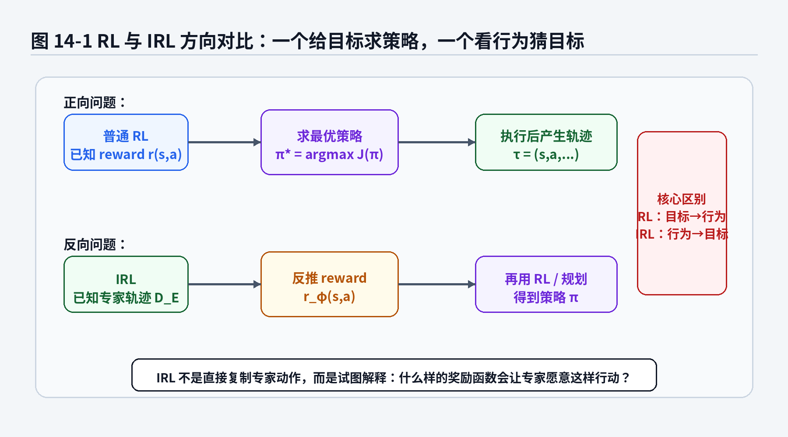
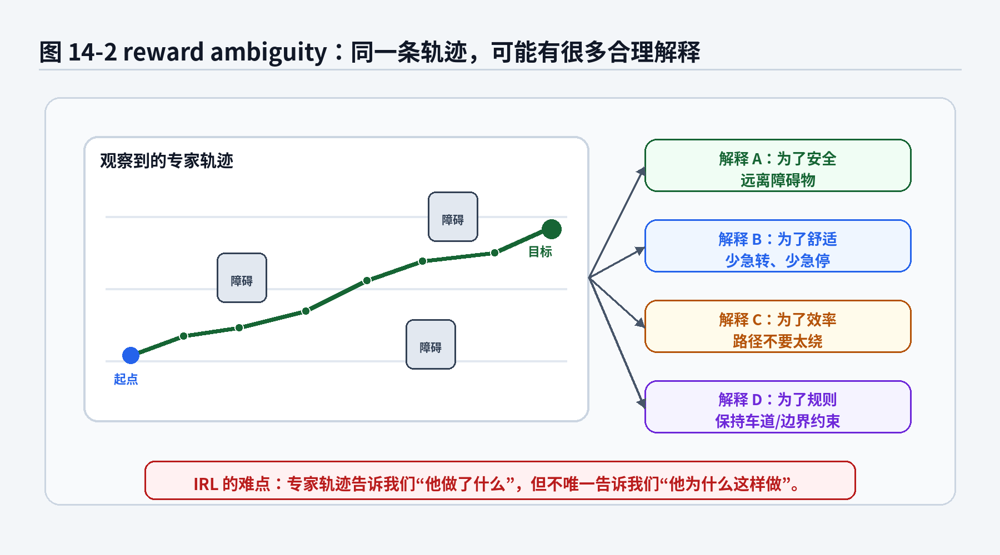
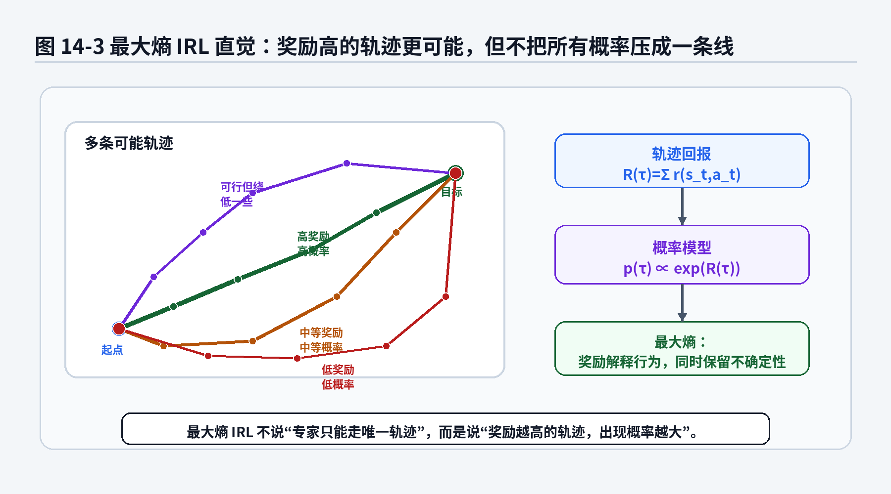
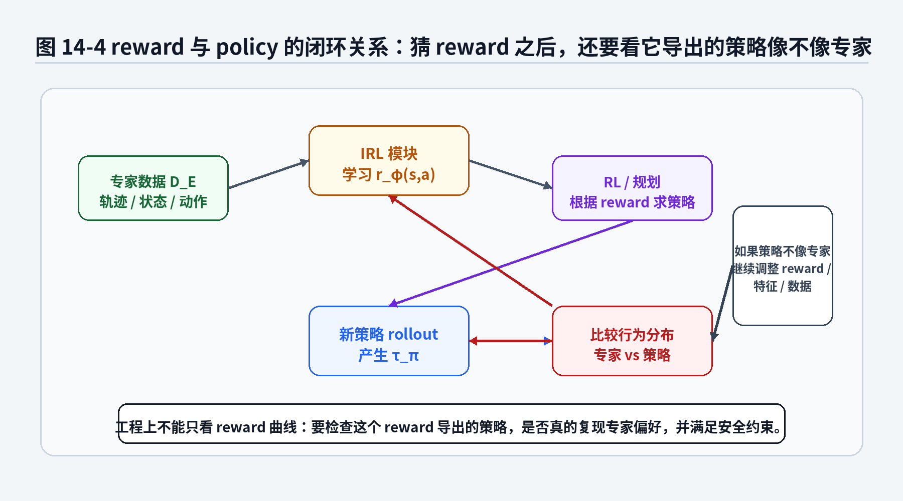

# 第14章 IRL：专家到底在优化什么？

> **统一公式编号说明**：本章（或本附录）中的展示公式统一采用按章节编号的方式。章节正文使用“（章号.序号）”，附录使用“（附录字母.序号）”。


> 第13章里，GAIL 用判别器给策略“偷”了一个隐式奖励。第14章我们继续往里追：如果专家行为背后确实有某种目标函数，那么这个目标函数到底是什么？IRL 试图从专家轨迹反推出 reward。听起来很诱人，但也很危险，因为同一条专家轨迹往往可以被很多 reward 解释。专家没把自己的目标函数贴在脑门上，日志里也不会写“本次打方向由 0.4 安全、0.3 舒适、0.2 效率、0.1 老师傅直觉共同驱动”。

---

## 1. 本章开场：从“他怎么做”追问“他为什么这么做”

前面几章，我们一直在围绕一个问题打转：

> 专家在某个状态下做了什么动作，模型应该怎样学？

BC 直接拟合动作；ACT 拟合动作块；Diffusion Policy 生成动作块；GAIL 不再逐帧照抄，而是让策略的状态—动作访问分布像专家。

这些方法都很重要。但它们大多还停留在一个层面：

> 专家做了什么。

IRL，Inverse Reinforcement Learning，逆强化学习，问的是另一个更“刨根问底”的问题：

> 专家为什么这样做？

这句话听起来像哲学问题，实际上是机器人学习中的硬核数学问题。

举几个例子。

自动驾驶场景里，人类司机在高速上保持较大车距。你只看动作，可以说专家在“轻踩油门、偶尔制动”。但更深层的解释可能是：

- 他在优化安全性；
- 他在优化舒适性；
- 他在遵守交通规则；
- 他在避免频繁加减速；
- 他在权衡到达时间和风险。

机械臂装配场景里，老师傅靠近孔位时动作变慢。你只看轨迹，可以说专家速度下降。可是背后的目标可能是：

- 减小碰撞冲击；
- 避免划伤工件；
- 提高插入成功率；
- 给视觉或力控留出反应时间；
- 夹具刚性不够，只能慢一点。

泊车场景里，老司机倒车入库时保持车身居中，方向盘变化平顺，最后车轮尽量回正。你只看控制量，可以拟合方向盘角和速度。但工程上真正想知道的是：

- 他是不是在惩罚离边线太近；
- 他是不是在惩罚大幅打方向；
- 他是不是在惩罚停车后姿态不正；
- 他是不是在惩罚距离障碍物太近；
- 他是不是在隐式优化“乘客不要被晃吐”。

IRL 的野心就在这里：

> 从专家轨迹中反推出一个 reward，使得专家行为看起来像是在优化这个 reward。

这比 BC 更深，也比 GAIL 更解释性一些。BC 说：“照着专家动作学。”GAIL 说：“让整体行为分布像专家。”IRL 说：“我想知道专家行为背后的目标函数。”

但这条路有个大坑，坑上还立着一块牌子：

> 同一条专家轨迹，可能被无数个 reward 解释。

这就是本章要拆开的核心难点：**reward ambiguity**。



**图14-1 说明**：
- 普通 RL 的方向是：给定 reward，求一个能最大化回报的策略；
- IRL 的方向反过来：给定专家轨迹，反推什么 reward 能解释专家行为；
- IRL 得到 reward 后，通常还要通过 RL、规划或策略优化得到策略；
- 这意味着 IRL 不是单纯的监督学习，而是夹在“行为解释”和“策略学习”之间的一座桥。

---

## 2. 本章要解决的核心问题

本章围绕以下 18 个问题展开：

1. 普通 RL 和 IRL 的方向到底有什么区别？
2. 为什么说 IRL 是“从行为反推目标”？
3. reward ambiguity 是什么？为什么同一条轨迹可以对应很多 reward？
4. 为什么“专家做了这条轨迹”不等于“只有这条轨迹奖励最高”？
5. 线性 reward \\(r_w(s,a)=w^\top f(s,a)\\) 为什么常用？
6. feature expectation \\(\mu(\pi)\\) 表示什么？
7. 为什么匹配 feature expectation 可以看成匹配专家偏好？
8. maximum entropy IRL 为什么要引入熵？
9. 轨迹概率 \\(p_w(\tau)\propto \exp(R_w(\tau))\\) 到底是什么意思？
10. partition function \\(Z(w)\\) 为什么出现？它在归一化什么？
11. maximum entropy IRL 的最大似然目标怎么读？
12. 为什么梯度会变成“专家特征期望 - 模型特征期望”？
13. IRL 和 GAIL 是什么关系？
14. IRL 和 BC、ACT、Diffusion Policy 的区别是什么？
15. IRL 在自动驾驶、泊车和机器人任务中有什么工程价值？
16. 为什么真实工程里很少直接把 IRL 当成万能方案？
17. IRL 的 reward 能不能直接上线？
18. 为什么第15章要继续讨论 offline imitation learning？

本章会反复使用以下符号：

- 状态：\\(s\\)；
- 动作：\\(a\\)；
- 轨迹：\\(\tau=(s_0,a_0,s_1,a_1,\dots,s_T)\\)；
- 专家数据集：\\(\mathcal D_E=\{\tau_i^E\}_{i=1}^{N}\\)；
- 奖励函数：\\(r(s,a)\\) 或 \\(r_\phi(s,a)\\)；
- 策略：\\(\pi(a|s)\\)；
- 特征函数：\\(f(s,a)\\)；
- 线性 reward 权重：\\(w\\)；
- 轨迹回报：\\(R(\tau)=\sum_t r(s_t,a_t)\\)；
- 最大熵轨迹分布：\\(p_w(\tau)=\frac{1}{Z(w)}\exp(R_w(\tau))\\)；
- 配分函数 / partition function：\\(Z(w)\\)。

先给一个全章最重要的对照：


a. 普通强化学习：

<div class="math-block">
\[
r(s,a) \longrightarrow \pi^* \tag{14.1}\]
</div>

意思是：给定 reward，求最优策略。

b. 逆强化学习：

<div class="math-block">
\[
\pi_E \;\text{或}\; \mathcal D_E \longrightarrow r(s,a) \tag{14.2}\]
</div>

意思是：给定专家策略或专家轨迹，反推 reward。

这就是 IRL 名字里 inverse 的来源。

---


### 主线定位与统一例子

为了让本章不变成孤立知识点，读本章时请始终把公式落回两个统一例子：

- **二维点机器人跟随专家轨迹**：状态可写成位置/速度，动作可写成二维控制量，适合观察状态分布、轨迹分布和误差累积。
- **机械臂末端运动/抓取轨迹模仿**：观测包含图像或本体状态，动作包含末端位姿增量或关节控制量，适合理解连续动作、多模态动作、动作块和实机闭环。

- **承接前文**：承接第13章的行为分布匹配，同时回到更经典的 IRL 问题。
- **本章推进**：解释为什么只模仿动作不够时，需要追问专家背后的 reward 或偏好结构。
- **铺垫后文**：为第15章离线数据覆盖、support 与 OOD 风险提供 reward/trajectory 层视角。
- **公式阅读抓手**：IRL 的难点不是“拟合一个奖励函数”，而是奖励歧义和轨迹概率假设。
- **建议同步回看**：附录 C、F、I。

## 3. 直觉解释：IRL 到底想干什么

### 3.1 RL 是“给 KPI 找员工”，IRL 是“看员工表现猜 KPI”

普通强化学习很像公司先写好 KPI，然后让员工去卷：

- 完成任务加分；
- 撞障碍扣分；
- 动作太猛扣分；
- 时间太长扣分；
- 成功装配加大分。

有了这个 reward，RL 算法去找策略：

> 怎样做，累计得分最高？

IRL 的处境相反。它手里没有 KPI 表，只有一堆专家行为记录。它看到专家这样做、那样做，于是推测：

> 什么样的 KPI 会让一个理性的专家愿意这么干？

这就像你观察一个老师傅调机台。他没有告诉你目标函数，但你看得出他很在意：

- 不让工件划伤；
- 不让夹具冲击过大；
- 不让节拍太慢；
- 不让位置误差超界；
- 宁愿多走一点，也不冒险卡死。

IRL 想把这些偏好写成一个 reward。

### 3.2 为什么不直接用 BC？

你可能会问：既然有专家轨迹，直接 BC 不就好了？为什么还要反推 reward？

答案是：BC 学的是输入到动作的映射，而 reward 更像任务偏好的压缩描述。

BC 关注：

<div class="math-block">
\[
\pi_\theta(a|s) \approx \pi_E(a|s) \tag{14.3}\]
</div>

IRL 关注：

<div class="math-block">
\[
r_\phi(s,a) \;\text{能不能解释专家为什么偏好某些行为？} \tag{14.4}\]
</div>

如果 reward 学得合理，它可能带来几个好处：

1. **更强的解释性**：你可以看到模型认为哪些状态—动作值得奖励，哪些应该惩罚。
2. **可以和规划结合**：得到 reward 后，可以用规划器或 RL 在新环境中重新求解策略。
3. **可以表达任务偏好**：比如安全、舒适、效率、能耗、距离边界等权衡。
4. **可以辅助调参与诊断**：如果 reward 学出“贴障碍物也高分”，工程师立刻知道数据或特征有问题。

但这里必须诚实：IRL 不是免费午餐。它通常比 BC 更难训练，对环境模型、特征设计、轨迹覆盖和优化稳定性要求更高。很多机器人项目里，BC/ACT/Diffusion Policy 是主力，IRL 更像“解释偏好、辅助 reward 设计、研究行为目标”的工具。

### 3.3 IRL 的一句话直觉

如果只用一句话概括 IRL：

> IRL 假设专家不是随机乱动，而是在某个未知 reward 下表现得比较好；我们希望从专家行为中把这个 reward 反推出去。

这里有三个关键词。

第一，**假设专家有目标**。如果专家数据本身很混乱，或者来自很多风格完全不同的人，却没有任务标注和上下文区分，那么 IRL 会非常难。

第二，**未知 reward**。这个 reward 不是环境直接给出的，需要从数据中学习。

第三，**比较好**。专家不一定绝对最优。人类会犯错，遥操作会抖，自动驾驶司机会分心，机械臂示教员也可能今天手感不好。所以现代 IRL 往往不会假设专家是唯一最优轨迹，而是用概率方式表达：专家轨迹更可能是高 reward 轨迹。

这正是 maximum entropy IRL 的出发点。

---

## 4. 数学建模：变量、轨迹、reward 与策略

### 4.1 从 MDP 重新看 reward

第5章讲过，MDP 可以写成：

<div class="math-block">
\[
(\mathcal S,\mathcal A,P,R,\gamma) \tag{14.5}\]
</div>

其中：

- \\(\mathcal S\\)：状态空间；
- \\(\mathcal A\\)：动作空间；
- \\(P(s'|s,a)\\)：状态转移概率；
- \\(R\\) 或 \\(r(s,a)\\)：奖励函数；
- \\(\gamma\\)：折扣因子。

普通 RL 通常默认 reward 已知。给定 reward 后，策略的目标是最大化期望回报：

<div class="math-block">
\[
J(\pi)
=
\mathbb E_{\tau\sim p_\pi(\tau)}
\left[
\sum_{t=0}^{T}\gamma^t r(s_t,a_t)
\right] \tag{14.6}\]
</div>

最优策略可以写成：

<div class="math-block">
\[
\pi^*
=
\arg\max_\pi J(\pi) \tag{14.7}\]
</div>

IRL 中，麻烦的地方在于：\\(r(s,a)\\) 不知道。

我们只有专家轨迹：

<div class="math-block">
\[
\mathcal D_E
=
\{\tau_i^E\}_{i=1}^{N} \tag{14.8}\]
</div>

每条专家轨迹是：

<div class="math-block">
\[
\tau_i^E
=
(s_0^i,a_0^i,s_1^i,a_1^i,\dots,s_T^i,a_T^i) \tag{14.9}\]
</div>

IRL 要做的是从 \\(\mathcal D_E\\) 中学习一个 reward：

<div class="math-block">
\[
r_\phi(s,a) \tag{14.10}\]
</div>

让专家轨迹在这个 reward 下显得“合理”。

### 公式拆解：普通 RL 的目标函数

公式：

<div class="math-block">
\[
J(\pi)
=
\mathbb E_{\tau\sim p_\pi(\tau)}
\left[
\sum_{t=0}^{T}\gamma^t r(s_t,a_t)
\right] \tag{14.11}\]
</div>

它要解决的问题：

描述一个策略在环境中执行后，平均能获得多少累计 reward。

符号解释：

- \\(J(\pi)\\)：策略 \\(\pi\\) 的性能指标；
- \\(\tau\sim p_\pi(\tau)\\)：轨迹由策略 \\(\pi\\) 和环境交互产生；
- \\(r(s_t,a_t)\\)：第 \\(t\\) 步状态—动作得到的即时奖励；
- \\(\gamma^t\\)：时间折扣，越远的未来权重越小；
- \\(\sum_{t=0}^{T}\\)：把整条轨迹上的奖励加起来；
- \\(\mathbb E[\cdot]\\)：对可能出现的轨迹求平均。

直觉理解：

策略不是只看眼前一步，而是在整段任务里尽量多拿分。一个动作当下看起来舒服，但如果导致后面撞上障碍，总回报就会很差。

工程含义：

在泊车、导航、装配任务中，reward 往往包含多种因素：任务成功、距离障碍、动作平滑、时间、能耗、接触力等。RL 的前提是这些因素已经被写进 reward。IRL 反过来问：这些因素能不能从专家数据里学出来？

常见误解：

不要把 \\(J(\pi)\\) 理解成某条固定轨迹的得分。它是对策略可能产生的轨迹分布求期望。策略、环境随机性和初始状态都会影响这个期望。

### 4.2 IRL 的目标不是唯一的

理想情况下，我们希望找到一个 reward，使得专家策略满足：

<div class="math-block">
\[
\pi_E
\approx
\arg\max_\pi
\mathbb E_{\tau\sim p_\pi(\tau)}
\left[
\sum_{t=0}^{T}\gamma^t r(s_t,a_t)
\right] \tag{14.12}\]
</div>

这句话很漂亮，但里面藏着麻烦。

它的意思是：专家策略大概是某个 reward 下的最优或近似最优策略。

问题是，满足这个条件的 reward 通常不止一个。

例如，如果某个 reward 让专家最优，那么把 reward 乘以一个正数：

<div class="math-block">
\[
r'(s,a)=\alpha r(s,a),\quad \alpha>0 \tag{14.13}\]
</div>

在很多情形下，最优策略不会改变。因为所有轨迹的得分只是被整体放大，排序没有变。

再比如，加一个常数：

<div class="math-block">
\[
r'(s,a)=r(s,a)+c \tag{14.14}\]
</div>

在固定长度任务中，所有轨迹都加了差不多同样的总量，轨迹排序也可能不变。

更复杂的情况下，还有 potential-based reward shaping 这类变换，也可能不改变最优策略。

所以 IRL 一上来就面对一个事实：

> 从行为反推 reward 是一个不适定问题。专家行为不足以唯一决定 reward。

这不是小瑕疵，而是 IRL 的核心困难。



**图14-2 说明**：
- 同一条专家轨迹可能有多种解释：安全、舒适、效率、规则约束；
- 如果只观察轨迹，不加入额外假设，很难判断专家到底最在意哪一个因素；
- reward ambiguity 不是算法实现问题，而是反问题本身的信息不足；
- 工程上通常需要结合特征设计、任务知识、约束和评测指标来减少歧义。

### 公式拆解：reward ambiguity 的简单例子

公式：

<div class="math-block">
\[
r'(s,a)=\alpha r(s,a),\quad \alpha>0 \tag{14.15}\]
</div>

它要解决的问题：

说明即使两个 reward 数值不同，也可能诱导出相同的最优策略。

符号解释：

- \\(r(s,a)\\)：原始奖励；
- \\(r'(s,a)\\)：变换后的奖励；
- \\(\alpha\\)：正的缩放系数；
- \\(\alpha>0\\)：保证奖励大小顺序不被反转。

直觉理解：

如果一条轨迹原来得 10 分，另一条得 5 分，把所有分数乘以 3 后，它们变成 30 分和 15 分。谁更好没有变。

工程含义：

IRL 学出来的 reward 数值大小未必有绝对意义。不要看到某个状态 reward 是 2.3、另一个是 1.1，就马上解释成真实世界里“前者好两倍”。更重要的是 reward 对行为排序、策略优化和安全约束的影响。

常见误解：

不要以为 IRL 能从数据中恢复专家内心真实 reward。它最多是在特定模型假设、特征表示和数据分布下，找到一个能解释专家行为的 reward。

---

## 5. 线性 reward：先把专家偏好写成特征加权

### 5.1 为什么从特征开始

早期 IRL 中，一个常见做法是先设计特征：

<div class="math-block">
\[
f(s,a) \tag{14.16}\]
</div>

然后假设 reward 是这些特征的线性组合：

<div class="math-block">
\[
r_w(s,a)
=
w^\top f(s,a) \tag{14.17}\]
</div>

这看起来有点朴素，但非常适合讲清楚 IRL 的核心逻辑。

举一个泊车任务。我们可以设计特征：

<div class="math-block">
\[
f(s,a)
=
\begin{bmatrix}
\text{距离车位中心误差}\\
\text{车身 yaw 误差}\\
\text{离障碍物最近距离}\\
\text{方向盘变化率}\\
\text{速度大小}\\
\text{是否压线}
\end{bmatrix} \tag{14.18}\]
</div>

权重 \\(w\\) 表示这些因素的重要性。比如：

- 如果“离障碍物近”权重大，策略会更保守；
- 如果“方向盘变化率”惩罚大，策略会更平顺；
- 如果“时间”惩罚大，策略会更快完成；
- 如果“压线”惩罚极大，策略会强烈避免越界。

IRL 试图从专家行为中学出 \\(w\\)。

### 5.2 线性 reward 的数学形式

线性 reward 写作：

<div class="math-block">
\[
r_w(s,a)
=
w^\top f(s,a) \tag{14.19}\]
</div>

展开看就是：

<div class="math-block">
\[
r_w(s,a)
=
\sum_{k=1}^{K} w_k f_k(s,a) \tag{14.20}\]
</div>

其中：

- \\(K\\)：特征数量；
- \\(f_k(s,a)\\)：第 \\(k\\) 个特征；
- \\(w_k\\)：第 \\(k\\) 个特征的权重。

如果某个特征代表“危险程度”，它的权重可能是负的；如果某个特征代表“任务进展”，它的权重可能是正的。

### 公式拆解：线性 reward 在表达什么

公式：

<div class="math-block">
\[
r_w(s,a)=w^\top f(s,a) \tag{14.21}\]
</div>

它要解决的问题：

把复杂的专家偏好表示成一组可解释特征的加权和。

符号解释：

- \\(f(s,a)\\)：状态—动作特征向量；
- \\(w\\)：特征权重向量；
- \\(w^\top f(s,a)\\)：向量内积，也就是每个特征乘以对应权重后相加；
- \\(r_w(s,a)\\)：由权重 \\(w\\) 定义的奖励。

直觉理解：

专家行为像一道菜，特征是原材料，权重是调料比例。IRL 想从成品味道倒推“盐、糖、辣椒到底放了多少”。难点在于，不同配方可能尝起来差不多。

工程含义：

线性 reward 的优点是可解释、可调试。你可以看到模型是否把“离障碍物远”“动作平滑”“靠近目标”这些因素赋予合理权重。缺点是表达能力受特征限制。特征没设计出来，IRL 就学不到。

常见误解：

不要以为线性 reward 一定低级。很多工程问题中，可解释特征加权反而比黑盒 reward 更容易上线、调试和安全审查。复杂模型不是为了显得高级，而是为了表达确实无法用简单特征描述的偏好。

### 5.3 轨迹回报：从一步奖励到整条轨迹

给定线性 reward，一条轨迹的总回报可以写成：

<div class="math-block">
\[
R_w(\tau)
=
\sum_{t=0}^{T}\gamma^t r_w(s_t,a_t) \tag{14.22}\]
</div>

代入 \\(r_w(s,a)=w^\top f(s,a)\\)：

<div class="math-block">
\[
R_w(\tau)
=
\sum_{t=0}^{T}\gamma^t w^\top f(s_t,a_t) \tag{14.23}\]
</div>

因为 \\(w\\) 不随时间变化，可以提出去：

<div class="math-block">
\[
R_w(\tau)
=
w^\top
\left(
\sum_{t=0}^{T}\gamma^t f(s_t,a_t)
\right) \tag{14.24}\]
</div>

括号里的东西非常重要：它是一条轨迹累计下来的特征。

我们定义轨迹特征计数：

<div class="math-block">
\[
F(\tau)
=
\sum_{t=0}^{T}\gamma^t f(s_t,a_t) \tag{14.25}\]
</div>

于是：

<div class="math-block">
\[
R_w(\tau)=w^\top F(\tau) \tag{14.26}\]
</div>

这说明：

> 在线性 reward 下，比较两条轨迹好不好，本质是在比较它们累计特征的加权和。

泊车轨迹的累计特征可能包括：总 yaw 误差、总边界风险、总方向盘变化、总时间、最终位置误差。IRL 学的是这些累计特征应该如何加权。

---

## 6. feature expectation：专家到底经常“消费”哪些特征

### 6.1 从单条轨迹到策略平均

一条轨迹有累计特征：

<div class="math-block">
\[
F(\tau)=\sum_{t=0}^{T}\gamma^t f(s_t,a_t) \tag{14.27}\]
</div>

但策略执行时可能产生很多轨迹。于是我们定义策略的 feature expectation：

<div class="math-block">
\[
\mu(\pi)
=
\mathbb E_{\tau\sim p_\pi(\tau)}
\left[
\sum_{t=0}^{T}\gamma^t f(s_t,a_t)
\right] \tag{14.28}\]
</div>

专家的 feature expectation 可以从专家数据中估计：

<div class="math-block">
\[
\mu_E
\approx
\frac{1}{N}
\sum_{i=1}^{N}
\sum_{t=0}^{T}
\gamma^t f(s_t^i,a_t^i) \tag{14.29}\]
</div>

这两个公式是 IRL 中非常重要的基础。

它们表达的是：

> 专家平均来说访问了多少安全特征、舒适特征、效率特征、目标进展特征。

### 公式拆解：feature expectation

公式：

<div class="math-block">
\[
\mu(\pi)
=
\mathbb E_{\tau\sim p_\pi(\tau)}
\left[
\sum_{t=0}^{T}\gamma^t f(s_t,a_t)
\right] \tag{14.30}\]
</div>

它要解决的问题：

用一个向量描述策略在闭环执行中平均累计了多少任务相关特征。

符号解释：

- \\(\mu(\pi)\\)：策略 \\(\pi\\) 的特征期望；
- \\(f(s_t,a_t)\\)：第 \\(t\\) 步的特征向量；
- \\(\sum_t \gamma^t f(s_t,a_t)\\)：整条轨迹的折扣累计特征；
- \\(\mathbb E_{\tau\sim p_\pi(\tau)}\\)：对策略可能产生的轨迹求平均。

直觉理解：

如果 reward 是一张消费账单，feature expectation 就是在统计一个策略平均“消费”了多少安全、舒适、效率、能耗、风险等特征。

工程含义：

对于自动驾驶或泊车，专家的 feature expectation 可以告诉我们专家行为整体偏好：是否更保守、是否更平顺、是否更重视效率。策略如果 feature expectation 和专家接近，说明它在这些可设计特征层面复现了专家习惯。

常见误解：

feature expectation 接近，不代表轨迹逐点一样。两条轨迹可能局部不同，但在累计安全距离、平滑性、效率等指标上接近。这也是 IRL 和逐帧 BC 的区别。

### 6.2 为什么匹配 feature expectation 有意义

在线性 reward 下：

<div class="math-block">
\[
R_w(\tau)=w^\top F(\tau) \tag{14.31}\]
</div>

策略的期望回报是：

<div class="math-block">
\[
J_w(\pi)
=
w^\top \mu(\pi) \tag{14.32}\]
</div>

专家的期望回报近似是：

<div class="math-block">
\[
J_w(\pi_E)
=
w^\top \mu_E \tag{14.33}\]
</div>

如果某个学习策略 \\(\pi\\) 满足：

<div class="math-block">
\[
\mu(\pi)\approx\mu_E \tag{14.34}\]
</div>

那么对任意线性 reward 权重 \\(w\\)，它和专家的期望回报都会接近：

<div class="math-block">
\[
w^\top\mu(\pi)\approx w^\top\mu_E \tag{14.35}\]
</div>

这给了我们一个重要直觉：

> 如果 reward 由这些特征线性组合而成，那么匹配专家的 feature expectation，就是在匹配专家在这些 reward 因素上的行为偏好。

这也是为什么第13章讲 occupancy measure 时，本章可以继续讲 feature expectation。occupancy measure 是状态—动作访问分布；feature expectation 是在这个访问分布上对特征求平均。

可以粗略理解为：

<div class="math-block">
\[
\mu(\pi)
\approx
\sum_{s,a}\rho_\pi(s,a) f(s,a) \tag{14.36}\]
</div>

也就是说，feature expectation 是 occupancy measure 经过特征函数压缩后的结果。

### 公式拆解：专家特征期望估计

公式：

<div class="math-block">
\[
\mu_E
\approx
\frac{1}{N}
\sum_{i=1}^{N}
\sum_{t=0}^{T}
\gamma^t f(s_t^i,a_t^i) \tag{14.37}\]
</div>

它要解决的问题：

从有限条专家轨迹中估计专家平均累计了哪些特征。

符号解释：

- \\(N\\)：专家轨迹数量；
- \\(i\\)：第 \\(i\\) 条专家轨迹；
- \\((s_t^i,a_t^i)\\)：第 \\(i\\) 条轨迹第 \\(t\\) 步的状态和动作；
- \\(f(s_t^i,a_t^i)\\)：对应特征；
- \\(\frac{1}{N}\sum_i\\)：对所有专家轨迹取平均。

直觉理解：

我们没有无限专家数据，只能用采集到的轨迹估计专家习惯。轨迹越多、覆盖越充分，估计越可靠。轨迹越少、场景越偏，估计越容易歪。

工程含义：

如果专家数据只覆盖晴天、直道、低速，学到的 feature expectation 可能无法代表雨天、弯道、高速。自动驾驶和机器人数据集都逃不开这个问题。

常见误解：

不要把 \\(\mu_E\\) 当成专家真实偏好的完整描述。它只是通过你设计的特征和采集到的数据，对专家行为做出的有限统计。

---

## 7. Maximum Entropy IRL：不要把专家说成只有一种走法

### 7.1 为什么需要最大熵

早期 IRL 容易落入一种强假设：专家总是最优的。

这在数学上方便，但在真实世界里有点像要求每个老司机都是最优控制器、每个遥操作员都是机械臂之神、每个停车动作都像教科书一样干净。现实当然没有这么客气。

专家可能：

- 偶尔抖一下；
- 在两个合理路径中随便选一个；
- 因为视觉遮挡临时保守一点；
- 因为人类习惯导致轨迹不完全最短；
- 同一个任务有多种同样合理的执行方式。

如果 IRL 强行说“专家轨迹就是唯一最优轨迹”，就容易过拟合。Maximum Entropy IRL 的想法更温和：

> reward 高的轨迹应该更可能出现，但不是只有最高 reward 轨迹才可能出现。

于是它把轨迹看成概率分布：

<div class="math-block">
\[
p_w(\tau)
=
\frac{1}{Z(w)}\exp(R_w(\tau)) \tag{14.38}\]
</div>

这个式子非常关键。

它表示：轨迹回报 \\(R_w(\tau)\\) 越高，\\(\exp(R_w(\tau))\\) 越大，轨迹概率越高。

但因为所有轨迹都有一个正概率，模型不会把专家行为理解成“世界上只有这一条路能走”。



**图14-3 说明**：
- 最大熵 IRL 把轨迹建模为概率分布，而不是只选一条最优轨迹；
- 高 reward 轨迹概率更大，低 reward 轨迹概率更小；
- 熵的作用是保留不确定性，避免把所有概率压到单一路径上；
- 这更符合真实专家：专家通常比较好，但不一定每一步都绝对最优。

### 7.2 轨迹概率为什么用指数形式

最大熵 IRL 常用的轨迹分布是：

<div class="math-block">
\[
p_w(\tau)
=
\frac{1}{Z(w)}\exp(R_w(\tau)) \tag{14.39}\]
</div>

其中：

<div class="math-block">
\[
Z(w)=\sum_{\tau}\exp(R_w(\tau)) \tag{14.40}\]
</div>

在连续空间里，求和会变成积分。本章先用离散轨迹集合解释，直觉更清楚。

为什么要用 \\(\exp(R_w(\tau))\\)？

因为我们希望：

- 回报高的轨迹概率大；
- 回报低的轨迹概率小；
- 概率必须是正数；
- 所有轨迹概率加起来要等于 1。

指数函数满足前两个条件：回报越高，指数越大，而且永远为正。\\(Z(w)\\) 负责第三个关键工作：归一化。

### 公式拆解：最大熵轨迹分布

公式：

<div class="math-block">
\[
p_w(\tau)
=
\frac{1}{Z(w)}\exp(R_w(\tau)) \tag{14.41}\]
</div>

它要解决的问题：

把 reward 转换成轨迹概率，让高 reward 轨迹更可能出现，同时保留多种可行轨迹的不确定性。

符号解释：

- \\(p_w(\tau)\\)：在 reward 参数 \\(w\\) 下，轨迹 \\(\tau\\) 出现的概率；
- \\(R_w(\tau)\\)：轨迹 \\(\tau\\) 的总回报；
- \\(\exp(\cdot)\\)：指数函数，把回报映射成正数权重；
- \\(Z(w)\\)：partition function，用于把所有轨迹权重归一化成概率。

直觉理解：

这像一个“软选择器”。不是只选最高分轨迹，而是给每条轨迹一个票数。分数越高，票数越多；分数低，也不是完全没票。

工程含义：

在机器人操作和自动驾驶中，同一个目标可能有多种合理做法。最大熵 IRL 不会强迫所有专家轨迹完全一致，而是允许多种高 reward 行为共同存在。

常见误解：

不要把 \\(p_w(\tau)\\) 理解为环境真实生成轨迹的唯一机制。它是一个用于解释专家数据的概率模型，不是说真实专家脑子里一定在计算指数函数。

### 7.3 partition function 到底在干什么

partition function 写作：

<div class="math-block">
\[
Z(w)=\sum_{\tau}\exp(R_w(\tau)) \tag{14.42}\]
</div>

它的作用是让概率加起来等于 1：

<div class="math-block">
\[
\sum_\tau p_w(\tau)=1 \tag{14.43}\]
</div>

代入 \\(p_w(\tau)\\)：

<div class="math-block">
\[
\sum_\tau \frac{1}{Z(w)}\exp(R_w(\tau))
=
\frac{1}{Z(w)}\sum_\tau\exp(R_w(\tau))
=
1 \tag{14.44}\]
</div>

所以 \\(Z(w)\\) 不是装饰品，它是归一化常数。

但工程上，\\(Z(w)\\) 很麻烦。因为它要求对所有可能轨迹求和。机器人连续状态、连续动作、长时域任务里，所有可能轨迹的数量大到离谱。你不可能真的把每条轨迹都列出来。

这就是最大熵 IRL 难训练的重要原因之一。

### 公式拆解：partition function

公式：

<div class="math-block">
\[
Z(w)=\sum_\tau \exp(R_w(\tau)) \tag{14.45}\]
</div>

它要解决的问题：

把每条轨迹的非归一化权重 \\(\exp(R_w(\tau))\\) 转换成真正的概率分布。

符号解释：

- \\(Z(w)\\)：配分函数，也叫 partition function；
- \\(\sum_\tau\\)：对所有可能轨迹求和；
- \\(\exp(R_w(\tau))\\)：轨迹 \\(\tau\\) 的正权重。

直觉理解：

如果每条轨迹都有一个“票数”，\\(Z(w)\\) 就是所有票数总和。某条轨迹的概率等于它自己的票数除以总票数。

工程含义：

在小规模网格世界里，\\(Z(w)\\) 还能算；在真实机械臂、自动驾驶和泊车任务中，完整计算通常不可行，需要动态规划、采样、近似推断或用其他方法绕开。

常见误解：

不要忽略 \\(Z(w)\\)。如果没有它，\\(\exp(R_w(\tau))\\) 只是权重，不是概率。很多概率模型看起来难，就是难在这个归一化常数上。

---

## 8. 最大熵 IRL 的最大似然目标

### 8.1 让专家轨迹在模型下概率更高

有了轨迹概率模型：

<div class="math-block">
\[
p_w(\tau)
=
\frac{1}{Z(w)}\exp(R_w(\tau)) \tag{14.46}\]
</div>

我们希望专家轨迹概率尽量高。

给定专家数据：

<div class="math-block">
\[
\mathcal D_E=\{\tau_i^E\}_{i=1}^{N} \tag{14.47}\]
</div>

最大似然目标是：

<div class="math-block">
\[
\max_w
\sum_{i=1}^{N}
\log p_w(\tau_i^E) \tag{14.48}\]
</div>

代入 \\(p_w(\tau)\\)：

<div class="math-block">
\[
\log p_w(\tau_i^E)
=
\log \left(\frac{1}{Z(w)}\exp(R_w(\tau_i^E))\right) \tag{14.49}\]
</div>

拆开：

<div class="math-block">
\[
\log p_w(\tau_i^E)
=
R_w(\tau_i^E)-\log Z(w) \tag{14.50}\]
</div>

所以整体目标变成：

<div class="math-block">
\[
\mathcal L(w)
=
\sum_{i=1}^{N} R_w(\tau_i^E)
-
N\log Z(w) \tag{14.51}\]
</div>

这就是 maximum entropy IRL 的核心目标形式。

### 公式拆解：最大熵 IRL 的 log-likelihood

公式：

<div class="math-block">
\[
\mathcal L(w)
=
\sum_{i=1}^{N} R_w(\tau_i^E)
-
N\log Z(w) \tag{14.52}\]
</div>

它要解决的问题：

调整 reward 参数 \\(w\\)，让专家轨迹在最大熵轨迹分布下具有较高概率。

符号解释：

- \\(\mathcal L(w)\\)：专家数据的对数似然；
- \\(R_w(\tau_i^E)\\)：第 \\(i\\) 条专家轨迹在 reward \\(w\\) 下的回报；
- \\(\sum_i R_w(\tau_i^E)\\)：希望专家轨迹回报高；
- \\(Z(w)\\)：所有可能轨迹的指数回报总和；
- \\(N\log Z(w)\\)：归一化带来的惩罚项。

直觉理解：

第一项在说：专家轨迹应该得高分。第二项在说：你不能把所有轨迹都随便打高分。如果所有轨迹都高分，专家轨迹虽然也高，但它们不再特殊，概率不会真正变高。

工程含义：

reward 学习不是简单地把专家出现过的状态全部加分。如果模型把所有状态都加分，就不能区分好坏行为。\\(\log Z(w)\\) 迫使 reward 对专家轨迹和其他可能轨迹拉开差异。

常见误解：

不要只看 \\(\sum_i R_w(\tau_i^E)\\)。如果没有 \\(-N\log Z(w)\\)，模型可以把所有 reward 推到无穷大，看起来专家回报很高，但没有任何判别力。

### 8.2 梯度：专家特征期望减去模型特征期望

在线性 reward 下：

<div class="math-block">
\[
R_w(\tau)=w^\top F(\tau) \tag{14.53}\]
</div>

最大熵 IRL 的梯度具有一个非常漂亮的形式：

<div class="math-block">
\[
\nabla_w \mathcal L(w)
=
\sum_{i=1}^{N} F(\tau_i^E)
-
N\mathbb E_{\tau\sim p_w(\tau)}[F(\tau)] \tag{14.54}\]
</div>

除以 \\(N\\) 后，可以写成：

<div class="math-block">
\[
\frac{1}{N}\nabla_w \mathcal L(w)
=
\mu_E
-
\mu_w \tag{14.55}\]
</div>

其中：

<div class="math-block">
\[
\mu_w
=
\mathbb E_{\tau\sim p_w(\tau)}[F(\tau)] \tag{14.56}\]
</div>

这个结果非常重要。它告诉我们：

> maximum entropy IRL 在调 reward，让模型分布下的特征期望接近专家特征期望。

如果专家比模型更多地保持安全距离，那么安全特征对应权重会被调整；如果模型比专家更频繁地急转，平滑性惩罚会被调整。

### 公式拆解：为什么梯度是专家特征期望减模型特征期望

公式：

<div class="math-block">
\[
\frac{1}{N}\nabla_w \mathcal L(w)
=
\mu_E-\mu_w \tag{14.57}\]
</div>

它要解决的问题：

给出 reward 参数更新方向：让模型产生的轨迹特征统计逐渐靠近专家。

符号解释：

- \\(\nabla_w \mathcal L(w)\\)：对 reward 权重的梯度；
- \\(\mu_E\\)：专家特征期望；
- \\(\mu_w\\)：当前 reward 模型诱导出的轨迹分布的特征期望；
- \\(\mu_E-\mu_w\\)：专家和模型之间的特征统计差异。

直觉理解：

如果专家经常做某件好事，而当前模型轨迹很少做，那么对应特征差值为正，reward 会提高这类行为的权重。如果模型经常做专家不做的坏事，对应差值会推动 reward 惩罚它。

工程含义：

这给 IRL 调试提供了很好的指标：不要只看 reward loss，还要看专家和模型的特征统计差异。比如泊车中，可以比较两者的平均边距、最终 yaw 误差、方向盘变化率和碰撞风险。

常见误解：

梯度不是直接告诉策略每一步该怎么做，而是告诉 reward 参数怎样调整。IRL 通常还需要内层 RL、规划或采样来得到 \\(\mu_w\\)。这也是 IRL 比普通监督学习更重的原因。

---

## 9. IRL 的算法流程

为了让概念落地，我们先看一个典型 IRL 流程。

### 9.1 基础流程

1. 收集专家轨迹：\\(\mathcal D_E\\)。
2. 设计状态、动作和特征：\\(f(s,a)\\)。
3. 初始化 reward 参数：\\(w\\)。
4. 根据当前 reward \\(r_w(s,a)\\)，求一个策略 \\(\pi_w\\) 或轨迹分布 \\(p_w(\tau)\\)。
5. 让当前策略 rollout，估计模型特征期望 \\(\mu_w\\)。
6. 计算专家特征期望 \\(\mu_E\\) 与模型特征期望差异。
7. 更新 reward 参数 \\(w\\)。
8. 重复 4—7，直到特征统计接近或策略表现满足要求。

这个流程最容易让人头大的地方是第4步：

> 给定一个 reward，还要解一个 RL 或规划问题。

也就是说，IRL 常常是一个外层学 reward、内层学策略的嵌套问题。

### 9.2 这和 GAIL 有什么关系

第13章讲的 GAIL，可以从某种角度看成绕开显式 reward 学习的一条路。

GAIL 直接让判别器提供隐式奖励：

<div class="math-block">
\[
r_D(s,a)=-\log D(s,a) \tag{14.58}\]
</div>

然后用策略优化去匹配 occupancy measure。

IRL 则更直接地问：

<div class="math-block">
\[
r_\phi(s,a)=? \tag{14.59}\]
</div>

两者都关心专家行为背后的目标，但侧重点不同：

- GAIL：更强调对抗式 occupancy matching；
- IRL：更强调从专家行为中恢复或构造 reward；
- GAIL 的 reward 往往是判别器给出的训练信号；
- IRL 的 reward 通常希望具有更清晰的解释性或可迁移性。

也可以这样理解：

> GAIL 更像“学一个让策略像专家的训练信号”；IRL 更像“学一个能解释专家行为的目标函数”。



**图14-4 说明**：
- IRL 从专家数据中学习 reward；
- 学到 reward 后，还需要 RL 或规划根据 reward 求策略；
- 新策略 rollout 后，要检查它和专家行为是否接近；
- 工程上不能只看 reward 数值，还要看 reward 导出的策略是否安全、稳定、可解释。

---

## 10. Python 风格伪代码

下面给一个简化版 maximum entropy IRL 伪代码。它不是可直接运行的完整实现，而是帮助你看清楚训练闭环。

```python
# 专家数据：expert_trajectories = [tau_1, tau_2, ...]
# 每条 tau 是 [(s0, a0), (s1, a1), ...]
# feature_fn(s, a) 返回特征向量 f(s, a)
# solve_policy(reward_fn) 表示在当前 reward 下求策略
# rollout(policy) 表示用当前策略采样轨迹

w = initialize_reward_weights()
mu_expert = estimate_feature_expectation(expert_trajectories, feature_fn)

for iteration in range(num_iterations):
    def reward_fn(s, a):
        return dot(w, feature_fn(s, a))

    # 内层：给定 reward，求一个策略
    policy = solve_policy(reward_fn)

    # 用当前策略 rollout，估计模型特征期望
    sampled_trajectories = rollout(policy)
    mu_model = estimate_feature_expectation(sampled_trajectories, feature_fn)

    # 外层：更新 reward 权重
    grad_w = mu_expert - mu_model
    w = w + learning_rate * grad_w

    log_metrics({
        "feature_gap": norm(mu_expert - mu_model),
        "reward_weights": w,
        "rollout_success_rate": evaluate_success(policy),
    })
```

这段伪代码里有几个关键点。

第一，IRL 不是只训练一个网络 forward 一下。它需要不断在当前 reward 下重新生成策略或轨迹。

第二，真正更新 reward 的信号不是“专家动作标签”，而是：

<div class="math-block">
\[
\mu_E-\mu_w \tag{14.60}\]
</div>

第三，评估不能只看 feature gap。特征统计接近不一定任务成功，还要看闭环成功率、安全距离、碰撞率、动作平滑性和失败恢复。

第四，如果 \\(solve_policy\\) 很慢，整个 IRL 就会很慢。真实机器人系统里，这通常是一个大问题。

---

## 11. 工程实践案例

### 11.1 自动驾驶：从人类驾驶中推断安全、舒适、效率权衡

自动驾驶非常适合解释 IRL 的直觉。

人类驾驶数据中有大量轨迹：跟车、变道、转弯、避障、泊车、通过路口。我们可以设计特征：

- 与前车距离；
- 车速；
- 加速度；
- jerk；
- 横向偏移；
- 车道线距离；
- 到目标车道的进展；
- 与动态障碍的碰撞时间 TTC；
- 是否违反交通规则。

线性 reward 可能写成：

<div class="math-block">
\[
r_w(s,a)
=
w_1 f_{\text{safety}}(s,a)
+
w_2 f_{\text{comfort}}(s,a)
+
w_3 f_{\text{efficiency}}(s,a)
+
w_4 f_{\text{rule}}(s,a) \tag{14.61}\]
</div>

IRL 可以尝试从人类数据中推断这些权重。

但工程上要小心。人类驾驶数据并不总是好数据。人类会分心、抢行、压线、急刹，也会受局部交通文化影响。如果不做数据筛选，IRL 可能把坏习惯也解释成 reward。

这就像你跟一个老司机学车，结果他确实老司机，但他开车喜欢贴着大货车钻缝。你要学的是经验，不是胆量。

### 11.2 泊车：反推“贴边、居中、少打方向”的隐含代价

泊车是用户非常熟悉的场景，也很适合 IRL 思路。

一条专家泊车轨迹背后可能包含这些偏好：

- 最终车身居中；
- 最终 yaw 对齐车位方向；
- 与障碍物保持安全距离；
- 尽量少打方向；
- 不频繁前后切换；
- 速度不要太高；
- 靠近终点时动作更平滑。

如果我们只用 BC 学方向盘角和速度，模型学到的是动作映射。如果用 IRL 思路，我们可以尝试学习一个泊车代价函数：

<div class="math-block">
\[
c_w(s,a)
=
w_1 e_{\text{center}}^2
+
w_2 e_{\text{yaw}}^2
+
w_3 \Delta \delta^2
+
w_4 v^2
+
w_5 \mathbb I[\text{near obstacle}] \tag{14.62}\]
</div>

这里用 cost 更符合工程习惯。reward 可以理解为负 cost：

<div class="math-block">
\[
r_w(s,a)=-c_w(s,a) \tag{14.63}\]
</div>

这个代价函数学出来后，可以用于：

- 规划器 cost 调参；
- 判断专家数据质量；
- 比较不同策略是否复现专家偏好；
- 给模仿学习模型设计辅助 loss；
- 分析失败案例：到底是安全项、平顺项还是目标项出了问题。

但真实泊车里也有 reward ambiguity。比如专家靠右一点，可能是因为左侧有柱子，也可能是因为车位线识别误差，也可能是司机个人习惯。如果状态表示没有包含这些上下文，IRL 会猜错原因。

### 11.3 机械臂摆放：从示教中推断“稳、准、轻”的偏好

机械臂抓取 + 精准摆放任务中，专家示教可能体现出：

- 接近目标时减速；
- 接触前保持姿态对齐；
- 抓取后避开障碍；
- 放置时避免横向刮擦；
- 插入治具时沿某个方向轻微搜索；
- 失败时退回再尝试。

这些行为如果只靠 BC，模型可能学到某些动作模式，但不一定知道为什么要慢、为什么要对齐、为什么要退回。

IRL 可以帮助我们把偏好显式化。例如设计特征：

- 末端到目标位姿误差；
- 末端速度；
- 姿态误差；
- 接触力；
- 与夹具边界距离；
- 是否产生卡滞；
- 是否完成插入。

学到的 reward 可以辅助判断：专家更重视速度还是接触安全？当前策略失败是因为目标误差大，还是因为接触阶段太激进？

这类任务中，IRL 的价值未必是直接训练最终策略，而是帮助设计更好的 cost、评测指标和安全约束。

---

## 12. 方法边界与工程风险

IRL 很有吸引力，但工程上必须冷静。它不是“看几条专家轨迹，自动悟出老师傅心法”的魔法。

### 12.1 reward ambiguity 无法完全消失

reward ambiguity 是结构性问题，不是换个网络就没了。

同一条轨迹可以由很多 reward 解释。要减少歧义，需要额外信息：

- 更丰富的状态表示；
- 更好的特征设计；
- 更多场景覆盖；
- 失败数据和反例；
- 人工偏好标注；
- 任务约束和安全规则；
- 真实闭环评测。

如果只给 IRL 一堆成功轨迹，它很难知道哪些因素是关键，哪些只是巧合。

### 12.2 特征设计决定上限

线性 IRL 中，reward 只能表达特征里已有的东西。

如果特征没有包含“接触力”，模型就很难学出轻柔接触；如果特征没有包含“动态障碍风险”，自动驾驶模型就很难学出避让偏好；如果特征没有包含“治具变形”，机械臂摆放 reward 就无法解释为什么专家在某些位置会绕一下。

深度 IRL 可以用神经网络学习 reward，但它也需要足够数据和约束，否则可解释性下降，过拟合风险上升。

### 12.3 内层 RL / 规划成本很高

IRL 往往需要在每次 reward 更新后重新求策略，或者至少采样当前 reward 下的轨迹。

这对真实机器人非常重：

- 实机试错成本高；
- 仿真器不一定准；
- 长时域任务采样效率低；
- 策略优化不稳定；
- reward 更新和策略更新互相影响。

这也是为什么很多工程系统更愿意先用 BC/ACT/Diffusion Policy 做策略，再用 reward/cost 做约束、评估和辅助调参。

### 12.4 学到的 reward 可能利用数据偏差

如果专家数据里所有成功样本都在白天采集，IRL 可能把某些和白天相关的观测模式误认为高 reward；如果某个示教员总是从左侧绕障，模型可能误以为左绕本身比右绕好；如果失败数据缺失，模型可能不知道哪些区域危险。

reward 学习也会过拟合。它不只是策略会 overfit，reward 也会 overfit。

### 12.5 reward 不等于安全约束

工程上最危险的误解是：

> 学到了 reward，就可以放心让策略自己优化。

不可以。

reward 是软信号，安全约束是硬边界。机械臂不能撞人，车辆不能撞障碍，泊车不能压到不可碰区域。这些不能只靠 reward 惩罚，而要有显式约束、碰撞检测、限幅、fallback、人工接管和监控。

---

## 13. 常见误区

### 13.1 误区一：IRL 能恢复专家真实内心 reward

IRL 学到的是在模型假设下能解释数据的 reward，不是专家大脑里的真实目标函数。

专家可能自己都说不清为什么这样操作。人类经验往往是习惯、感知、风险判断和肌肉记忆混合出来的，不一定对应一个干净的数学 reward。

### 13.2 误区二：reward 学得好，策略自然就好

reward 只是第一步。给定 reward 后，还要能求出好策略。内层 RL 或规划如果做不好，最终策略仍然会失败。

这就像你写了一份完美 KPI，但员工听不懂、工具不好用、流程跑不通，公司照样乱成一锅粥。

### 13.3 误区三：专家轨迹越多，reward 一定越准

数据多当然重要，但覆盖更重要。

如果 100 万条轨迹都来自同一种简单场景，IRL 学到的是这个场景里的偏好，不是全世界通用 reward。对于机器人和自动驾驶，场景覆盖、失败样本、边界状态和恢复动作非常关键。

### 13.4 误区四：最大熵就是让策略随机

最大熵 IRL 不是鼓励机器人乱动。它是在满足专家行为解释的前提下，保留不确定性。高 reward 轨迹仍然更可能出现，低 reward 轨迹仍然概率低。

“不要过早断言唯一解释”和“随便乱来”不是一回事。

### 13.5 误区五：IRL 比 BC 一定高级

方法没有绝对高级，只有是否适合问题。

如果你有大量高质量遥操作数据，任务主要是从观测直接输出动作，BC/ACT/Diffusion Policy 可能更直接有效。IRL 更适合需要解释偏好、构造 reward、辅助规划或分析专家目标的场景。

---

## 14. 与 BC、GAIL、Offline RL 的关系

### 14.1 IRL 与 BC

BC 的核心是：

<div class="math-block">
\[
\max_\theta \sum_t \log \pi_\theta(a_t^E|s_t^E) \tag{14.64}\]
</div>

它直接让模型在专家状态下输出专家动作。

IRL 的核心是：

<div class="math-block">
\[
\mathcal D_E \rightarrow r_\phi(s,a) \tag{14.65}\]
</div>

它先学 reward，再用 reward 解释或优化策略。

两者区别：

- BC 学动作映射，IRL 学目标函数；
- BC 更像监督学习，IRL 更像反问题 + RL；
- BC 简单高效，IRL 更有解释性但更难；
- BC 对数据分布偏移敏感，IRL 关注行为背后的偏好，但也需要环境或轨迹分布估计。

### 14.2 IRL 与 GAIL

GAIL 和 IRL 都不满足于逐帧动作监督。

GAIL 通过判别器匹配 occupancy measure：

<div class="math-block">
\[
\rho_{\pi_\theta}(s,a)\approx \rho_{\pi_E}(s,a) \tag{14.66}\]
</div>

IRL 试图学习 reward：

<div class="math-block">
\[
r_\phi(s,a) \tag{14.67}\]
</div>

从更高层看，它们都在处理“专家行为背后的目标”。不同的是：

- GAIL 的判别器奖励通常服务于策略训练；
- IRL 更强调 reward 的解释、迁移和可分析性；
- GAIL 训练像对抗学习；
- IRL 训练常常涉及最大似然、特征匹配、内层规划或 RL。

### 14.3 IRL 与 Offline RL / Offline Imitation Learning

第15章会进入 offline imitation learning。它关心的问题是：

> 给定离线数据，如何安全地学策略？

IRL 和 offline learning 有天然联系。因为很多时候我们只有历史轨迹，没有机会在线试错。IRL 可以从离线轨迹中学 reward，但如果要用这个 reward 继续优化策略，就会遇到 offline RL 的经典问题：数据覆盖不足、OOD action、价值高估和安全风险。

这就是第15章要继续讲的：

> 离线数据不是越多越好，是坑有没有录进去。

---

## 15. 工程落地建议：IRL 更适合当“偏好显微镜”

从工程角度看，IRL 最适合的定位不一定是直接替代 BC 或 Diffusion Policy，而是作为偏好显微镜。

### 15.1 用 IRL 辅助设计 cost

在自动驾驶、泊车和机械臂规划中，工程系统本来就有 cost function。IRL 可以用专家数据帮助调 cost 权重。

例如泊车 cost：

<div class="math-block">
\[
c(s,a)
=
w_1 e_{\text{center}}^2
+w_2 e_{\text{yaw}}^2
+w_3 \Delta\delta^2
+w_4 c_{\text{obs}} \tag{14.68}\]
</div>

手工调参常常靠经验。IRL 可以提供一种数据驱动的参考：专家行为似乎更重视哪项，当前权重和专家偏好差在哪里。

### 15.2 用 IRL 做专家数据诊断

如果学出来的 reward 很奇怪，比如：

- 贴障碍物反而高分；
- 急转急停高分；
- 越靠近边界越高分；
- 任务失败轨迹得分也高；
- 某个无关传感器特征权重异常大。

这通常说明数据或特征有问题。

IRL 可以帮助你发现：专家数据里是不是混进了坏样本？状态表示是不是缺关键信息？特征是不是和任务目标错位？

### 15.3 用 IRL 辅助评估策略

训练一个策略后，不只看成功率，也可以看它在 learned reward 下的分布：

- 它是否和专家一样重视安全距离？
- 它是否为了成功率牺牲了平顺性？
- 它是否经常进入专家不会进入的状态？
- 它是否在某些边界场景下 reward 很低？

这可以作为模型评估的一部分，但不能替代真实闭环测试。

### 15.4 不建议一上来就端到端深度 IRL

对于工程团队，尤其是算力、数据、仿真和实机闭环能力有限的团队，不建议一上来就做复杂深度 IRL。

更稳妥的路径是：

1. 先定义可解释特征和手工 cost；
2. 用专家数据统计 feature expectation；
3. 对比不同策略与专家的特征差异；
4. 尝试线性 reward 权重学习；
5. 把学到的 reward 用于评估、调参或辅助规划；
6. 最后再考虑深度 reward 或更复杂 IRL。

这条路线不花哨，但更接近真实项目能落地的节奏。

---

## 16. 核心公式拆解总表

本章已经在正文中拆解了多个公式，这里再集中整理一次，方便复习。

### 16.1 普通 RL 目标

<div class="math-block">
\[
J(\pi)
=
\mathbb E_{\tau\sim p_\pi(\tau)}
\left[
\sum_{t=0}^{T}\gamma^t r(s_t,a_t)
\right] \tag{14.69}\]
</div>

含义：给定 reward，评价策略的期望累计回报。

### 16.2 IRL 方向

<div class="math-block">
\[
\mathcal D_E \longrightarrow r_\phi(s,a) \tag{14.70}\]
</div>

含义：从专家轨迹反推奖励函数。

### 16.3 reward 缩放歧义

<div class="math-block">
\[
r'(s,a)=\alpha r(s,a),\quad \alpha>0 \tag{14.71}\]
</div>

含义：不同 reward 可能诱导相同策略，说明 reward 不唯一。

### 16.4 线性 reward

<div class="math-block">
\[
r_w(s,a)=w^\top f(s,a) \tag{14.72}\]
</div>

含义：用特征加权和表达奖励。

### 16.5 轨迹回报

<div class="math-block">
\[
R_w(\tau)=\sum_{t=0}^{T}\gamma^t r_w(s_t,a_t) \tag{14.73}\]
</div>

含义：一条轨迹在 reward \\(w\\) 下的总得分。

### 16.6 轨迹累计特征

<div class="math-block">
\[
F(\tau)=\sum_{t=0}^{T}\gamma^t f(s_t,a_t) \tag{14.74}\]
</div>

含义：一条轨迹累计“消费”了多少特征。

### 16.7 feature expectation

<div class="math-block">
\[
\mu(\pi)
=
\mathbb E_{\tau\sim p_\pi(\tau)}[F(\tau)] \tag{14.75}\]
</div>

含义：策略平均累计的特征向量。

### 16.8 专家特征期望估计

<div class="math-block">
\[
\mu_E
\approx
\frac{1}{N}
\sum_{i=1}^{N}F(\tau_i^E) \tag{14.76}\]
</div>

含义：从有限专家轨迹估计专家的平均特征统计。

### 16.9 最大熵轨迹分布

<div class="math-block">
\[
p_w(\tau)
=
\frac{1}{Z(w)}\exp(R_w(\tau)) \tag{14.77}\]
</div>

含义：高回报轨迹概率更大，但保留多种轨迹可能性。

### 16.10 partition function

<div class="math-block">
\[
Z(w)=\sum_\tau \exp(R_w(\tau)) \tag{14.78}\]
</div>

含义：把非归一化轨迹权重转成概率分布的归一化常数。

### 16.11 最大熵 IRL 对数似然

<div class="math-block">
\[
\mathcal L(w)
=
\sum_{i=1}^{N}R_w(\tau_i^E)-N\log Z(w) \tag{14.79}\]
</div>

含义：让专家轨迹概率高，同时不能把所有轨迹都打高分。

### 16.12 最大熵 IRL 梯度

<div class="math-block">
\[
\frac{1}{N}\nabla_w\mathcal L(w)=\mu_E-\mu_w \tag{14.80}\]
</div>

含义：更新 reward，使模型特征期望接近专家特征期望。

---

## 17. 本章公式索引

1. \\(r(s,a)\rightarrow \pi^*\\)
2. \\(\mathcal D_E\rightarrow r_\phi(s,a)\\)
3. \\(J(\pi)=\mathbb E_{\tau\sim p_\pi(\tau)}[\sum_t\gamma^t r(s_t,a_t)]\\)
4. \\(\pi^*=\arg\max_\pi J(\pi)\\)
5. \\(r'(s,a)=\alpha r(s,a),\alpha>0\\)
6. \\(r_w(s,a)=w^\top f(s,a)\\)
7. \\(R_w(\tau)=\sum_t\gamma^t r_w(s_t,a_t)\\)
8. \\(F(\tau)=\sum_t\gamma^t f(s_t,a_t)\\)
9. \\(\mu(\pi)=\mathbb E_{\tau\sim p_\pi(\tau)}[F(\tau)]\\)
10. \\(\mu_E\approx\frac{1}{N}\sum_i F(\tau_i^E)\\)
11. \\(p_w(\tau)=\frac{1}{Z(w)}\exp(R_w(\tau))\\)
12. \\(Z(w)=\sum_\tau\exp(R_w(\tau))\\)
13. \\(\mathcal L(w)=\sum_iR_w(\tau_i^E)-N\log Z(w)\\)
14. \\(\frac{1}{N}\nabla_w\mathcal L(w)=\mu_E-\mu_w\\)
15. \\(r_w(s,a)=-c_w(s,a)\\)

---

## 18. 建议阅读的附录条目

本章建议配合以下附录阅读：

1. **附录 F：强化学习与序列决策基础**
   用于复习 MDP、reward、return、policy、rollout、trajectory distribution 和普通 RL 的目标函数。

2. **附录 C：最大似然、负对数似然、交叉熵与 KL 散度**
   用于理解 maximum entropy IRL 中为什么要最大化专家轨迹的 log-likelihood，以及 \\(\log p_w(\tau)\\) 如何展开。

3. **附录 B：概率论最小生存包**
   用于复习轨迹概率、条件概率、期望、归一化和 partition function 的基础直觉。

4. **附录 E：优化基础**
   用于理解 reward 参数 \\(w\\) 如何通过梯度 \\(\mu_E-\mu_w\\) 更新。

5. **附录 H：实验评估与闭环 rollout 基础**
   用于理解为什么 IRL 学到 reward 后，还必须通过 rollout、成功率、安全指标和分布覆盖进行验证。

6. **附录 G：生成模型基础**
   用于理解最大熵轨迹分布 \\(p_w(\tau)\propto\exp(R_w(\tau))\\) 与能量模型、归一化常数之间的关系。

---

## 19. 本章核心概念回顾

1. **IRL**：Inverse Reinforcement Learning，从专家行为反推 reward。
2. **普通 RL**：给定 reward，求最优策略。
3. **逆问题**：IRL 方向与 RL 相反，是从行为猜目标。
4. **reward ambiguity**：同一专家行为可能由很多 reward 解释，reward 通常不唯一。
5. **线性 reward**：把奖励写成特征加权和 \\(r_w(s,a)=w^\top f(s,a)\\)。
6. **轨迹回报**：一条轨迹累计得到的 reward。
7. **feature expectation**：策略平均累计的特征统计。
8. **专家特征期望**：从专家轨迹估计专家在特征层面的行为偏好。
9. **maximum entropy IRL**：用概率分布表达专家轨迹，高 reward 轨迹更可能，但保留多种可能性。
10. **partition function**：把指数回报归一化成概率的常数。
11. **最大似然目标**：让专家轨迹在模型下概率更高。
12. **梯度直觉**：reward 更新方向是专家特征期望减模型特征期望。
13. **与 GAIL 的关系**：二者都关注专家行为背后的目标，GAIL 更偏对抗式分布匹配，IRL 更偏 reward 学习与解释。
14. **工程价值**：IRL 适合做偏好解释、cost 调参、专家数据诊断和策略评估。
15. **工程风险**：特征缺失、数据偏差、内层 RL 成本高、reward 不唯一、安全约束不能只靠 reward。

---

## 20. 思考题

1. 请用自己的话解释：普通 RL 和 IRL 的方向有什么不同？

2. 为什么说 IRL 不是简单的监督学习？它相比 BC 多了哪些环节？

3. 给定公式 \\(r'(s,a)=\alpha r(s,a),\alpha>0\\)，说明它如何体现 reward ambiguity。

4. 在泊车任务中，请设计 5 个特征 \\(f_k(s,a)\\)，并说明每个特征对应什么工程偏好。

5. 请解释 \\(r_w(s,a)=w^\top f(s,a)\\) 中 \\(w\\) 和 \\(f(s,a)\\) 分别代表什么。

6. feature expectation \\(\mu(\pi)\\) 和 occupancy measure \\(\rho_\pi(s,a)\\) 有什么关系？

7. 为什么 maximum entropy IRL 不把专家轨迹看成唯一最优轨迹？这对机器人多模态行为有什么意义？

8. partition function \\(Z(w)\\) 为什么必须存在？如果没有它，\\(\exp(R_w(\tau))\\) 还算概率吗？

9. 最大熵 IRL 目标中的 \\(-N\log Z(w)\\) 在防止什么问题？

10. 请解释为什么最大熵 IRL 的梯度可以理解为 \\(\mu_E-\mu_w\\)。

11. 如果专家数据中混入大量坏示教，IRL 可能学出什么错误 reward？如何在工程上缓解？

12. 对于“抓取 + 精准摆入治具”任务，IRL 更适合作为直接策略学习方法，还是作为 cost / reward 辅助分析工具？请说明理由。

13. 为什么 learned reward 不能替代安全约束？请结合机械臂或自动驾驶案例说明。

14. 请比较 BC、GAIL 和 IRL：它们分别在模仿专家的哪个层面？动作、行为分布，还是目标函数？

15. 如果你只有离线数据，不能在线 rollout，IRL 会遇到哪些困难？这如何引出第15章？

---

## 21. 本章配图清单

1. **图14-1 RL 与 IRL 方向对比图**
   解释普通 RL 是从 reward 到 policy，IRL 是从专家轨迹到 reward。

2. **图14-2 reward ambiguity 示例图**
   展示同一条专家轨迹可能对应安全、舒适、效率、规则等多种解释。

3. **图14-3 最大熵 IRL 直觉图**
   解释 maximum entropy IRL 如何让高 reward 轨迹更可能，同时保留多种轨迹可能性。

4. **图14-4 reward 与 policy 闭环关系图**
   展示 IRL 学 reward、RL / 规划求策略、rollout 验证、再调整 reward 的闭环。

---

## 22. 下一章预告：Offline Imitation Learning，离线数据不是越多越好，是坑有没有录进去

IRL 让我们从专家行为追问背后的 reward。但在真实机器人和自动驾驶工程中，还有一个更现实的问题：很多时候我们不能在线乱试。

机械臂不能为了探索 reward 把工件撞坏；自动驾驶不能为了采样边界动作去马路上试错；泊车系统不能为了估计 \\(\mu_w\\) 在真实车库里反复撞柱子。于是，我们经常只能依赖离线数据。

这会带来一个新问题：

> 数据里没覆盖的状态和动作，模型凭什么知道自己不会翻车？

第15章会进入 Offline Imitation Learning。我们会讨论离线数据、behavior policy、support mismatch、OOD action、保守学习和离线评估。请先记住一句工程味很重的话：

> 离线数据不是越多越好，是关键的坑、失败、恢复和边界状态有没有录进去。
