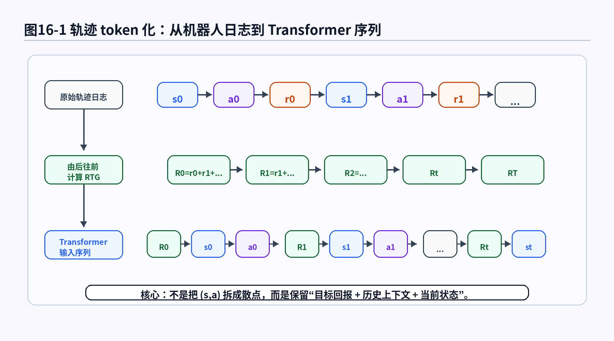
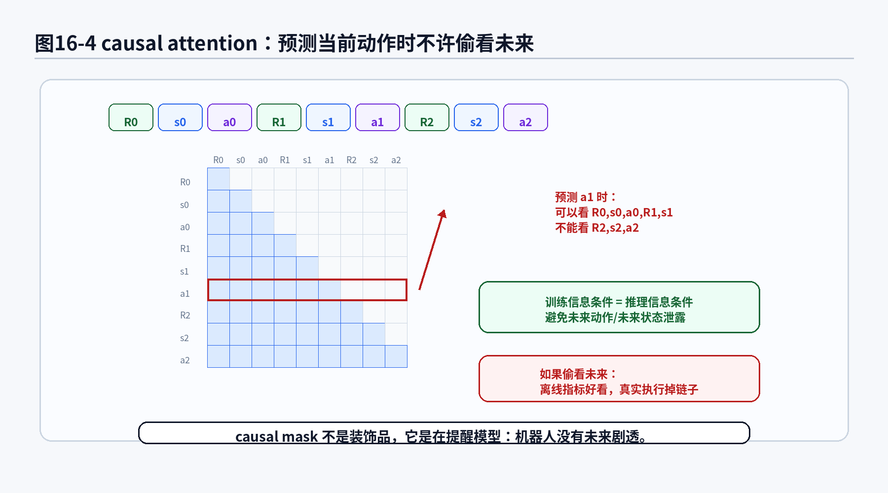
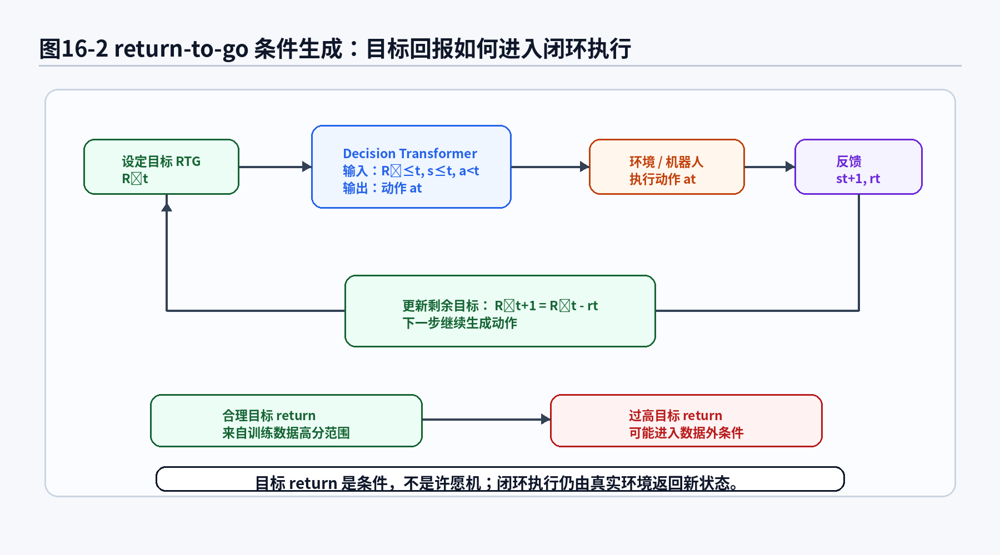
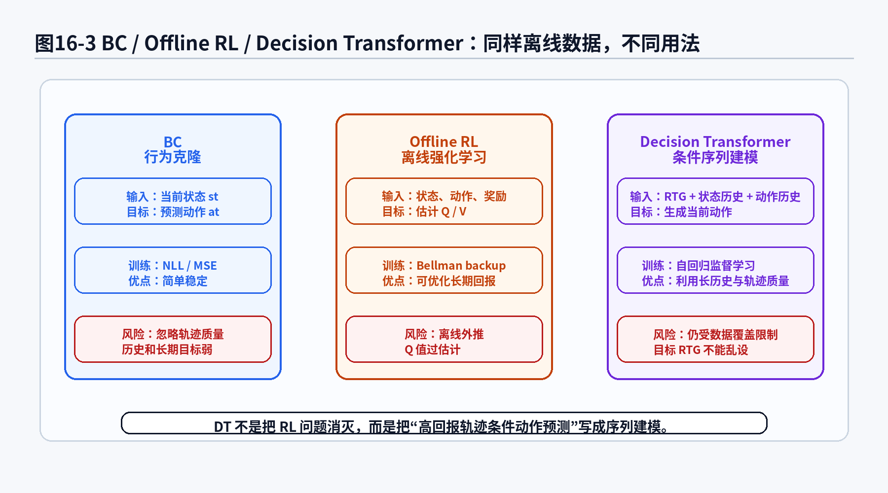

# 第16章 Decision Transformer：把决策问题伪装成语言建模

> **统一公式编号说明**：本章（或本附录）中的展示公式统一采用按章节编号的方式。章节正文使用“（章号.序号）”，附录使用“（附录字母.序号）”。


> 第15章讲到，离线数据不是一座无限矿山，而是一批有限的旧轨迹。轨迹里录了什么，策略就比较有机会学到什么；轨迹里没录什么，模型就容易在部署时现场发挥。第16章进入 Decision Transformer：它把离线轨迹重新组织成一个序列建模问题，把状态、动作、回报串成 token，然后让 Transformer 像续写文本一样预测下一步动作。听起来很优雅，但请先把香槟放下：机器人不是写小说，动作续写错了，可能真的会撞桌子。

---

## 1. 本章开场：如果机器人也会“续写轨迹”

前面我们讲 BC 时，策略像一个监督学习模型：给它当前观测，它输出当前动作。


given observation，predict action。

这很直接，也很朴素。朴素到有时候像让一个新手司机只看当前仪表盘，然后立刻回答：“现在方向盘打多少？”

到了第15章，我们把视角从单步动作扩大到离线轨迹。轨迹不是一堆散落的

\\((s,a)\\) 样本，而是一段有上下文的过程：

- 任务一开始是什么状态；
- 专家做了哪些动作；
- 中间拿到了多少奖励或进展；
- 后面是否成功；
- 哪些动作是在“快失败时补锅”，哪些动作是在“稳稳推进任务”。

Decision Transformer 的想法可以用一句话概括：

> 不要急着把决策问题写成 Bellman 方程，也不要先学一个 value function；先把轨迹当成序列，让 Transformer 学会“在这个历史和目标回报条件下，下一步动作应该是什么”。

它看起来像把机器人决策问题伪装成语言建模。

语言模型看到前面的词，预测下一个词：

```text
我 今天 想 吃  →  火锅 / 面条 / 饺子
```

Decision Transformer 看到前面的回报、状态、动作，预测下一个动作：

```text
目标回报 R0，状态 s0，动作 a0，目标回报 R1，状态 s1  →  动作 a1
```

区别在于，语言模型写错一个词，最多句子有点怪；机器人动作写错，夹爪可能会优雅地夹住空气，或者更糟，夹住不该夹的东西。

所以本章会分两层讲 Decision Transformer：

第一层，讲清楚它的数学形式：return-to-go、轨迹 token 化、自回归分解、causal attention 和训练目标。

第二层，讲清楚它的工程边界：它不是万能离线强化学习神器，也不是“Transformer 一上，机器人自动悟道”。它更像一个强大的条件序列建模器，能从离线轨迹里学习“什么样的历史和目标，对应什么样的动作”。至于数据里没出现过的世界，它仍然不能凭空发明一套可靠控制策略。

---

## 2. 本章要解决的核心问题

本章围绕以下 20 个问题展开：

1. Decision Transformer 为什么要把决策问题改写成序列建模问题？
2. 它和第15章 Offline Imitation Learning 有什么关系？
3. 什么是 return-to-go？它为什么能作为条件输入？
4. 一条轨迹怎样被 token 化成 Transformer 可以处理的序列？
5. 为什么序列里要交替放入 return、state、action？
6. 条件动作生成公式

<div class="math-block">
\[
P(a_t|s_{\le t},a_{<t},R_{\le t}) \tag{16.1}\]
</div>

到底在说什么？
7. autoregressive factorization 在轨迹建模中是什么意思？
8. causal attention 为什么重要？为什么不能让模型偷看未来动作？
9. Decision Transformer 的训练目标和 BC 有什么相似处？
10. 连续动作下为什么常用 MSE？离散动作下为什么可以用交叉熵？
11. 推理时目标 return-to-go 怎么设置？设置太高会发生什么？
12. Decision Transformer 和 Offline RL 的 Bellman backup 有什么区别？
13. Decision Transformer 和 BC、ACT、Diffusion Policy 的关系是什么？
14. 如果模仿数据没有 reward，能不能用 Decision Transformer？
15. 多任务机器人数据为什么适合用 return 或任务条件组织？
16. 自动驾驶轨迹模仿中，return-to-go 可以怎样定义？
17. 泊车任务中，return 条件和轨迹历史能提供什么信息？
18. Decision Transformer 在工程中可能失败在哪些地方？
19. 为什么说它更像“高回报轨迹条件模仿”，而不是凭空优化策略？
20. 它怎样为后面第17章 Transformer 和第18章 VLA 铺垫？

---


### 主线定位与统一例子

为了让本章不变成孤立知识点，读本章时请始终把公式落回两个统一例子：

- **二维点机器人跟随专家轨迹**：状态可写成位置/速度，动作可写成二维控制量，适合观察状态分布、轨迹分布和误差累积。
- **机械臂末端运动/抓取轨迹模仿**：观测包含图像或本体状态，动作包含末端位姿增量或关节控制量，适合理解连续动作、多模态动作、动作块和实机闭环。

- **承接前文**：承接第15章离线轨迹数据。
- **本章推进**：把决策问题改写为序列建模问题，用 return-to-go 作为条件。
- **铺垫后文**：为第17章更一般地理解 Transformer policy 做准备。
- **公式阅读抓手**：Decision Transformer 不做 Bellman backup，但仍在学习条件动作分布。
- **建议同步回看**：附录 F、H。

## 3. 先不写公式：Decision Transformer 的直觉

我们先把强化学习问题放在一边，只看一批离线轨迹。

假设我们有很多机器人放置工件的数据：

- 有的轨迹很顺利，最终成功，奖励高；
- 有的轨迹中间偏了一下，但专家救回来了，奖励也还不错；
- 有的轨迹一开始就歪，后面越修越糟，奖励低；
- 有的轨迹动作很激进，速度快但风险高；
- 有的轨迹动作保守，速度慢但稳定。

传统 BC 会把这些轨迹拆成很多

\\((s_t,a_t)\\) 对，然后学习：

> 在状态 \\(s_t\\) 下，模仿数据里的动作 \\(a_t\\)。

这样做有一个问题：它不太关心这条轨迹最后好不好，也不太关心同一个状态附近是否有不同质量的动作。

Decision Transformer 会换一种问法：

> 如果我希望接下来得到高回报，并且历史上已经发生了这些状态和动作，那么下一步应该采取什么动作？

这里的“希望接下来得到高回报”，就是 return-to-go 条件。它像一个目标分数，也像一句对模型的要求：

```text
请按“高质量轨迹”的风格继续往下写动作。
```

当然，模型不是因为你喊“高质量”就真的高质量。它只能从数据里学到：在历史轨迹中，哪些状态—动作序列通常会通向高回报。它学的是统计规律，不是被目标 return 召唤出来的许愿精灵。

一个很有用的类比是：

- BC 像做单题选择：给当前状态，选一个动作；
- Decision Transformer 像写续集：给前文、目标分数和当前情节，续写下一步动作；
- Offline RL 像考试前还要学评分规则：通过 reward 和 Bellman backup 估计哪些动作长期更值钱。

Decision Transformer 的优雅之处在于，它避开了很多经典 RL 中让初学者头疼的东西：value function、Q function、Bellman backup、bootstrapping、target network 等。它说：先把轨迹当序列，直接做条件建模。

但它的代价也很明确：

> 既然它主要从离线轨迹中学统计相关性，那么离线数据质量和覆盖范围仍然是它的命门。

第15章讲的数据坑，在第16章不会自动消失，只是换了一件 Transformer 外套。

---

## 4. 数学建模：从一条离线轨迹开始

先定义一条带奖励的轨迹：

<div class="math-block">
\[
\tau
=
(s_0,a_0,r_0,s_1,a_1,r_1,\dots,s_T,a_T,r_T) \tag{16.2}\]
</div>

如果是视觉机器人任务，也可以写成观测形式：

<div class="math-block">
\[
\tau
=
(o_0,a_0,r_0,o_1,a_1,r_1,\dots,o_T,a_T,r_T) \tag{16.3}\]
</div>

为了和前面章节统一，本章大多数地方用 \\(s_t\\) 表示状态；在真实工程中，\\(s_t\\) 经常由图像、机器人关节角、末端位姿、速度、力传感器、语言指令等拼出来。

离线数据集是多条轨迹组成的集合：

<div class="math-block">
\[
\mathcal D
=
\{\tau_i\}_{i=1}^{N} \tag{16.4}\]
</div>

这里和第15章一样，\\(\mathcal D\\) 是固定的历史数据。Decision Transformer 不会在训练中主动去环境里探索；它看到的是数据集里已经发生过的轨迹。

### 公式拆解：带奖励轨迹

公式：

<div class="math-block">
\[
\tau
=
(s_0,a_0,r_0,s_1,a_1,r_1,\dots,s_T,a_T,r_T) \tag{16.5}\]
</div>

它要解决的问题：

把“一个任务执行过程”写成可以输入模型的数学对象。轨迹不只记录状态和动作，还记录每一步的 reward 或任务进展信号。

符号解释：

- \\(\tau\\)：一条轨迹；
- \\(s_t\\)：第 \\(t\\) 时刻状态；
- \\(a_t\\)：第 \\(t\\) 时刻动作；
- \\(r_t\\)：执行动作后得到的即时奖励或任务分数；
- \\(T\\)：轨迹长度；
- \\(\mathcal D\\)：离线轨迹数据集。

直觉理解：

这条式子把机器人一次完整任务执行记录成“流水账”：当时看到什么、做了什么、做完以后任务进展怎么样。

机器人 / 自动驾驶案例：

机械臂抓取中，\\(s_t\\) 可以是图像和关节状态，\\(a_t\\) 可以是末端位姿增量，\\(r_t\\) 可以是是否接近目标、是否成功抓取、是否碰撞。自动驾驶中，\\(s_t\\) 可以是车辆周围环境和自车状态，\\(a_t\\) 可以是方向盘、油门、刹车控制，\\(r_t\\) 可以根据安全、舒适、效率设计。

常见误解：

不要以为所有模仿学习数据天然都有漂亮的 reward。很多遥操作数据只有观测和动作，没有显式奖励。要使用 Decision Transformer，通常需要补充 reward、成功标签、任务质量分数，或者把 return 条件替换成其他任务条件。

---

## 5. return-to-go：不是已经拿到的分，而是还想拿到的分

Decision Transformer 的关键输入之一是 return-to-go，常记为 \\(R_t\\)。

最简单的不折扣形式是：

<div class="math-block">
\[
R_t
=
\sum_{k=t}^{T} r_k \tag{16.6}\]
</div>

它表示从时刻 \\(t\\) 开始，到轨迹结束还能拿到的总奖励。

如果考虑折扣因子 \\(\gamma\\)，可以写成：

<div class="math-block">
\[
R_t^{\gamma}
=
\sum_{k=t}^{T}
\gamma^{k-t}r_k \tag{16.7}\]
</div>

其中 \\(0<\gamma\le 1\\)。\\(\gamma\\) 越小，越看重近处奖励；\\(\gamma\\) 越接近 1，越看重整段未来。

return-to-go 的直觉非常重要。

它不是在问：

> 到目前为止你已经得了多少分？

它是在问：

> 从现在开始，你还希望拿到多少分？

这和机器人执行很像。假设机械臂已经把工件拿起来了，后面还要把工件放进治具。此时 return-to-go 表示“剩下的任务还应该完成到什么质量”。如果目标 return 很高，模型应该更倾向于选择历史数据中通向成功、高质量、少碰撞轨迹的动作。



**图16-1 说明**：
- 原始轨迹包含状态、动作和即时奖励；
- return-to-go 由后往前累加奖励得到，表示“从当前时刻开始还希望获得多少回报”；
- Decision Transformer 不直接把轨迹当散点样本，而是组织成 \\(R_t,s_t,a_t\\) 交替出现的序列；
- 这种组织方式让模型既能看到当前状态，也能看到目标回报和历史动作。

### 公式拆解：return-to-go

公式：

<div class="math-block">
\[
R_t
=
\sum_{k=t}^{T} r_k \tag{16.8}\]
</div>

它要解决的问题：

给模型提供一个“未来目标质量”的条件，让动作预测不只依赖当前状态，还依赖希望完成到什么水平。

符号解释：

- \\(R_t\\)：第 \\(t\\) 时刻的 return-to-go；
- \\(r_k\\)：第 \\(k\\) 步的即时奖励；
- \\(\sum_{k=t}^{T}\\)：从当前时刻一直加到轨迹结束；
- \\(T\\)：轨迹终止时刻。

直觉理解：

\\(R_t\\) 像给模型递的一张小纸条：后面还要拿这么多分，请按这个目标继续做动作。

工程含义：

在机器人放置任务中，高 return 可以对应成功放入、碰撞少、路径平滑、时间短。低 return 可能对应失败、碰撞、超时或动作抖动。模型看到不同 return 条件时，可以学习不同质量轨迹的动作模式。

常见误解：

return-to-go 不是魔法目标。你不能随便给一个远高于训练数据最大回报的 \\(R_t\\)，然后期待模型突然学会数据里从没出现过的超能力。这个做法更像给实习生说“这次项目做到行业第一”，但不给资源、不给经验、不给边界条件。

---

## 6. 轨迹 token 化：把机器人日志排成 Transformer 爱吃的样子

Transformer 本质上擅长处理序列。它不关心你给它的是文字、图像 patch、代码 token，还是机器人状态动作，只要你把数据整理成序列，再配上合适的 embedding，它就可以做条件建模。

Decision Transformer 常用的序列组织方式是：

<div class="math-block">
\[
(R_0,s_0,a_0,R_1,s_1,a_1,\dots,R_T,s_T,a_T) \tag{16.9}\]
</div>

也就是说，每个时间步放三个东西：

1. 当前 return-to-go \\(R_t\\)；
2. 当前状态 \\(s_t\\)；
3. 当前动作 \\(a_t\\)。

在训练时，模型看到前面的 token，预测对应位置的动作。更具体地说，它要学：

<div class="math-block">
\[
p_\theta(a_t|R_{\le t},s_{\le t},a_{<t}) \tag{16.10}\]
</div>

注意动作历史只到 \\(a_{<t}\\)，不包括 \\(a_t\\)。因为 \\(a_t\\) 是要预测的答案，不能在输入里提前泄露。考试时把答案写在题干里，成绩再高也不值得庆祝。

### 公式拆解：轨迹序列化

公式：

<div class="math-block">
\[
x(\tau)
=
(R_0,s_0,a_0,R_1,s_1,a_1,\dots,R_T,s_T,a_T) \tag{16.11}\]
</div>

它要解决的问题：

把强化学习轨迹转成 Transformer 可以处理的 token 序列。

符号解释：

- \\(x(\tau)\\)：由轨迹 \\(\tau\\) 转换得到的序列；
- \\(R_t\\)：第 \\(t\\) 步的目标剩余回报；
- \\(s_t\\)：第 \\(t\\) 步状态；
- \\(a_t\\)：第 \\(t\\) 步动作；
- 三者按时间顺序交替排列。

直觉理解：

原始机器人日志像一张杂乱表格，token 化之后像一句有语法的句子：目标、情境、动作，目标、情境、动作，继续往下写。

工程含义：

在真实项目中，token 化不只是字符串拼接。图像需要视觉编码器，关节状态需要向量投影，语言指令可能需要文本编码器，连续动作也要映射到模型隐藏维度。所谓 token 化，本质是把不同模态变成同一序列空间里的表示。

常见误解：

不要把 token 化理解成“所有东西都必须离散成词表”。Decision Transformer 原始形式中，连续状态和动作通常通过线性层或神经网络投影到 embedding；后续 VLA 中才会更频繁地讨论 action tokenization 和离散动作词表。

---

## 7. 条件动作生成：给定历史、状态和目标，预测下一步动作

现在可以写出本章最核心的条件概率：

<div class="math-block">
\[
p_\theta(a_t|R_{\le t},s_{\le t},a_{<t}) \tag{16.12}\]
</div>

这个式子看起来比 BC 的 \\(\pi_\theta(a_t|s_t)\\) 长很多，但不要慌。它只是把“当前状态”扩展成了“历史上下文 + 目标 return”。

在 BC 中，模型通常学习：

<div class="math-block">
\[
\pi_\theta(a_t|s_t) \tag{16.13}\]
</div>

它的意思是：只看当前状态 \\(s_t\\)，预测动作 \\(a_t\\)。

Decision Transformer 学的是：

<div class="math-block">
\[
p_\theta(a_t|R_{\le t},s_{\le t},a_{<t}) \tag{16.14}\]
</div>

它的意思是：看从过去到现在的 return 条件、状态历史、动作历史，再预测当前动作。

这就像开车时，BC 只问：“现在车在哪？”

Decision Transformer 还会问：

- 之前是怎么开到这里的？
- 当前目标是稳妥到达，还是快速到达？
- 前面几步动作已经修过方向了吗？
- 这条轨迹历史看起来像高质量轨迹，还是已经进入补锅模式？

### 公式拆解：条件动作生成

公式：

<div class="math-block">
\[
p_\theta(a_t|R_{\le t},s_{\le t},a_{<t}) \tag{16.15}\]
</div>

它要解决的问题：

让策略在预测当前动作时，不只依赖当前状态，还依赖历史上下文和目标回报。

符号解释：

- \\(p_\theta\\)：由模型参数 \\(\theta\\) 定义的条件概率分布；
- \\(a_t\\)：当前要预测的动作；
- \\(R_{\le t}\\)：从第 0 步到第 \\(t\\) 步的 return-to-go 条件；
- \\(s_{\le t}\\)：从第 0 步到第 \\(t\\) 步的状态历史；
- \\(a_{<t}\\)：第 \\(t\\) 步之前的动作历史，不包含当前动作；
- 竖线 \\(|\\)：表示“在给定这些条件的情况下”。

直觉理解：

这个式子在说：下一步动作不是孤零零地从当前状态里蹦出来的，而是由目标、历史和当前状态共同决定。

机器人 / 自动驾驶案例：

在机械臂插入任务中，同样的当前末端位姿，前面如果已经发生过接触和微调，下一步动作可能应该更小、更保守；如果前面一路很顺，下一步可以继续推进。在自动驾驶变道中，同样的横向位置，过去几秒的速度、方向盘变化和目标效率会影响当前控制量。

常见误解：

这个条件概率不意味着模型真正理解了 reward 的因果机制。它主要是在数据中学习“高 return 条件 + 历史模式”与动作之间的相关性。相关性足够好时会很有用，相关性离开数据支持区域时就会开始心虚。

---

## 8. 自回归分解：一边看历史，一边生成动作

语言模型经常使用自回归分解：

<div class="math-block">
\[
p(x_1,x_2,\dots,x_n)
=
\prod_{i=1}^{n}p(x_i|x_{<i}) \tag{16.16}\]
</div>

意思是：整个序列的概率，可以拆成每个位置在前文条件下出现的概率乘积。

Decision Transformer 也采用类似思想，只是我们真正关心的是动作序列。可以写成：

<div class="math-block">
\[
p_\theta(a_{0:T}|R_{0:T},s_{0:T})
=
\prod_{t=0}^{T}
p_\theta(a_t|R_{\le t},s_{\le t},a_{<t}) \tag{16.17}\]
</div>

这个公式很重要，因为它把“预测整段动作序列”拆成“逐步预测当前动作”。

### 公式拆解：自回归动作分解

公式：

<div class="math-block">
\[
p_\theta(a_{0:T}|R_{0:T},s_{0:T})
=
\prod_{t=0}^{T}
p_\theta(a_t|R_{\le t},s_{\le t},a_{<t}) \tag{16.18}\]
</div>

它要解决的问题：

把一整段动作序列的条件概率，拆成每个时间步动作的条件概率，方便训练和推理。

符号解释：

- \\(a_{0:T}\\)：从第 0 步到第 \\(T\\) 步的动作序列；
- \\(R_{0:T}\\)：整段 return-to-go 序列；
- \\(s_{0:T}\\)：整段状态序列；
- \\(\prod_{t=0}^{T}\\)：把每个时间步的条件概率相乘；
- \\(a_{<t}\\)：当前时间之前的动作。

直觉理解：

模型不是一次性从空气中掏出整段动作，而是像写句子一样，一步一步往后续写。每一步都依赖前面已经发生的内容。

工程含义：

推理时，机器人每执行一步，环境会返回新的状态，模型再根据更新后的历史预测下一步动作。真实系统中通常还会结合控制频率、动作平滑、安全限幅和 fallback，而不是让 Transformer 裸奔。

常见误解：

自回归分解不等于模型可以长期无限稳定地生成动作。误差仍然会沿时间传播。如果某一步动作让状态进入数据缺口，后面的上下文也会变得陌生，模型可能继续错下去。

---

## 9. causal attention：不许偷看未来答案

Transformer 之所以能处理历史上下文，核心机制之一是 attention。简单说，attention 允许当前位置从其他位置读取信息。

但在决策任务里，当前动作不能依赖未来状态和未来动作。否则训练时模型会偷看答案，推理时却没有这些答案。结果就是：训练报告像学霸，真实执行像临场忘带脑子。

所以 Decision Transformer 需要 causal attention，也就是只能看过去和当前，不能看未来。

可以用一个 mask 表示：

<div class="math-block">
\[
M_{ij}
=
\mathbf 1[j\le i] \tag{16.19}\]
</div>

这里 \\(M_{ij}=1\\) 表示第 \\(i\\) 个 token 可以看到第 \\(j\\) 个 token；\\(M_{ij}=0\\) 表示不允许看。



**图16-4 说明**：
- causal attention 只允许当前位置关注过去和当前 token；
- 预测 \\(a_t\\) 时，可以使用 \\(R_{\le t}\\)、\\(s_{\le t}\\)、\\(a_{<t}\\)，但不能使用未来状态和未来动作；
- 如果训练时偷看未来，离线指标会虚高，推理时会失去这些信息；
- 这也是 Decision Transformer 和普通双向序列编码器的重要差别。

### 公式拆解：causal mask

公式：

<div class="math-block">
\[
M_{ij}
=
\mathbf 1[j\le i] \tag{16.20}\]
</div>

它要解决的问题：

限制 Transformer 在预测当前位置时只能使用过去信息，避免训练时泄露未来答案。

符号解释：

- \\(M_{ij}\\)：attention mask 中第 \\(i\\) 行第 \\(j\\) 列的值；
- \\(i\\)：当前 token 位置；
- \\(j\\)：被关注的 token 位置；
- \\(\mathbf 1[\cdot]\\)：指示函数，条件成立为 1，否则为 0；
- \\(j\le i\\)：表示被关注位置不在未来。

直觉理解：

就像考试时可以看前面的题干和自己已经写过的草稿，但不能翻到标准答案页。causal mask 的工作就是把答案页封住。

工程含义：

机器人部署时只能拿到过去和当前观测，不可能知道未来状态。训练时必须模拟这个信息约束，否则模型学到的是不可部署的作弊规则。

常见误解：

causal attention 不是为了让模型“更像 GPT”而加的形式主义部件，而是为了保证训练和推理的信息条件一致。

---

## 10. Decision Transformer 的训练目标

训练 Decision Transformer 时，我们从离线数据集中采样轨迹片段，把它们转成序列，然后让模型预测真实动作。

如果动作是离散的，可以用负对数似然：

<div class="math-block">
\[
\mathcal L_{\mathrm{DT}}^{\mathrm{NLL}}(\theta)
=
-
\mathbb E_{\tau\sim\mathcal D}
\left[
\sum_{t=0}^{T}
\log
p_\theta(a_t|R_{\le t},s_{\le t},a_{<t})
\right] \tag{16.21}\]
</div>

如果动作是连续的，常见做法是让模型输出动作均值 \\(\hat a_t\\)，然后用 MSE：

<div class="math-block">
\[
\hat a_t
=
f_\theta(R_{\le t},s_{\le t},a_{<t}) \tag{16.22}\]
</div>

<div class="math-block">
\[
\mathcal L_{\mathrm{DT}}^{\mathrm{MSE}}(\theta)
=
\mathbb E_{\tau\sim\mathcal D}
\left[
\sum_{t=0}^{T}
\|a_t-\hat a_t\|_2^2
\right] \tag{16.23}\]
</div>

看到这里，读者可能会有一个熟悉感：这不还是监督学习吗？

没错，Decision Transformer 的训练确实很像监督学习。它的特别之处不在于 loss 变得神秘，而在于输入条件从单个状态变成了“return + 历史轨迹”。

也就是说，它不是在训练时通过 Bellman backup 反复更新 Q 值，而是在离线高低质量轨迹上学习一个条件生成模型。

### 公式拆解：Decision Transformer 的 NLL 目标

公式：

<div class="math-block">
\[
\mathcal L_{\mathrm{DT}}^{\mathrm{NLL}}(\theta)
=
-
\mathbb E_{\tau\sim\mathcal D}
\left[
\sum_{t=0}^{T}
\log
p_\theta(a_t|R_{\le t},s_{\le t},a_{<t})
\right] \tag{16.24}\]
</div>

它要解决的问题：

让模型在给定 return 条件和轨迹历史时，提高数据中真实动作的概率。

符号解释：

- \\(\mathcal L_{\mathrm{DT}}^{\mathrm{NLL}}\\)：Decision Transformer 的负对数似然损失；
- \\(\theta\\)：模型参数；
- \\(\tau\sim\mathcal D\\)：从离线数据集中采样轨迹；
- \\(\sum_{t=0}^{T}\\)：对轨迹中每个时间步求和；
- \\(p_\theta(a_t|R_{\le t},s_{\le t},a_{<t})\\)：模型给真实动作 \\(a_t\\) 分配的概率；
- 前面的负号：把最大化概率转成最小化损失。

直觉理解：

训练时模型不断练习：在这段历史和这个目标回报下，专家当时做了这个动作，请你把这个动作的概率调高。

机器人 / 自动驾驶案例：

在自动驾驶轨迹数据中，模型可以看到过去几秒车辆状态、目标 return 和历史控制量，然后预测当前方向盘或加速度。在机械臂数据中，模型可以看到前面接近物体、夹取、移动的过程，再预测下一步末端增量。

常见误解：

这个损失看起来像 BC，所以有人会说 Decision Transformer 只是“带历史的 BC”。这句话有一部分道理，但不完整。它确实是监督式训练，但 return-to-go 条件和长历史上下文让它可以区分不同质量、不同风格、不同任务进度的轨迹。

### 公式拆解：连续动作 MSE 目标

公式：

<div class="math-block">
\[
\mathcal L_{\mathrm{DT}}^{\mathrm{MSE}}(\theta)
=
\mathbb E_{\tau\sim\mathcal D}
\left[
\sum_{t=0}^{T}
\|a_t-\hat a_t\|_2^2
\right] \tag{16.25}\]
</div>

它要解决的问题：

在连续动作空间中，让模型预测的动作 \\(\hat a_t\\) 尽量接近数据中的真实动作 \\(a_t\\)。

符号解释：

- \\(a_t\\)：数据中的真实动作；
- \\(\hat a_t\\)：模型预测动作；
- \\(\|a_t-\hat a_t\|_2^2\\)：两个动作向量之间的平方误差；
- \\(\mathbb E_{\tau\sim\mathcal D}\\)：对离线轨迹数据求平均。

直觉理解：

在给定历史和目标 return 后，如果模型输出的动作越接近数据中对应动作，loss 越小。

工程含义：

连续控制任务中，MSE 简单稳定，容易训练。但如果同一个上下文下存在多种合理动作，MSE 仍然可能平均掉多模态动作。这个问题第7章、第8章、第11章都讲过，Decision Transformer 并不会自动消除它。

常见误解：

不要因为模型用了 Transformer，就以为 MSE 的多模态平均问题不存在了。输入历史更长、条件更多，确实可能减轻歧义；但如果数据本身存在多峰动作分布，生成式动作头、混合分布或 diffusion action head 仍然可能更合适。

---

## 11. 推理过程：目标 return 不是口号，要一步步扣账

训练完成后，Decision Transformer 推理时通常要指定一个目标 return-to-go，记作 \\(\hat R_0\\)。

然后流程大致是：

1. 给定初始状态 \\(s_0\\) 和目标 return \\(\hat R_0\\)；
2. 模型预测动作 \\(a_0\\)；
3. 环境执行动作，返回下一状态 \\(s_1\\) 和奖励 \\(r_0\\)；
4. 更新剩余目标 return；
5. 把新的 \\(R_1,s_1\\) 和历史动作放进上下文，继续预测 \\(a_1\\)。

不折扣情况下，目标 return 更新为：

<div class="math-block">
\[
\hat R_{t+1}
=
\hat R_t-r_t \tag{16.26}\]
</div>

如果使用折扣 return，则可以写成：

<div class="math-block">
\[
\hat R_{t+1}
=
\frac{\hat R_t-r_t}{\gamma} \tag{16.27}\]
</div>

这一步可以理解成“扣账”。一开始你设定后面还想拿 100 分；第一步拿了 5 分，后面就还剩 95 分要拿。



**图16-2 说明**：
- 推理时需要先设定目标 return-to-go；
- 模型根据目标 return、当前状态和历史动作生成动作；
- 动作执行后，环境返回新状态和即时奖励；
- 剩余 return 会根据实际奖励更新，形成下一步条件；
- 目标 return 设得太高而数据没有支撑时，模型可能进入不可靠区域。

### 公式拆解：推理时的 return 更新

公式：

<div class="math-block">
\[
\hat R_{t+1}
=
\hat R_t-r_t \tag{16.28}\]
</div>

它要解决的问题：

在模型闭环执行过程中，根据已经获得的奖励更新剩余目标回报。

符号解释：

- \\(\hat R_t\\)：第 \\(t\\) 步输入模型的目标剩余回报；
- \\(r_t\\)：执行当前动作后实际获得的奖励；
- \\(\hat R_{t+1}\\)：下一步还希望获得的剩余回报。

直觉理解：

目标回报像任务预算，完成一部分就扣掉一部分。后续动作要围绕剩余目标继续生成。

工程含义：

如果奖励设计稳定，这个更新能让策略根据任务进度调整动作。如果奖励稀疏、延迟或噪声很大，return-to-go 条件就会变得不稳定，模型可能很难理解“还剩多少任务质量要完成”。

常见误解：

目标 return 不是越大越好。目标 return 应该结合训练数据中高质量轨迹的 return 范围设置。设得太低，模型可能学到保守或失败轨迹；设得太高，模型可能被迫在没见过的条件下输出动作。

---

## 12. Decision Transformer 和 BC：亲戚关系很近，但不是同一个人

Decision Transformer 和 BC 的关系可以用一个退化过程理解。

BC 通常是：

<div class="math-block">
\[
\pi_\theta(a_t|s_t) \tag{16.29}\]
</div>

Decision Transformer 是：

<div class="math-block">
\[
p_\theta(a_t|R_{\le t},s_{\le t},a_{<t}) \tag{16.30}\]
</div>

如果我们把历史去掉，把 return 条件去掉，只保留当前状态，那么 Decision Transformer 就退化成类似 BC 的形式：

<div class="math-block">
\[
p_\theta(a_t|R_{\le t},s_{\le t},a_{<t})
\rightarrow
\pi_\theta(a_t|s_t) \tag{16.31}\]
</div>

所以可以说：

> Decision Transformer 是一种更强条件输入下的序列化行为克隆。

但这句话后面要加一个补充：

> 它用 return-to-go 把不同质量的轨迹区分开，用历史上下文减少状态歧义，用 Transformer 建模长序列依赖。

比如同一个机械臂状态 \\(s_t\\)，如果前面历史显示夹爪已经轻微打滑，下一步可能要重新调整姿态；如果前面历史显示抓取稳定，下一步可以直接移动到放置区域。BC 只看 \\(s_t\\)，可能分不清这两种情况；Decision Transformer 看到历史，就有机会分清。

再比如同一个泊车状态，若目标 return 表示“安全、低碰撞风险、高舒适”，模型可能选择更保守的控制；若目标 return 强调效率，模型可能选择更直接的轨迹。但前提是数据中确实存在这些不同质量轨迹，且 return 定义能把它们区分出来。

---

## 13. Decision Transformer 和 Offline RL：不用 Bellman，不代表没有 RL 味道

Offline RL 通常会显式使用 reward，并通过某种形式的 Bellman backup 学习 value 或 Q function。

典型 Q-learning 目标可以写成类似形式：

<div class="math-block">
\[
Q(s_t,a_t)
\approx
r_t+\gamma\max_{a'}Q(s_{t+1},a') \tag{16.32}\]
</div>

这个式子在说：当前动作价值约等于当前奖励加上下一个状态的未来最优价值。

Decision Transformer 不这样做。它不显式学习 \\(Q(s,a)\\)，也不通过 \\(\max_{a'}Q(s',a')\\) 选动作。它学习的是：

<div class="math-block">
\[
p_\theta(a_t|R_{\le t},s_{\le t},a_{<t}) \tag{16.33}\]
</div>

这让它避开了 Offline RL 中一些很难处理的问题，例如离线数据外动作的 Q 值过估计。因为它并不主动对所有可能动作估值，而是主要模仿数据中在某些 return 条件下出现过的动作。

但这也带来另一种限制：

> 它更擅长在数据支持范围内重组和条件生成高质量轨迹，不擅长凭空发现数据中没有展示过的高价值行为。



**图16-3 说明**：
- BC 主要学习当前状态到动作的监督映射；
- Offline RL 显式利用 reward 和 Bellman backup 学习 value / Q，并面临离线外推风险；
- Decision Transformer 将轨迹组织成序列，用 return-to-go 作为条件预测动作；
- 三者都依赖离线数据质量，但使用数据的方式不同。

### 公式拆解：Bellman 目标和 DT 目标的差别

公式一：

<div class="math-block">
\[
Q(s_t,a_t)
\approx
r_t+\gamma\max_{a'}Q(s_{t+1},a') \tag{16.34}\]
</div>

公式二：

<div class="math-block">
\[
p_\theta(a_t|R_{\le t},s_{\le t},a_{<t}) \tag{16.35}\]
</div>

它们要解决的问题：

Bellman 目标试图估计某个动作长期有多好；Decision Transformer 目标试图在给定目标回报和历史时预测数据中对应的动作。

符号解释：

- \\(Q(s_t,a_t)\\)：状态—动作价值；
- \\(r_t\\)：即时奖励；
- \\(\gamma\\)：折扣因子；
- \\(\max_{a'}Q(s_{t+1},a')\\)：下一状态下最佳动作的估计价值；
- \\(p_\theta(a_t|\cdot)\\)：Decision Transformer 的条件动作分布。

直觉理解：

Offline RL 像在问：“这个动作长期值多少钱？” Decision Transformer 更像在问：“在想拿到这个回报的历史轨迹里，下一步通常怎么做？”

工程含义：

如果 reward 可靠且需要超越数据中的行为，Offline RL 思路可能更直接；如果离线轨迹质量差异明显、希望用强序列模型从轨迹中学习高质量行为，Decision Transformer 很自然。但如果高质量行为在数据中根本没出现过，DT 也很难造出来。

常见误解：

不要把“没有 Bellman backup”理解成“没有长期决策问题”。长期性仍然存在，只是被编码进 return-to-go 和历史序列建模中。

---

## 14. return 条件到底在学什么：目标、风格，还是数据标签？

return-to-go 常被描述成目标条件。这个说法有用，但需要仔细拆开。

在理想情况下，\\(R_t\\) 表示从当前时刻起还能获得的未来回报。模型看到高 \\(R_t\\)，就学习高回报轨迹中的动作模式。

但在工程中，return 还可能承担三种角色。

第一，它是任务目标。

比如移动机器人导航中，高 return 对应更快到达目标且少碰撞。输入高 return，就像告诉模型：请按“成功且高效”的方式行动。

第二，它是轨迹质量标签。

在遥操作数据中，专家水平不同、操作风格不同、任务难度不同。return 可以把好轨迹和差轨迹区分开。模型并不是理解“成功”这个哲学概念，而是看到：高 return 样本里的动作统计模式和低 return 样本不一样。

第三，它有时只是一个粗糙条件。

如果 reward 设计很随意，或者成功才给 1、失败给 0，那么很多中间步骤的 \\(R_t\\) 信息会非常稀疏。模型可能只能学到“成功轨迹”和“失败轨迹”的大致区别，而学不到精细控制策略。

所以使用 Decision Transformer 前，一定要问：

> 这个 return 到底表达了什么？它真的能区分我关心的行为质量吗？

如果 return 只是在数据表里凑出来的数字，模型就会很认真地学习一堆不认真设计的信号。机器学习模型有一个朴素品质：你给它什么垃圾标签，它就努力把垃圾拟合得很漂亮。

---

## 15. 如果模仿数据没有 reward，怎么办？

很多模仿学习数据没有 \\(r_t\\)。遥操作采集时，数据里通常只有：

<div class="math-block">
\[
(o_t,a_t) \tag{16.36}\]
</div>

或者：

<div class="math-block">
\[
(o_t,q_t,a_t) \tag{16.37}\]
</div>

其中 \\(q_t\\) 是机器人关节状态、末端位姿等。没有 reward，就没有直接的 return-to-go。

这时有几种处理方式。

第一种，人工定义 reward。

例如抓取任务中：接近物体给小奖励，成功抓起给大奖励，碰撞给负奖励。这样可以从已有轨迹重新计算 \\(r_t\\) 和 \\(R_t\\)。

第二种，使用成功标签或质量分数。

如果每条轨迹有成功 / 失败标签，可以把整条成功轨迹赋予较高 return，把失败轨迹赋予较低 return。这样比较粗糙，但能让模型区分轨迹质量。

第三种，把 return 替换成任务条件。

如果任务是语言条件或目标条件，例如“把红色方块放到蓝色盒子里”，可以用任务 embedding、目标图像、目标位姿等代替 return。这样就更接近后续 VLA 的条件策略学习。

第四种，干脆不用 return，退化成历史条件 BC。

也就是说，模型学习：

<div class="math-block">
\[
p_\theta(a_t|s_{\le t},a_{<t}) \tag{16.38}\]
</div>

这仍然可以利用 Transformer 建模历史，但少了 return-to-go 对轨迹质量的条件控制。

工程建议是：不要为了使用 Decision Transformer 而强行制造一个没有意义的 return。return 如果不表达任务质量，模型就会把错误信号当正经老师。

---

## 16. 算法流程：从离线数据到策略执行

Decision Transformer 的训练流程可以概括为以下几步。

第一步，整理离线轨迹数据。

每条轨迹至少要有状态和动作。如果使用 return-to-go，还需要 reward 或轨迹质量分数。

第二步，计算 return-to-go。

从轨迹末尾往前累加奖励，得到每个时间步的 \\(R_t\\)。

第三步，构造上下文窗口。

由于 Transformer 上下文长度有限，通常不会把整条轨迹都输入模型，而是截取长度为 \\(K\\) 的片段：

<div class="math-block">
\[
(R_{t-K+1},s_{t-K+1},a_{t-K+1},\dots,R_t,s_t,a_t) \tag{16.39}\]
</div>

训练时模型在这个窗口内预测动作。

第四步，编码不同类型 token。

状态、动作、return 可能维度不同，需要分别映射到统一的 hidden dimension。

第五步，使用 causal Transformer 建模序列。

模型只能看过去和当前，不看未来。

第六步，计算动作预测损失。

离散动作使用交叉熵，连续动作使用 MSE 或概率分布 NLL。

第七步，推理时指定目标 return。

模型根据目标 return、当前状态和历史动作滚动预测动作，并在执行后更新剩余 return。

---

## 17. Python 风格伪代码

下面给出一个简化伪代码，帮助读者理解数据如何进入 Decision Transformer。它不是完整可运行工程代码，而是展示核心结构。

```python
# 轨迹数据格式示意
trajectory = {
    "states":  [s0, s1, ..., sT],
    "actions": [a0, a1, ..., aT],
    "rewards": [r0, r1, ..., rT],
}

# 1. 从后往前计算 return-to-go
returns = []
running_return = 0.0
for r in reversed(trajectory["rewards"]):
    running_return = r + running_return
    returns.append(running_return)
returns = list(reversed(returns))

# 2. 截取一个上下文窗口
# tokens: R, s, a, R, s, a, ...
context = []
for t in range(start, end):
    context.append(("return", returns[t]))
    context.append(("state", trajectory["states"][t]))
    context.append(("action", trajectory["actions"][t]))

# 3. 模型输入历史，预测动作
pred_actions = decision_transformer(context)

# 4. 对真实动作计算监督损失
loss = mse_loss(pred_actions, target_actions)
```

推理时的伪代码如下：

```python
target_return = desired_return
history = []
state = env.reset()

for t in range(max_steps):
    history.append(("return", target_return))
    history.append(("state", state))

    action = decision_transformer.predict_next_action(history)
    next_state, reward, done, info = env.step(action)

    history.append(("action", action))
    target_return = target_return - reward
    state = next_state

    if done:
        break
```

这段伪代码揭示一个朴素事实：Decision Transformer 的推理仍然是闭环的。模型输出动作，动作改变环境，环境返回新状态，新状态再进入模型。它不是离线写好一整段动作脚本然后机械执行。真实机器人仍然需要感知、控制、安全约束和异常处理。

---

## 18. 工程案例一：机械臂“抓取 + 放置”的离线轨迹建模

考虑一个机械臂任务：从桌面抓起零件，并放入托盘槽口。

离线数据可能来自人类遥操作。每条轨迹包含：

- 相机图像或物体位姿；
- 机械臂关节角或末端位姿；
- 夹爪开合状态；
- 末端速度或位姿增量；
- 是否成功放入托盘；
- 是否碰撞、卡住、掉落；
- 执行时间。

可以设计 reward：

- 成功放入槽口：大奖励；
- 末端接近目标：小奖励；
- 碰撞或卡住：负奖励；
- 动作过大或抖动：惩罚；
- 超时：惩罚。

然后计算 return-to-go。高 return 轨迹往往代表成功、平滑、少碰撞；低 return 轨迹可能代表失败、卡住或操作犹豫。

Decision Transformer 在这个任务中的潜在优势是：它可以利用历史。

比如某一时刻末端位姿看起来差不多，但历史不同：

- 轨迹 A：刚刚稳定抓取，夹爪没有打滑；
- 轨迹 B：夹爪刚刚发生轻微滑动，专家正在补救；
- 轨迹 C：已经碰到托盘边缘，专家正在小幅调整。

只看当前状态，三者可能很像；看历史，三者差异就明显很多。

但风险也很清楚：

如果数据里几乎没有“托盘变形后如何恢复”的轨迹，模型不会因为叫 Decision Transformer 就学会变形补偿。它最多在高 return 条件下模仿数据中已有的成功放置模式。遇到数据外变形，还是需要感知纠偏、力控、安全停止或人工接管。

---

## 19. 工程案例二：自动驾驶和泊车轨迹模仿

自动驾驶轨迹天然是序列数据。

一个驾驶片段可以包含：

- 自车速度、加速度、航向角；
- 周围车辆、车道线、障碍物；
- 历史方向盘、油门、刹车；
- 规划目标或导航信息；
- 安全、舒适、效率相关 reward。

在 Decision Transformer 视角下，我们可以把一段驾驶轨迹组织为：

<div class="math-block">
\[
(R_0,s_0,a_0,R_1,s_1,a_1,\dots) \tag{16.40}\]
</div>

其中 \\(a_t\\) 可以是低层控制量，也可以是规划轨迹参数，取决于系统定义。

泊车任务也类似。状态可以包括：

- 车辆当前位姿；
- 车位入口线、车位角点；
- 周围障碍物；
- 历史控制量；
- 与目标泊车位的相对位置；
- 是否压线、碰撞、超出可行轨迹范围。

return 可以根据泊车质量定义：

- 成功停入车位得高分；
- 最终姿态误差小得高分；
- 碰撞、压线、急打方向扣分；
- 时间过长或轨迹不舒适扣分。

Decision Transformer 的一个吸引点是：它可以在同一个模型中利用历史轨迹和目标质量条件，学习不同风格的泊车行为。

但工程中要非常谨慎。泊车是安全敏感任务，不能因为模型在离线轨迹上预测得像，就直接让它控制车辆。真实系统还需要：

- 几何可行性检查；
- 动作限幅；
- 碰撞预测；
- 车辆运动学约束；
- 低速控制器；
- fallback 策略；
- 仿真和实车闭环评测。

一句话：Decision Transformer 可以给策略学习提供一种序列建模框架，但不能替代车辆工程里的安全外壳。安全外壳不是论文里的配角，它更像项目上线时真正拿着否决权的人。

---

## 20. 数据格式与训练细节：坑通常藏在表格列名后面

Decision Transformer 看起来是模型方法，但很多坑出在数据处理。

### 20.1 return 归一化

不同任务的 return 数值范围可能差别很大。如果一个任务 return 在 0 到 1，另一个任务 return 在 0 到 10000，模型训练会很难稳定。通常需要对 return 做归一化或缩放。

### 20.2 context length

上下文窗口 \\(K\\) 太短，模型看不到足够历史；\\(K\\) 太长，计算成本增加，也可能引入无关信息。

机械臂精细操作可能需要较短但高频的历史；自动驾驶场景可能需要几秒级历史；双臂操作可能需要更复杂的多模态历史。

### 20.3 状态编码

如果状态是低维向量，线性层就能处理；如果状态包含图像，需要视觉 encoder。图像 encoder 的质量直接影响后续策略。不要指望 Transformer 在输入表示很烂的情况下自动变成视觉专家。

### 20.4 动作尺度

连续动作要注意归一化。末端位姿增量、关节速度、夹爪开合命令如果量纲差异很大，MSE 会偏向数值范围大的维度。

### 20.5 轨迹切片

训练时常把长轨迹切成短窗口。切片方式会影响模型看到的上下文。如果总是在成功轨迹中间切片，模型可能缺少任务开始和失败恢复的上下文。

### 20.6 目标 return 采样

推理时目标 return 怎么设，是一个实际问题。常见做法是选择训练集中高分轨迹的 return 范围，而不是随便设一个天文数字。给模型一个没见过的 return，就像让导航去一个地图上不存在的城市。

---

## 21. 方法边界与工程风险

Decision Transformer 的方法边界必须讲清楚。

### 21.1 它依赖离线数据覆盖

第15章讲过 support mismatch。Decision Transformer 没有打破这个限制。高 return 条件只能引导模型在数据中学到高 return 行为模式，不能补齐数据从未覆盖的状态—动作区域。

### 21.2 它依赖 reward 或质量信号

return-to-go 是核心条件。如果 reward 设计混乱，模型就会学习混乱目标。很多机器人任务的 reward 不是天然存在的，而是工程师设计出来的。这个设计过程本身就可能引入偏差。

### 21.3 它不显式学习 dynamics

Decision Transformer 预测动作，但环境状态转移仍由真实世界决定。模型可以利用历史相关性，却不一定理解动力学约束。机械臂碰撞、轮胎打滑、工件变形、传感器延迟，这些问题不会因为序列建模而自动消失。

### 21.4 它可能对目标 return 过敏

目标 return 设得不同，行为可能差异很大。如果部署时 return 设置不当，策略可能表现不稳定。工程中需要通过验证集、仿真和闭环测试确定安全的 return 范围。

### 21.5 它仍然可能有多模态动作问题

长历史和 return 条件可以减少歧义，但不能保证动作分布单峰。如果同一上下文下仍然有多种合理动作，MSE 可能输出平均动作。对于精细操作，平均动作有时不是折中，而是事故的中间路线。

### 21.6 它不替代控制器

模型输出动作只是策略层结果。真实机器人还需要低层控制、轨迹插值、限速、限力、碰撞检测和异常处理。不要让 Transformer 直接接管所有工程责任，否则它迟早会把你带到需求评审会上接受灵魂拷问。

---

## 22. 常见误区

### 误区一：Decision Transformer 是强化学习的终结者

不是。它是把离线决策问题转成序列建模的一条路线，避开了部分 RL 训练难点，但没有消灭长期决策、数据覆盖、reward 设计和闭环安全问题。

### 误区二：有了目标 return，就能要求模型达到任意目标

不能。目标 return 只能在训练数据支持范围内发挥作用。超出数据范围，模型可能输出看似自信但没有可靠依据的动作。

### 误区三：Transformer 能自动理解机器人动力学

Transformer 可以建模序列相关性，但这不等于它显式掌握动力学方程。真实物理约束仍然需要数据、结构、控制器和安全机制共同支撑。

### 误区四：Decision Transformer 只适合有 reward 的 RL 数据

原始形式依赖 return-to-go，但在模仿学习场景中，可以用质量分数、成功标签、任务条件或目标条件扩展思路。只是这时要清楚：你输入的条件到底表示什么。

### 误区五：开环预测好，就说明闭环策略好

这句话第6章、第15章已经反复敲黑板。Decision Transformer 仍然需要闭环评测。open-loop action error 低，只说明它在离线数据上预测像；closed-loop success rate 才能说明它执行稳不稳。

### 误区六：它一定比 BC 好

不一定。如果任务很简单、状态充分、数据干净、历史不重要，普通 BC 可能更简单、更稳定、更省算力。Decision Transformer 的优势主要出现在长历史、多任务、轨迹质量差异明显、需要条件控制的场景。

---

## 23. 核心公式拆解总表

### 23.1 带奖励轨迹

<div class="math-block">
\[
\tau
=
(s_0,a_0,r_0,s_1,a_1,r_1,\dots,s_T,a_T,r_T) \tag{16.41}\]
</div>

含义：一条任务执行记录，包含状态、动作和即时奖励。

### 23.2 离线轨迹数据集

<div class="math-block">
\[
\mathcal D
=
\{\tau_i\}_{i=1}^{N} \tag{16.42}\]
</div>

含义：训练时使用的固定历史轨迹集合。

### 23.3 不折扣 return-to-go

<div class="math-block">
\[
R_t
=
\sum_{k=t}^{T}r_k \tag{16.43}\]
</div>

含义：从当前时刻到轨迹结束还能获得的总奖励。

### 23.4 折扣 return-to-go

<div class="math-block">
\[
R_t^\gamma
=
\sum_{k=t}^{T}\gamma^{k-t}r_k \tag{16.44}\]
</div>

含义：带折扣的未来回报，更强调近处奖励。

### 23.5 轨迹 token 化

<div class="math-block">
\[
x(\tau)
=
(R_0,s_0,a_0,R_1,s_1,a_1,\dots,R_T,s_T,a_T) \tag{16.45}\]
</div>

含义：把轨迹组织成 Transformer 可以处理的序列。

### 23.6 条件动作生成

<div class="math-block">
\[
p_\theta(a_t|R_{\le t},s_{\le t},a_{<t}) \tag{16.46}\]
</div>

含义：给定目标 return、状态历史和动作历史，预测当前动作。

### 23.7 自回归动作分解

<div class="math-block">
\[
p_\theta(a_{0:T}|R_{0:T},s_{0:T})
=
\prod_{t=0}^{T}
p_\theta(a_t|R_{\le t},s_{\le t},a_{<t}) \tag{16.47}\]
</div>

含义：整段动作序列概率可以拆成逐步动作预测。

### 23.8 causal mask

<div class="math-block">
\[
M_{ij}
=
\mathbf 1[j\le i] \tag{16.48}\]
</div>

含义：当前位置只能看过去和当前 token，不能看未来。

### 23.9 NLL 训练目标

<div class="math-block">
\[
\mathcal L_{\mathrm{DT}}^{\mathrm{NLL}}(\theta)
=
-
\mathbb E_{\tau\sim\mathcal D}
\left[
\sum_{t=0}^{T}
\log
p_\theta(a_t|R_{\le t},s_{\le t},a_{<t})
\right] \tag{16.49}\]
</div>

含义：提高模型给真实动作分配的概率。

### 23.10 连续动作 MSE 目标

<div class="math-block">
\[
\mathcal L_{\mathrm{DT}}^{\mathrm{MSE}}(\theta)
=
\mathbb E_{\tau\sim\mathcal D}
\left[
\sum_{t=0}^{T}
\|a_t-\hat a_t\|_2^2
\right] \tag{16.50}\]
</div>

含义：让预测动作接近数据中的真实连续动作。

### 23.11 推理时 return 更新

<div class="math-block">
\[
\hat R_{t+1}
=
\hat R_t-r_t \tag{16.51}\]
</div>

含义：根据已经获得的奖励扣减剩余目标回报。

### 23.12 折扣情况下的 return 更新

<div class="math-block">
\[
\hat R_{t+1}
=
\frac{\hat R_t-r_t}{\gamma} \tag{16.52}\]
</div>

含义：在折扣 return 定义下更新下一步目标回报。

### 23.13 BC 退化形式

<div class="math-block">
\[
p_\theta(a_t|R_{\le t},s_{\le t},a_{<t})
\rightarrow
\pi_\theta(a_t|s_t) \tag{16.53}\]
</div>

含义：去掉 return 和历史上下文后，形式上退化为普通 BC。

### 23.14 Bellman backup 对比

<div class="math-block">
\[
Q(s_t,a_t)
\approx
r_t+\gamma\max_{a'}Q(s_{t+1},a') \tag{16.54}\]
</div>

含义：Offline RL 常通过价值递推估计动作长期价值，而 DT 不显式使用这种 backup。

---

## 24. 本章公式索引

1. \\(\tau=(s_0,a_0,r_0,s_1,a_1,r_1,\dots,s_T,a_T,r_T)\\)
2. \\(\tau=(o_0,a_0,r_0,o_1,a_1,r_1,\dots,o_T,a_T,r_T)\\)
3. \\(\mathcal D=\{\tau_i\}_{i=1}^{N}\\)
4. \\(R_t=\sum_{k=t}^{T}r_k\\)
5. \\(R_t^\gamma=\sum_{k=t}^{T}\gamma^{k-t}r_k\\)
6. \\(x(\tau)=(R_0,s_0,a_0,R_1,s_1,a_1,\dots,R_T,s_T,a_T)\\)
7. \\(p_\theta(a_t|R_{\le t},s_{\le t},a_{<t})\\)
8. \\(p(x_1,x_2,\dots,x_n)=\prod_{i=1}^{n}p(x_i|x_{<i})\\)
9. \\(p_\theta(a_{0:T}|R_{0:T},s_{0:T})=\prod_{t=0}^{T}p_\theta(a_t|R_{\le t},s_{\le t},a_{<t})\\)
10. \\(M_{ij}=\mathbf 1[j\le i]\\)
11. \\(\mathcal L_{\mathrm{DT}}^{\mathrm{NLL}}(\theta)=-\mathbb E_{\tau\sim\mathcal D}[\sum_t\log p_\theta(a_t|R_{\le t},s_{\le t},a_{<t})]\\)
12. \\(\hat a_t=f_\theta(R_{\le t},s_{\le t},a_{<t})\\)
13. \\(\mathcal L_{\mathrm{DT}}^{\mathrm{MSE}}(\theta)=\mathbb E_{\tau\sim\mathcal D}[\sum_t\|a_t-\hat a_t\|_2^2]\\)
14. \\(\hat R_{t+1}=\hat R_t-r_t\\)
15. \\(\hat R_{t+1}=(\hat R_t-r_t)/\gamma\\)
16. \\(p_\theta(a_t|R_{\le t},s_{\le t},a_{<t})\rightarrow\pi_\theta(a_t|s_t)\\)
17. \\(Q(s_t,a_t)\approx r_t+\gamma\max_{a'}Q(s_{t+1},a')\\)

---

## 25. 建议阅读的附录条目

本章建议配合以下附录阅读：

1. **附录 F：强化学习与序列决策基础**
   用于复习 trajectory、reward、return、折扣因子、rollout、policy 和 Bellman backup 的基础概念。

2. **附录 B：概率论最小生存包**
   用于理解条件概率 \\(p(a_t|R_{\le t},s_{\le t},a_{<t})\\)、期望 \\(\mathbb E\\) 和从数据集采样轨迹是什么意思。

3. **附录 H：实验与代码基础**
   用于理解序列数据格式、轨迹切片、训练循环、open-loop evaluation 和 closed-loop rollout。

4. **附录 C：最大似然、负对数似然、交叉熵与 KL 散度**
   用于复习 NLL 训练目标，以及离散动作下交叉熵损失的来源。

5. **附录 D：高斯分布、MSE 与连续动作回归**
   用于理解连续动作预测中 MSE 和高斯负对数似然之间的关系。

6. **附录 A：数学符号与公式阅读方法**
   用于复习 \\(\le t\\)、\\(<t\\)、\\(\prod\\)、\\(\sum\\)、条件概率和指示函数等符号读法。

---

## 26. 本章核心概念回顾

1. **Decision Transformer**：把离线决策问题改写成条件序列建模问题。
2. **return-to-go**：从当前时刻到轨迹结束还能获得的未来回报。
3. **目标 return**：推理时给模型的期望剩余回报条件，不是万能许愿指令。
4. **轨迹 token 化**：把 \\(R_t,s_t,a_t\\) 交替排列成 Transformer 输入序列。
5. **条件动作生成**：根据 return、状态历史和动作历史预测当前动作。
6. **自回归分解**：把整段动作序列概率拆成逐步条件概率。
7. **causal attention**：限制模型只能看过去和当前，不能偷看未来。
8. **NLL 训练目标**：离散动作下提高真实动作概率。
9. **MSE 训练目标**：连续动作下让预测动作接近真实动作。
10. **推理 return 更新**：执行动作后根据实际奖励扣减剩余 return。
11. **和 BC 的关系**：可以看作带 return 和历史上下文的序列化 BC。
12. **和 Offline RL 的关系**：利用离线 reward 和 return，但不显式做 Bellman backup。
13. **reward 质量问题**：return 条件是否有用，取决于 reward 或质量分数是否表达真实任务目标。
14. **数据覆盖限制**：DT 不能凭空补齐离线数据没有覆盖的状态和动作。
15. **多模态动作问题**：Transformer 和长历史能缓解部分歧义，但 MSE 仍可能平均掉多种合理动作。
16. **工程部署边界**：仍需控制器、安全外壳、闭环评测和失败回流。
17. **面向 VLA 的铺垫**：把状态、动作、目标组织成序列，是后续视觉—语言—动作模型的重要基础。

---

## 27. 思考题

1. 请用自己的话解释：为什么 Decision Transformer 可以被看作“把决策问题伪装成语言建模”？

2. return-to-go \\(R_t\\) 和已经累计获得的 return 有什么区别？为什么 DT 使用的是前者？

3. 给定奖励序列 \\([1,0,2,3]\\)，请计算不折扣情况下每个时间步的 return-to-go。

4. 如果使用折扣因子 \\(\gamma=0.9\\)，return-to-go 的含义会发生什么变化？

5. 为什么轨迹序列常组织为 \\((R_0,s_0,a_0,R_1,s_1,a_1,\dots)\\)，而不是只组织为 \\((s_0,a_0,s_1,a_1,\dots)\\)？

6. 请解释 \\(p_\theta(a_t|R_{\le t},s_{\le t},a_{<t})\\) 中每一项的含义。

7. 为什么条件中是 \\(a_{<t}\\)，而不是 \\(a_{\le t}\\)？如果把 \\(a_t\\) 放进输入会发生什么？

8. causal attention 在 Decision Transformer 中解决什么问题？它和训练—推理一致性有什么关系？

9. Decision Transformer 的 NLL 目标和第2章 BC 的 NLL 目标有哪些相似点和不同点？

10. 连续动作下使用 MSE 会带来哪些优点和风险？请联系第7章的多模态动作问题回答。

11. 推理时目标 return 设得太高可能导致什么问题？请结合第15章 support mismatch 解释。

12. 为什么说 Decision Transformer 没有 Bellman backup，但仍然和 RL 有关系？

13. 请比较 BC、Decision Transformer 和 Offline RL 在“如何使用离线数据”上的差异。

14. 如果一个机器人遥操作数据集没有 reward，你会如何构造可用于 Decision Transformer 的条件信号？

15. 对机械臂“抓取 + 精准摆入治具”任务，设计 5 个可以影响 reward 的因素。

16. 对泊车任务，return 可以包含哪些安全、舒适和效率指标？

17. 为什么 Decision Transformer 不等于真实世界 dynamics model？

18. 如果图像 encoder 表示质量很差，Decision Transformer 是否能靠序列建模弥补？为什么？

19. 请设计一个 DT 策略上线前的评测清单，至少包含 open-loop、仿真闭环、真实低速测试、安全回退四类内容。

20. 第16章如何为第17章“Transformer 在机器人策略中的作用”做铺垫？

---

## 28. 本章配图清单

1. **图16-1 轨迹 token 化图**
   展示原始轨迹、return-to-go 计算和 \\(R_t,s_t,a_t\\) token 序列之间的关系。

2. **图16-2 return-to-go 条件生成图**
   展示推理时目标 return、状态历史、模型动作生成、环境反馈和 return 更新之间的闭环。

3. **图16-3 Decision Transformer 与 BC / Offline RL 对比**
   对比 BC、Offline RL 和 DT 在输入、训练目标、优势和风险上的差异。

4. **图16-4 causal attention 在轨迹建模中的作用图**
   展示 causal mask 如何限制模型只能看过去和当前，避免未来信息泄露。

---

## 29. 下一章预告：Transformer 在机器人策略中的作用

第16章讲了 Decision Transformer：它把轨迹改写成序列，把 return-to-go 当成条件，把动作预测变成类似语言建模的任务。

这自然引出一个更大的问题：

> Transformer 到底为什么适合机器人策略？

是因为它真的懂物理吗？不是。

是因为它天然会控制机械臂吗？也不是。

更准确地说，Transformer 是一个强大的条件建模器。它擅长把长历史、多模态输入、任务条件和动作输出放在统一序列框架下处理。Decision Transformer 是这个思想在离线决策上的早期代表，后面的机器人基础模型、VLA、OpenVLA、Octo、π0 等路线，会把这个思想进一步扩展到视觉、语言和动作。

但下一章仍然会保持本书一贯的冷静态度：

> Transformer 不是魔法棒。它能扩大条件建模能力，但不能自动解决数据、控制、安全和真实物理交互问题。

第17章我们就来拆这根“超大号条件建模器”：它到底解决了什么，又把哪些问题原封不动地留给了工程师。
