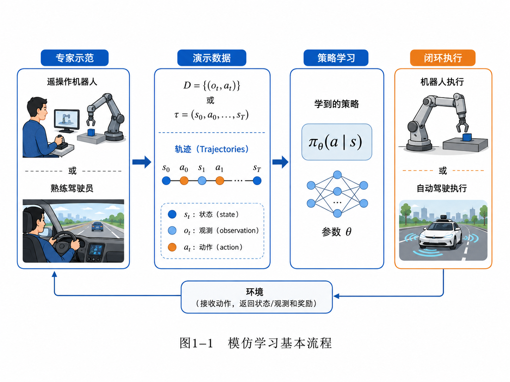

# 第1章 模仿学习到底在模仿什么？（更新版）

> **统一公式编号说明**：本章（或本附录）中的展示公式统一采用按章节编号的方式。章节正文使用“（章号.序号）”，附录使用“（附录字母.序号）”。


> **本章一句话导读**：
> 机器人做模仿学习，不是在背动作答案，而是在学习一个“看到什么，就该怎么做”的决策规律。说得更学术一点：它学的不是一张动作表，而是一个策略函数。
>
> **新版更新说明**：
> 本章按照 v2.0 总控文档更新：补充公式拆解、符号解释、公式索引和附录阅读建议。由于本章属于全书概念起步章，公式不会很多，但每个基础符号都要讲清楚，避免后面讲 BC、DAgger、CVAE、Diffusion Policy 时突然“数学空降”。

---

## 1. 本章开场：机器人不是看一遍就能“悟道”

很多人第一次听到“模仿学习”这个词，脑海里都会自动播放一种很美好的画面：

- 老师傅示范一次抓杯子；
- 机器人认真看完；
- 然后它点点头，露出“我悟了”的表情；
- 接着稳稳地把杯子抓起来，动作丝滑得像广告片。

现实通常没有这么浪漫。

更常见的情况是：

- 人类示范抓杯子；
- 机器人学到一点点规律；
- 真执行时，夹爪偏了 2 厘米；
- 接着它一脸自信地夹住了空气。

这并不是因为机器人不努力，而是因为 **模仿学习学的东西，比“抄答案”复杂得多**。

人类示范给它的，不只是一个动作，而是一整套“在什么情况下该做什么”的对应关系。你可以把它理解成一种决策经验：

> 看到杯子在左边，就把手往左伸；
> 看到车头偏右，就稍微往左修方向；
> 看到车位入口快对不齐了，就早点修正，不要等到最后一把再抢救现场。

所以，本章要回答一个看似简单、其实很关键的问题：

> **模仿学习到底在模仿什么？**

---

## 2. 本章要解决的核心问题

本章主要解决 5 个问题：

1. 模仿学习中的“示范数据”到底长什么样？
2. 什么是状态（state）、观测（observation）、动作（action）和轨迹（trajectory）？
3. 机器人学到的是单个动作、整条轨迹，还是更抽象的策略？
4. 为什么说模仿学习的核心对象是策略 \\(\pi_\theta(a\mid s)\\)？
5. 为什么“死记硬背动作表”不是模仿学习真正想要的能力？

---


### 主线定位与统一例子

为了让本章不变成孤立知识点，读本章时请始终把公式落回两个统一例子：

- **二维点机器人跟随专家轨迹**：状态可写成位置/速度，动作可写成二维控制量，适合观察状态分布、轨迹分布和误差累积。
- **机械臂末端运动/抓取轨迹模仿**：观测包含图像或本体状态，动作包含末端位姿增量或关节控制量，适合理解连续动作、多模态动作、动作块和实机闭环。

- **承接前文**：全书起点：从“专家演示”进入模仿学习问题定义。
- **本章推进**：把状态/观测/动作/轨迹/策略这些对象先摆到桌面上，避免后文公式变成空中楼阁。
- **铺垫后文**：为第2章把模仿学习写成监督学习与最大似然问题做准备。
- **公式阅读抓手**：看见 D、tau、s、o、a、pi_theta 时，先问它是数据、轨迹、状态、观测、动作还是策略。
- **建议同步回看**：附录 A、B、F。

## 3. 先从直觉说起：模仿学习像什么？

如果用最朴素的话来讲，模仿学习就是：

> **给机器人看一批专家示范，让它学会在相似情境下做出相似决策。**

这里有三个关键词：

- **专家**：会做这件事的人或系统；
- **示范**：专家在任务中的行为记录；
- **学习**：从这些记录里总结出一个决策规律。

比如：

### 3.1 机械臂抓取场景

你用遥操作设备控制机械臂抓取一个杯子。你的每一步动作——手柄怎么动、夹爪什么时候闭合、机械臂怎么靠近目标——都可以被记录下来。

### 3.2 自动驾驶场景

熟练驾驶员在道路上行驶。摄像头看到路面，车辆状态在变化，驾驶员不断打方向、踩油门、踩刹车。这些也能构成示范数据。

### 3.3 泊车场景

老司机倒车入库时，不是在背诵“第一步打一圈半，第二步回半圈”这种死板口诀，而是在根据当前画面和车身位置实时调整动作。模仿学习想学的，正是这种 **条件化决策能力**。

也就是说：

> 模仿学习不是“复制一个动作”，而是“学习一种做决策的方式”。

---

## 4. 模仿学习的基本流程

从工程角度看，一个最基本的模仿学习系统，通常包含四步：

1. **专家示范**：由人类或已有系统完成任务；
2. **记录数据**：保存观测、状态、动作等信息；
3. **策略学习**：训练一个模型，从输入映射到动作；
4. **闭环执行**：让机器人或自动驾驶系统自己运行。

下面这张图把这个过程画出来了。



**图1-1 说明**：

- 左边是专家示范，专家可以是遥操作机械臂的人，也可以是熟练驾驶员；
- 中间是演示数据 \\(D\\) 或轨迹 \\(\tau\\)；
- 再后面是策略学习，学出一个参数化策略；
- 右边是闭环执行，也就是学到的策略自己去控制机器人或车辆。

这个流程看着很顺，但里面其实藏着后续全书的大坑：

- 记录什么数据才够？
- 学的是动作还是策略？
- 训练时看到的是专家数据，执行时看到的是自己制造出来的新状态，这会不会出问题？

别急，后面章节会逐个拆雷。本章先把最基础的对象讲清楚。

---

## 5. 什么是示范数据？

### 5.1 最简单的数据形式：观测—动作对

在很多模仿学习任务里，最直接的数据形式是：

<div class="math-block">
\[
D = \{(o_t, a_t)\}_{t=1}^{N} \tag{1.1}\]
</div>

### 公式拆解：\\(D = \{(o_t, a_t)\}_{t=1}^{N}\\)

**这个公式要解决什么问题？**

它想回答：“专家示范数据到底怎么表示？”
在机器学习里，我们不能只说“我有很多示范”，我们要把示范变成可以训练模型的数据结构。

**符号解释**

- \\(D\\)：demonstration dataset，专家示范数据集；
- \\(o_t\\)：第 \\(t\\) 个时刻的观测，通常来自传感器；
- \\(a_t\\)：专家在观测 \\(o_t\\) 下采取的动作；
- \\((o_t,a_t)\\)：一个训练样本，意思是“看到 \\(o_t\\)，专家做了 \\(a_t\\)”；
- \\(N\\)：样本数量；
- \\(\{ \cdot \}_{t=1}^{N}\\)：从第 1 个样本到第 \\(N\\) 个样本组成的集合。

**直觉理解**

这就像整理老师傅的操作录像时，把每一帧都整理成一条记录：

```text
这时看到了什么 → 老师傅做了什么
```

它的风格非常像监督学习：

```text
输入 x → 标签 y
```

只不过在模仿学习里，输入变成了观测 \\(o_t\\)，标签变成了专家动作 \\(a_t\\)。

**工程含义**

在机械臂抓取中：

- \\(o_t\\) 可能是相机图像、深度图、关节状态；
- \\(a_t\\) 可能是机械臂末端位姿增量、关节速度、夹爪开合命令。

在自动驾驶中：

- \\(o_t\\) 可能是前视摄像头图像、车速、历史轨迹；
- \\(a_t\\) 可能是方向盘角度、油门、刹车。

**常见误解**

不要把 \\(D\\) 理解成“完美覆盖所有情况的秘籍大全”。
它只是专家在有限场景里留下的数据。真实执行时，机器人可能会遇到数据里从没出现过的情况。这正是后面分布偏移问题的源头。

---

### 5.2 更完整的数据形式：轨迹

如果我们不只是关心单个时刻，而是关心整个执行过程，就会把数据写成轨迹：

<div class="math-block">
\[
\tau = (s_0, a_0, s_1, a_1, \dots, s_T) \tag{1.2}\]
</div>

### 公式拆解：\\(\tau = (s_0, a_0, s_1, a_1, \dots, s_T)\\)

**这个公式要解决什么问题？**

它想表示一次完整任务执行过程。
单个 \\((o_t,a_t)\\) 像一张照片，轨迹 \\(\tau\\) 像一段视频。

**符号解释**

- \\(\tau\\)：trajectory，轨迹；
- \\(s_t\\)：第 \\(t\\) 个时刻的状态；
- \\(a_t\\)：第 \\(t\\) 个时刻采取的动作；
- \\(T\\)：轨迹终止时刻；
- \\((s_0,a_0,s_1,a_1,\dots,s_T)\\)：状态和动作交替出现的一整段执行过程。

**直觉理解**

如果一条机械臂抓取轨迹是一次“剧情回放”，那么：

- \\(s_0\\)：机械臂还没动，杯子在桌上；
- \\(a_0\\)：机械臂开始靠近；
- \\(s_1\\)：机械臂位置变了；
- \\(a_1\\)：继续调整末端；
- 最后 \\(s_T\\)：杯子被成功抓起，或者机器人优雅地夹住空气。

**工程含义**

轨迹提醒我们：机器人任务不是一次性判断，而是一连串相互影响的决策。
当前动作会改变未来状态，未来状态又会影响后续动作。

这也是为什么模仿学习不能只按普通监督学习理解。普通图像分类错一张图，最多是一条样本错了；机器人控制错一步，后面可能整条轨迹都开始跑偏。

**常见误解**

不要把轨迹理解成“固定动作脚本”。
模仿学习最终要学的是策略，而不是把某条轨迹照抄一遍。轨迹是训练材料，不是最终产品。

---

## 6. 状态、观测、动作：三兄弟长得像，但千万别认错

很多初学者一开始最容易混淆的，就是状态、观测和动作。它们确实关系很近，但职责完全不同。

### 6.1 状态 \\(s_t\\)：世界真实情况

状态（state）指的是 **环境在某个时刻的真实情况**。

比如在自动驾驶中，状态可能包含：

- 自车位置与姿态；
- 周围车辆的位置和速度；
- 交通灯状态；
- 道路几何；
- 路面附着情况。

在机械臂抓取中，状态可能包含：

- 机械臂各关节角；
- 末端位姿；
- 物体精确位置；
- 物体姿态；
- 接触关系。

**注意**：状态通常是“理论上最完整”的描述，但在现实系统里，往往 **不能被直接完整观测**。

### 6.2 观测 \\(o_t\\)：传感器看到的内容

观测（observation）指的是传感器真正拿到的信息。它是状态的一个“投影”或者“带噪版本”。

例如：

- 摄像头图像；
- 激光雷达点云；
- IMU 测量；
- 编码器读数。

观测不一定完整，也不一定干净。

同样一个杯子，摄像头可能因为反光、遮挡、模糊，看到的是一个“像杯子但也可能像别的东西”的东西。工程上这很常见，学术上这叫现实很不配合。

### 6.3 动作 \\(a_t\\)：系统发出的控制命令

动作（action）是策略最终输出的控制量。

在不同系统里，它可以是：

- 机械臂关节速度；
- 末端执行器位姿增量；
- 夹爪开合命令；
- 方向盘角度；
- 油门和刹车指令。

所以，最朴素的决策过程可以写成：

> 先看到观测 \\(o_t\\)，
> 再根据它做决策，
> 最后输出动作 \\(a_t\\)。

这就是后面要讲的“策略”的基础。

下面这张图，把“时间—观测—状态—动作—轨迹”的关系串起来了。


**图1-2 说明**：

- 顶部是时间轴；
- 每个时刻都有观测 \\(o_t\\)、状态 \\(s_t\\)、动作 \\(a_t\\)；
- 环境会随着动作发生状态转移；
- 一串这样的时刻连起来，就构成轨迹 \\(\tau\\)。

这张图有一个特别重要的信息：

> **机器人做任务，不是做一次判断，而是在一个连续演化的系统里不断观察、决策、执行。**

这也是为什么后面我们会说：模仿学习虽然看起来像监督学习，但本质上活在一个序列决策世界里。

---

## 7. 模仿学习真正学的对象：策略

现在来到本章最关键的一步。

很多人会问：

> 既然示范数据里有动作，那模仿学习学的不就是动作吗？

答案是：**不完全是。**

动作只是结果，真正要学的是“从状态或观测到动作的映射关系”。这个映射关系就叫 **策略（policy）**。

### 7.1 策略的数学形式

最常见的写法是：

<div class="math-block">
\[
\pi_\theta(a\mid s) \tag{1.3}\]
</div>

或者在部分可观测场景里，也常写成：

<div class="math-block">
\[
\pi_\theta(a\mid o) \tag{1.4}\]
</div>

### 公式拆解：\\(\pi_\theta(a\mid s)\\)

**这个公式要解决什么问题？**

它想表示：在当前状态 \\(s\\) 下，机器人应该如何选择动作 \\(a\\)。

**符号解释**

- \\(\pi\\)：policy，策略；
- \\(\theta\\)：策略模型的参数，比如神经网络权重；
- \\(s\\)：状态；
- \\(o\\)：观测；
- \\(a\\)：动作；
- \\(\pi_\theta(a\mid s)\\)：给定状态 \\(s\\) 时，策略选择动作 \\(a\\) 的规则或概率。

**直觉理解**

如果先不谈概率，你可以把策略理解成一个函数：

```text
现在是什么情况 → 现在该做什么
```

如果谈概率，策略就是：

```text
现在是什么情况 → 各个动作分别有多大可能被选中
```

比如车快偏右了，策略可能给“向左轻微修正”较高概率，给“继续向右打方向”较低概率。

**工程含义**

在机器人系统里，策略可能是：

- 一个小型 MLP；
- 一个 CNN + MLP；
- 一个 Transformer；
- 一个 Diffusion Policy；
- 一个 VLA 模型中的动作生成头。

模型形态可以变，但“输入当前情况，输出动作决策”这个核心对象不变。

**常见误解**

\\(\pi_\theta(a\mid s)\\) 不等于“死记一张表”。
真实世界里的状态空间非常大，查表法会被组合爆炸按在地上摩擦。策略真正有价值的地方，是希望它能对没见过但相似的状态做出合理动作。

---

### 7.2 为什么不是学一张动作表？

因为真实世界不会乖乖把每一种情况都提前列好。

想象一下，如果你想用“查表法”解决抓取问题，你需要准备一张表：

- 杯子在左上角怎么办；
- 杯子在右下角怎么办；
- 杯子稍微转了 15 度怎么办；
- 杯子被遮挡一半怎么办；
- 杯子前面还有个勺子怎么办。

这个表会迅速膨胀到比你的人生烦恼还多。

所以真正有用的不是记住每一种情况，而是学会一个泛化规则：

> 遇到新情况，也能根据相似经验做出合适动作。

下面这张图，对“动作、轨迹、策略”的区别做了一个更直观的对比。


**图1-3 说明**：

- **单个动作**：某一时刻的控制命令；
- **轨迹**：一段时间内动作和状态变化的序列；
- **策略**：一个能在多种不同情境下输出动作的决策规律。

所以，虽然模仿学习的训练数据里装的是动作，最终目标却是学出策略。

---

## 8. 一个更完整的视角：模仿学习在学专家行为分布

如果再往数学上走半步，我们可以把模仿学习理解成：

> 让学习到的策略 \\(\pi_\theta\\) 在给定状态下，尽可能像专家策略 \\(\pi_E\\) 那样行动。

其中：

- \\(\pi_E\\)：专家策略（expert policy）；
- \\(\pi_\theta\\)：我们要学习的策略。

理想情况下，我们希望：

<div class="math-block">
\[
\pi_\theta(a\mid s) \approx \pi_E(a\mid s) \tag{1.5}\]
</div>

### 公式拆解：\\(\pi_\theta(a\mid s) \approx \pi_E(a\mid s)\\)

**这个公式要解决什么问题？**

它想表达模仿学习的基本目标：让学习策略尽量像专家策略。

**符号解释**

- \\(\pi_E\\)：专家策略，来自人类专家、已有控制器或高性能系统；
- \\(\pi_\theta\\)：我们训练出来的策略；
- \\(a\mid s\\)：在状态 \\(s\\) 条件下选择动作 \\(a\\)；
- \\(\approx\\)：近似，不是完全相等。

**直觉理解**

这条公式在说：

> 同样看到一个情况，专家倾向于怎么做，模型也应该倾向于怎么做。

它不是说模型要复制专家每一次手抖，而是要学专家行为背后的稳定规律。

**工程含义**

在泊车任务里：

- 专家在车身偏右时会提前修正；
- 模型也应该学到“偏右 → 适当左修”的规律；
- 但模型不应该把某一次示范里的偶然抖动也当成圣旨。

**常见误解**

\\(\approx\\) 不代表数据集上每一帧都要一模一样。
真实系统里，专家动作本身可能有噪声，也可能存在多种合理动作。后面讲概率策略、CVAE、Diffusion Policy 时，我们会专门处理“一个状态不止一个正确动作”的问题。

---

## 9. 工程案例：把抽象概念落回真实任务

### 9.1 案例一：机械臂抓杯子

**任务描述**：
让机械臂从桌上抓起一个蓝色杯子，放到指定区域。

**数据形式**：

- 观测 \\(o_t\\)：相机图像、深度图；
- 状态 \\(s_t\\)：杯子真实位置、机械臂关节状态、末端位姿；
- 动作 \\(a_t\\)：关节角速度或末端位姿增量。

**模仿学习真正学什么**：
不是记住“杯子在这个像素位置时，手往前伸 4.2 厘米”；而是学会：

- 如何从当前视觉输入判断目标位置；
- 如何规划接近方式；
- 什么时候闭合夹爪；
- 抓稳后如何抬起并移动。

### 9.2 案例二：自动驾驶车道保持

**任务描述**：
给定前视摄像头图像和车辆状态，让系统像熟练驾驶员一样维持车辆在车道中心附近行驶。

**数据形式**：

- 观测 \\(o_t\\)：前视图像、车速；
- 状态 \\(s_t\\)：车辆与车道线的真实相对位置、自车姿态；
- 动作 \\(a_t\\)：方向盘角度、纵向控制量。

**模仿学习真正学什么**：
不是学“这帧图像对应这个方向盘角”；而是学“当车头偏左、前方道路弯曲、速度为某值时，该输出怎样的修正动作”。

### 9.3 案例三：泊车入位

一个人类司机倒车入库时，并不是执行一条固定模板轨迹。因为每次：

- 车位位置不同；
- 入口角度不同；
- 初始车身姿态不同；
- 周围障碍物不同。

真正稳定的能力，是一种策略能力：

> **根据当前感知结果，不断调整下一步动作，让整车逐渐逼近成功入位。**

这和自动泊车、感知后处理中的“闭环修正”思想是一脉相承的：静态地图、车辆姿态、观测误差、后续动作，全都耦合在一个连续系统里。

---

## 10. 常见误区

### 误区 1：模仿学习就是监督学习，没什么特别的

只说一半对。

从训练损失看，很多模仿学习方法确实可以写成监督学习；但从问题本质看，它面对的是 **连续交互、状态转移、闭环执行**，这和普通图像分类不是一个世界。

### 误区 2：有了很多动作标签，就等于学会了任务

不对。

你拿到的是很多“在某些时刻做了什么”，但真正要学的是“在不同情境下为什么这么做，以及接下来还应该怎么做”。

### 误区 3：状态和观测差不多，可以混着说

不建议。

在数学上它们往往是不同对象：

- 状态是环境真实情况；
- 观测是传感器拿到的信息。

一开始不区分，后面讲 POMDP、state estimation、belief、sim2real 的时候会越讲越乱。

### 误区 4：模仿学习就是记住专家轨迹

也不对。

记住轨迹只能解决“高度重复”的固定场景，一旦初始条件变一点、物体位置偏一点、相机角度晃一点，纯记忆型方法就容易翻车。

### 误区 5：策略一定是确定性的

不一定。

有些任务里，一个状态下可能有多个合理动作。比如抓杯子可以从左边抓，也可以从右边抓。后面我们会看到：

- 确定性策略；
- 概率策略；
- 多模态动作分布；
- CVAE、Diffusion Policy 等生成式策略。

这些方法的出现，正是因为“一个状态只有一个标准答案”很多时候并不成立。

---

## 11. 本章核心概念回顾

本章最重要的不是公式多，而是把后续全书会反复出现的基本对象摆正。

| 概念 | 符号 | 直觉理解 | 工程例子 |
|---|---|---|---|
| 观测 | \\(o_t\\) | 传感器看到的内容 | 图像、点云、关节读数 |
| 状态 | \\(s_t\\) | 世界真实情况 | 车辆位姿、物体真实位置 |
| 动作 | \\(a_t\\) | 系统输出的控制命令 | 方向盘角、关节速度 |
| 轨迹 | \\(\tau\\) | 一次完整执行过程 | 一次抓取或一次泊车 |
| 策略 | \\(\pi_\theta\\) | 从状态/观测到动作的决策规则 | 神经网络策略、VLA 动作头 |
| 专家策略 | \\(\pi_E\\) | 专家如何行动 | 人类示范、已有控制器 |

---

## 12. 本章公式索引

| 公式 | 位置 | 作用 | 需要掌握到什么程度 |
|---|---|---|---|
| \\(D=\{(o_t,a_t)\}_{t=1}^{N}\\) | 第5节 | 表示专家示范数据集 | 理解每个样本是“观测—动作”对 |
| \\(\tau=(s_0,a_0,s_1,a_1,\dots,s_T)\\) | 第5节 | 表示完整轨迹 | 理解状态与动作按时间交替出现 |
| \\(\pi_\theta(a\mid s)\\) | 第7节 | 表示策略 | 理解它是给定状态下的动作决策规则 |
| \\(\pi_\theta(a\mid o)\\) | 第7节 | 部分可观测场景下的策略 | 理解真实系统常用观测而非完整状态 |
| \\(\pi_\theta(a\mid s)\approx \pi_E(a\mid s)\\) | 第8节 | 表示模仿学习目标 | 理解学习策略要接近专家策略 |

---

## 13. 建议阅读的附录条目

本章涉及的公式还不复杂，但建议读者提前阅读以下附录，为后续章节做准备：

- **附录 A：数学符号与公式阅读方法**
  - A.1 为什么技术书里的公式看起来吓人？
  - A.2 如何阅读一个机器学习公式？
  - A.3 常用符号表

- **附录 B：概率论最小生存包**
  - B.1 什么是随机变量？
  - B.2 什么是概率分布？
  - B.3 条件概率：为什么 \\(\pi(a\mid s)\\) 里有一个竖线？

- **附录 F：强化学习与序列决策基础**
  - F.1 MDP 是什么？
  - F.2 策略是什么？
  - F.3 状态、动作、转移的基本关系

如果你现在暂时不看附录，也不影响阅读本章；但从第2章开始，最大似然、负对数似然、交叉熵、MSE 会陆续登场，概率统计基础就不能再靠“感觉差不多”硬扛了。

---

## 14. 思考题

1. 请用你自己的话解释：状态、观测、动作三者有什么区别？
2. 为什么说模仿学习最终学的是策略，而不是一张“观测—动作表”？
3. 在机械臂抓取任务中，哪些量更适合看成状态？哪些量更适合看成观测？
4. 如果把自动驾驶中的方向盘角度作为动作，那么输入中至少应该包含哪些观测信息？
5. 你能否举一个“单个状态下存在多个合理动作”的机器人例子？这对策略建模意味着什么？
6. 为什么轨迹不是动作表？轨迹和策略的区别是什么？

---

## 15. 本章配图清单

- 图1-1：模仿学习基本流程
- 图1-2：状态、观测、动作与轨迹
- 图1-3：动作、轨迹与策略的区别

---

> **给下一章留个钩子**：
> 现在我们已经知道模仿学习想学的是策略。那下一个自然问题就是：
>
> **如果我直接拿数据集做监督学习，去拟合这个策略，会发生什么？**
>
> 这就是 Behavior Cloning 的故事。它很朴素，也很危险——像极了很多机器学习方法的青春期。
