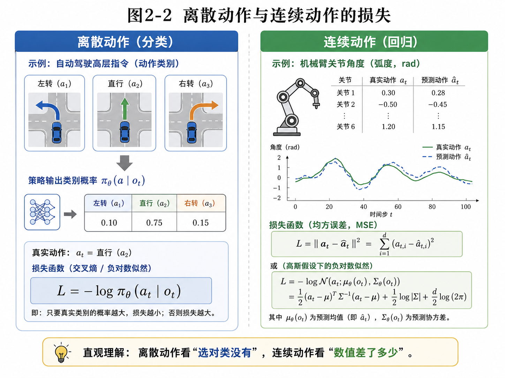
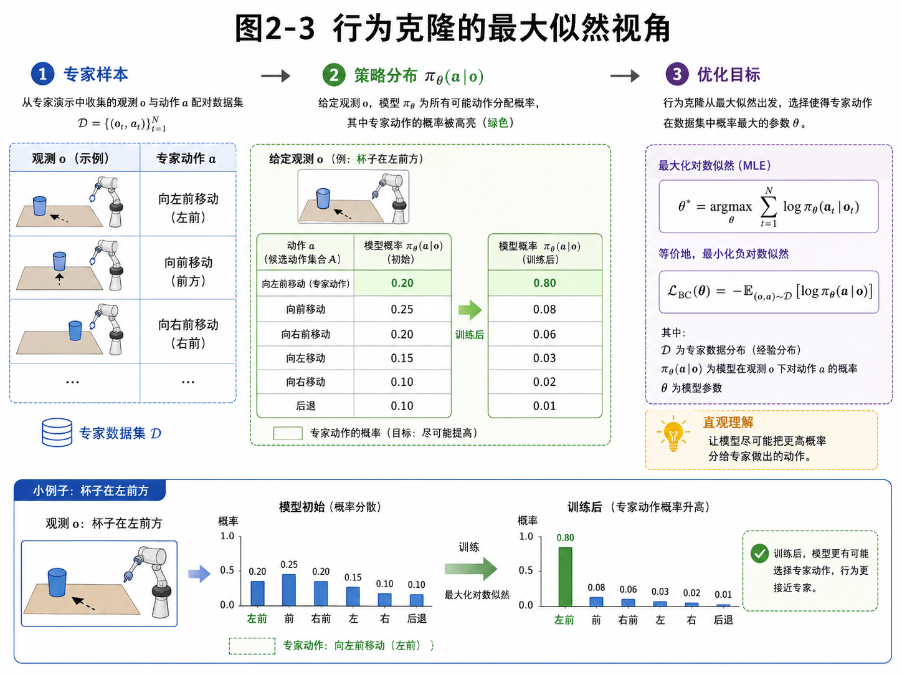

# 第2章 Behavior Cloning：最朴素，也最容易翻车的模仿学习（更新版）

> **统一公式编号说明**：本章（或本附录）中的展示公式统一采用按章节编号的方式。章节正文使用“（章号.序号）”，附录使用“（附录字母.序号）”。


> **本章一句话导读**：
> Behavior Cloning（行为克隆，简称 BC）最迷人的地方在于：它看起来非常朴素——把模仿学习当成监督学习来做；它最危险的地方也在于：它看起来太朴素了，容易让人误以为“这不就是回归或分类吗，还有什么好讲的”。
>
> **新版更新说明**：
> 本章按照 v2.0 总控文档更新：对最大似然、负对数似然、交叉熵、MSE 等公式增加“动机—符号—直觉—工程含义—常见误解”拆解，并在章末增加公式索引和附录阅读建议。

---

## 1. 本章开场：像老师傅学手艺，也像学生刷原题

假设你想让一个机械臂学会抓杯子。

你请来一位熟练操作员，用遥操作设备做了 1000 次示范。每次示范里，你都记录：

- 相机看到了什么；
- 机械臂做了什么动作。

然后你把这些数据喂给一个神经网络，让它学会：

> “看到这样的画面，就输出这样的动作。”

这件事听起来是不是特别自然？

自然到你甚至会觉得：

> “这不就是监督学习吗？输入图像，输出标签。完事。”

恭喜你，已经摸到 Behavior Cloning 的核心了。

Behavior Cloning 的基本思想就是：

> **把专家示范数据看成监督学习数据集，把专家动作看成标签，然后训练一个策略模型去拟合这种从观测到动作的映射。**

它像什么？

- 像学车时跟着老司机练；
- 像实习生看老同事怎么处理工单；
- 也像学生刷老师给的原题。

问题是：

- 原题刷得很好，考试一变形怎么办？
- 演示数据上拟合得很好，闭环执行时会不会出事？

这些问题，本章先不全部展开。我们先把 BC 的数学地基打牢。

---

## 2. 本章要解决的核心问题

本章主要解决 6 个问题：

1. 为什么 Behavior Cloning 可以看成监督学习？
2. BC 的训练数据、输入、输出分别是什么？
3. 离散动作和连续动作下，BC 的损失函数怎么写？
4. 为什么 BC 可以从最大似然估计（MLE）的角度理解？
5. BC 在工程上为什么这么常用？
6. BC 为什么“好用，但不耐打”？

---


### 主线定位与统一例子

为了让本章不变成孤立知识点，读本章时请始终把公式落回两个统一例子：

- **二维点机器人跟随专家轨迹**：状态可写成位置/速度，动作可写成二维控制量，适合观察状态分布、轨迹分布和误差累积。
- **机械臂末端运动/抓取轨迹模仿**：观测包含图像或本体状态，动作包含末端位姿增量或关节控制量，适合理解连续动作、多模态动作、动作块和实机闭环。

- **承接前文**：承接第1章的策略定义，把“模仿专家”落到条件动作分布 pi_theta(a|s) 的拟合上。
- **本章推进**：说明 BC 为什么既是监督学习，也是最大似然估计。
- **铺垫后文**：为第3章解释训练分布与执行分布不一致埋下伏笔。
- **公式阅读抓手**：BC 的核心不是“记动作”，而是在专家访问到的状态上提高专家动作的概率。
- **建议同步回看**：附录 C、D、E。

## 3. 直觉解释：Behavior Cloning 到底在做什么？

Behavior Cloning 的名字很形象：

- **Behavior**：专家的行为；
- **Cloning**：克隆、模仿、照着学。

它不去显式推理“专家为什么这么做”，也不去显式学习奖励函数，更不要求你先有一个复杂的规划器。

它做的事非常直接：

> 把专家的动作当作“正确答案”，让模型在同样输入下尽量输出同样动作。

如果写得更正式一点，给定一个专家示范数据集：

<div class="math-block">
\[
\mathcal{D} = \{(o_t, a_t)\}_{t=1}^{N} \tag{2.1}\]
</div>

其中：

- \\(o_t\\) 是第 \\(t\\) 个样本的观测；
- \\(a_t\\) 是专家在该观测下采取的动作；
- \\(N\\) 是样本总数。

BC 训练一个参数化策略：

<div class="math-block">
\[
\pi_\theta(a \mid o) \tag{2.2}\]
</div>

或者在确定性回归场景里，也可以写成：

<div class="math-block">
\[
\hat{a} = f_\theta(o) \tag{2.3}\]
</div>

意思非常朴素：

- 输入：观测 \\(o\\)；
- 输出：动作 \\(a\\) 或动作分布；
- 目标：让输出尽可能接近专家动作。

下面这张图把“BC = 监督学习”的直觉画出来了。


**图2-1 说明**：

- 左边是专家示范数据集，每条数据本质上都是一个 \\((o_t, a_t)\\) 对；
- 中间是策略模型 \\(\pi_\theta(a\mid o)\\) 或 \\(f_\theta(o)\\)；
- 右边是模型输出的预测动作 \\(\hat a_t\\) 与专家动作 \\(a_t\\) 的对比；
- 底部的损失函数 \\(L(\theta)\\) 衡量两者差距，并通过反向传播更新参数 \\(\theta\\)。

所以，Behavior Cloning 从训练流程上看，几乎就是一个“机器人版监督学习”。

---

## 4. 数学建模：BC 的目标函数从哪来？

### 4.1 监督学习视角

如果我们站在监督学习的视角，BC 的问题非常简单：

> 给你很多输入 \\(o_t\\)，以及对应标签 \\(a_t\\)，请学出一个函数，让预测 \\(\hat a_t\\) 尽量接近 \\(a_t\\)。

这时目标可以概括为：

<div class="math-block">
\[
\theta^* = \arg\min_\theta \sum_{t=1}^{N} \ell\big(f_\theta(o_t), a_t\big) \tag{2.4}\]
</div>

### 公式拆解：监督学习形式的 BC 目标

**这个公式要解决什么问题？**

它想表达：我们要找一组模型参数 \\(\theta\\)，让模型在专家数据上的总错误最小。

**符号解释**

- \\(\theta\\)：模型参数，比如神经网络权重；
- \\(\theta^*\\)：训练完成后希望得到的最优参数；
- \\(\arg\min_\theta\\)：找到让后面目标函数最小的 \\(\theta\\)；
- \\(f_\theta(o_t)\\)：模型在观测 \\(o_t\\) 下预测的动作；
- \\(a_t\\)：专家动作；
- \\(\ell(\cdot,\cdot)\\)：单个样本的损失函数；
- \\(\sum_{t=1}^{N}\\)：把所有样本损失加起来。

**直觉理解**

这就是“全班考试总扣分最少”的思路：每个样本都给模型扣一次分，最后选一个总扣分最少的模型。

**工程含义**

在机械臂场景里，\\(\ell\\) 可能衡量预测关节速度与专家关节速度的差距；
在自动驾驶场景里，\\(\ell\\) 可能衡量预测方向盘角与人类驾驶员方向盘角的差距。

**常见误解**

不要以为 “\\(\arg\min\\)” 是某种高级黑魔法。它只是说：
> 在很多可能的模型参数里，找一个让损失最小的。

---

## 5. 离散动作：把行为克隆当分类问题

有些任务的动作是离散集合，例如：

- 左转 / 直行 / 右转；
- 前进 / 后退 / 停止；
- 抓 / 放 / 松开。

这时策略更自然地表示为条件概率分布：

<div class="math-block">
\[
\pi_\theta(a \mid o) \tag{2.5}\]
</div>

它表示：在观测 \\(o\\) 下，模型认为每个动作的概率是多少。

如果专家真实动作是 \\(a_t\\)，那么最常见的损失就是 **交叉熵损失**，也可以写成 **负对数似然**：

<div class="math-block">
\[
L_t = -\log \pi_\theta(a_t \mid o_t) \tag{2.6}\]
</div>

### 公式拆解：离散动作的负对数似然

**这个公式要解决什么问题？**

它想衡量：模型有没有把高概率分给专家真正采取的动作。

**符号解释**

- \\(L_t\\)：第 \\(t\\) 个样本的损失；
- \\(\log\\)：对数函数；
- \\(\pi_\theta(a_t\mid o_t)\\)：模型在观测 \\(o_t\\) 下，给专家动作 \\(a_t\\) 分配的概率；
- 前面的负号 \\(-\\)：把“概率越大越好”变成“损失越小越好”。

**直觉理解**

假设专家在某个路口选择“直行”。如果模型给“直行”的概率是 0.9，那很好，损失小；如果模型给“直行”的概率只有 0.01，那就相当于模型在说：

> “专家虽然直行了，但我觉得直行几乎不可能。”

这当然要被狠狠扣分。

**为什么要取 \\(\log\\)？**

在概率模型中，多个样本的联合概率通常是连乘：

<div class="math-block">
\[
\prod_{t=1}^{N} \pi_\theta(a_t\mid o_t) \tag{2.7}\]
</div>

连乘容易导致数值非常小，也不方便优化。取对数后，乘法会变成加法：

<div class="math-block">
\[
\log \prod_{t=1}^{N} \pi_\theta(a_t\mid o_t)
=
\sum_{t=1}^{N}\log \pi_\theta(a_t\mid o_t) \tag{2.8}\]
</div>

这不是数学家为了显得优雅，而是工程和优化都更方便。

**工程含义**

在移动机器人中，如果动作集合是：

```text
左转 / 直行 / 右转 / 停止
```

那么 BC 训练时就是希望模型在每个观测下，把专家动作对应的类别概率提高。

**常见误解**

负对数似然不是“玄学损失”。它就是在惩罚模型不给专家动作面子。

---

## 6. 连续动作：把行为克隆当回归问题

在机器人控制里，更常见的其实是连续动作，例如：

- 机械臂各关节角速度；
- 机械臂末端位姿增量；
- 方向盘转角；
- 油门和刹车的连续控制量。

这时最常见的写法是让模型直接预测连续值：

<div class="math-block">
\[
\hat a_t = f_\theta(o_t) \tag{2.9}\]
</div>

然后使用均方误差（MSE）：

<div class="math-block">
\[
L_t = \|a_t - \hat a_t\|^2 \tag{2.10}\]
</div>

如果动作是 \\(d\\) 维向量，则：

<div class="math-block">
\[
L_t = \sum_{i=1}^{d} (a_{t,i} - \hat a_{t,i})^2 \tag{2.11}\]
</div>

### 公式拆解：连续动作的 MSE

**这个公式要解决什么问题？**

它想衡量：模型预测的连续动作数值和专家动作数值差了多少。

**符号解释**

- \\(a_t\\)：专家动作；
- \\(\hat a_t\\)：模型预测动作；
- \\(a_{t,i}\\)：专家动作的第 \\(i\\) 个维度；
- \\(\hat a_{t,i}\\)：预测动作的第 \\(i\\) 个维度；
- \\(d\\)：动作维度；
- \\(\|\cdot\|^2\\)：平方范数，也就是把每个维度差值平方后相加。

**直觉理解**

如果专家方向盘角是 \\(5^\circ\\)，模型预测 \\(6^\circ\\)，问题不大；
如果专家方向盘角是 \\(5^\circ\\)，模型预测 \\(-20^\circ\\)，那就不是“略有偏差”，是准备带全车人去体验绿化带。

**为什么要平方？**

平方有两个常见作用：

1. 正误差和负误差不会互相抵消；
2. 大误差会被更重地惩罚。

比如误差从 1 变成 2，平方误差从 1 变成 4，惩罚不是线性增加，而是更严厉。

**工程含义**

在机械臂中，如果动作是 6 维关节速度，MSE 会逐维比较预测速度和专家速度。
在泊车中，如果动作是方向盘角和纵向加速度，MSE 会衡量模型输出和人类驾驶动作的差距。

**常见误解**

MSE 常用，但不代表它永远合理。
如果同一个状态下存在多个合理动作，比如“从左边抓杯子”和“从右边抓杯子”都可以成功，MSE 可能会把两种动作平均成一个尴尬动作。这个问题会在后面“多模态动作”和 Diffusion Policy 章节重点讨论。

下面这张图，把离散动作和连续动作的 BC 损失放在一起对比。



**图2-2 说明**：

- 左边是离散动作：看模型有没有把真实类别选对，或者至少给真实类别足够高的概率；
- 右边是连续动作：看预测数值与专家数值之间差了多少；
- 所以，离散动作通常对应分类损失，连续动作通常对应回归损失。

---

## 7. 最大似然视角：BC 不只是“拟合”，还是“让专家动作更可能发生”

如果你只从监督学习的角度看 BC，会觉得它不过是：

> 输入观测，输出动作，最小化误差。

这当然没错，但还不够深。

从概率建模视角，Behavior Cloning 其实可以看成：

> **学习一个策略分布，让专家在数据集中做出的动作，变得尽可能“高概率”。**

### 7.1 最大化似然

给定数据集 \\(\mathcal D = \{(o_t, a_t)\}_{t=1}^{N}\\)，我们希望找到参数 \\(\theta\\)，让所有专家动作在对应观测下的联合似然最大：

<div class="math-block">
\[
\theta^* = \arg\max_\theta \prod_{t=1}^{N} \pi_\theta(a_t \mid o_t) \tag{2.12}\]
</div>

### 公式拆解：最大似然目标

**这个公式要解决什么问题？**

它想找一组参数，让数据集中专家实际做出的动作，在模型看来尽可能“合理”或“高概率”。

**符号解释**

- \\(\arg\max_\theta\\)：寻找让目标最大的一组参数；
- \\(\prod_{t=1}^{N}\\)：从第 1 个样本到第 \\(N\\) 个样本做连乘；
- \\(\pi_\theta(a_t\mid o_t)\\)：模型给专家动作的概率。

**直觉理解**

如果模型真的学得像专家，那么专家做出的那些动作，在模型看来就不应该是“小概率事件”。
否则就像一个学生嘴上说“我懂老师了”，但老师每做一步，他都觉得“这一步不太可能”。这就有点离谱。

**常见误解**

这里的“似然”不是“模型预测未来的概率”那么简单，它是问：

> 在当前模型参数下，已经观察到的专家数据有多合理？

---

### 7.2 对数似然：把连乘变成求和

因为连乘不方便优化，我们通常取对数：

<div class="math-block">
\[
\theta^* = \arg\max_\theta \sum_{t=1}^{N} \log \pi_\theta(a_t \mid o_t) \tag{2.13}\]
</div>

### 公式拆解：对数似然

**这个公式要解决什么问题？**

它把很多概率的乘法变成了对数概率的加法，让计算和优化更稳定。

**符号解释**

- \\(\log\\)：对数；
- \\(\sum_{t=1}^{N}\\)：对所有样本求和；
- \\(\log \pi_\theta(a_t\mid o_t)\\)：专家动作概率的对数。

**直觉理解**

概率通常小于 1，很多小于 1 的数连乘会越来越小，最后小到计算机都开始尴尬。
取 \\(\log\\) 后，乘法变加法，数值更稳定，优化也更顺手。

---

### 7.3 负对数似然：把最大化变成最小化

优化时，更常见的写法是等价地最小化负对数似然：

<div class="math-block">
\[
\mathcal L_{\mathrm{BC}}(\theta)
=
-\mathbb E_{(o,a)\sim\mathcal D}
\left[
\log \pi_\theta(a\mid o)
\right] \tag{2.14}\]
</div>

### 公式拆解：BC 的统一损失

**这个公式要解决什么问题？**

它给出了 Behavior Cloning 的统一训练目标：让模型给专家动作更高概率。

**符号解释**

- \\(\mathcal L_{\mathrm{BC}}(\theta)\\)：BC 损失函数；
- \\(\mathbb E_{(o,a)\sim\mathcal D}\\)：从专家数据集 \\(\mathcal D\\) 中抽样，然后求平均；
- \\(\log \pi_\theta(a\mid o)\\)：模型给专家动作的对数概率；
- 前面的负号 \\(-\\)：把“最大化对数概率”改写成“最小化损失”。

**直觉理解**

这条公式在说：

> 从数据集里拿一个样本，看模型给专家动作的概率高不高。高就少扣分，低就多扣分。对所有样本平均，得到整体损失。

**工程含义**

训练神经网络时，我们通常写的是 `loss.backward()`，优化器默认帮你最小化 loss。
所以即使理论上说“最大化似然”，工程实现里也经常写成“最小化负对数似然”。

**常见误解**

不要看到 \\(\mathbb E\\) 就紧张。这里的期望在工程实现中通常就是 mini-batch 平均：

```python
loss = batch_loss.mean()
```

下面这张图专门解释这个最大似然过程。



**图2-3 说明**：

- 左侧是专家样本：同一个观测场景下，专家采取了某个动作；
- 中间是模型在该观测下对多个候选动作分配概率；
- 训练前，概率可能比较分散；训练后，专家动作的概率被明显抬高；
- 右侧公式说明了这一点正是通过最大化对数似然实现的。

---

## 8. 高斯视角：为什么 MSE 可以解释成一种概率假设？

本书强调数学原理，所以这里再往前走一步：MSE 不只是“数值差多少”，它也可以来自概率模型。

假设连续动作满足：

<div class="math-block">
\[
a_t \sim \mathcal N(\mu_\theta(o_t), \sigma^2 I) \tag{2.15}\]
</div>

其中：

- \\(a_t\\)：专家动作；
- \\(\mu_\theta(o_t)\\)：模型预测的动作均值；
- \\(\sigma^2 I\\)：各个动作维度方差相同、互相独立的协方差矩阵；
- \\(\mathcal N\\)：高斯分布。

在这个假设下，最大化专家动作的高斯似然，等价于最小化：

<div class="math-block">
\[
\|a_t-\mu_\theta(o_t)\|^2 \tag{2.16}\]
</div>

### 公式拆解：MSE 背后的高斯假设

**这个公式要解决什么问题？**

它解释为什么连续动作回归经常使用 MSE。
不是因为 MSE 天生神圣，而是因为它隐含了“专家动作围绕模型预测均值呈高斯噪声波动”的假设。

**直觉理解**

模型预测一个动作均值 \\(\mu_\theta(o_t)\\)。
专家动作 \\(a_t\\) 离这个均值越近，说明数据在模型看来越合理；离得越远，说明模型越不像专家。

**工程含义**

当动作噪声比较接近单峰高斯时，MSE 很合适。
但如果动作分布是多峰的，比如同一个杯子可以左抓也可以右抓，MSE 可能会把两个峰平均掉，学出一个“从杯子中间穿过去”的动作。

**常见误解**

MSE 不是连续控制的唯一答案。它背后有单峰、高斯、平均误差这些隐含假设。后面讲概率策略、CVAE、Diffusion Policy，本质上就是在突破这些假设。

---

## 9. 算法流程：Behavior Cloning 怎么训练？

一个最基本的 BC 训练流程如下：

1. 采集专家演示数据；
2. 构造训练集 \\((o_t, a_t)\\)；
3. 选择策略模型 \\(\pi_\theta\\) 或 \\(f_\theta\\)；
4. 定义损失函数（交叉熵、MSE 或负对数似然）；
5. 用梯度下降或其变体优化参数；
6. 在验证集或离线数据上评估；
7. 最后在闭环环境中测试。

### 9.1 Python 风格伪代码

```python
# D = {(o_t, a_t)}
# model = pi_theta or f_theta

for epoch in range(num_epochs):
    for obs, act in dataloader:
        pred = model(obs)

        if action_type == "discrete":
            loss = cross_entropy(pred, act)
        elif action_type == "continuous":
            loss = mse_loss(pred, act)
        else:
            loss = negative_log_likelihood(pred, act)

        optimizer.zero_grad()
        loss.backward()
        optimizer.step()
```

这段伪代码简单到有点不像机器人学习，甚至会让人产生一种危险错觉：

> “这不就是普通深度学习训练脚本吗？”

没错，训练代码层面，确实经常就是这么朴素。真正的复杂性往往不在这 15 行代码里，而在：

- 你收了什么数据；
- 动作怎么定义；
- 观测怎么组织；
- 训练集和部署时分布是否一致；
- 闭环执行时误差如何积累。

---

## 10. 工程实践案例

### 10.1 机械臂抓取

**输入**：相机图像、深度图、关节状态。
**输出**：关节目标、末端位姿增量或夹爪开合命令。

**BC 的好处**：

- 实现路径清晰；
- 对已有遥操作数据很友好；
- 可以快速做出 baseline。

**风险**：

- 相机角度一变、光照一变、目标位置一偏，性能可能明显下降；
- 如果示范里几乎没有失败恢复动作，模型就学不会“救场”。

### 10.2 自动驾驶中的方向盘模仿

**输入**：前视图像、自车速度等。
**输出**：方向盘角度，甚至加减速控制量。

**BC 的好处**：

- 非常适合做第一版行为模型；
- 可以直接利用人类驾驶日志数据。

**风险**：

- 训练时车通常在正常车道中心附近；
- 执行时只要偏一点，后续看到的图像就会变；
- 模型如果没见过这种偏离状态，就容易越修越离谱。

这个风险就是后面第 3 章要展开讲的 **distribution shift**。

### 10.3 泊车轨迹模仿

在泊车任务中，BC 可以把：

- 当前感知结果；
- 车辆姿态；
- 车位相对位置；
- 历史控制量；

映射到下一步动作。

它适合做什么？

- 快速验证端到端策略可不可行；
- 作为更复杂方法的 baseline；
- 在场景相对规整、数据覆盖较好的情况下给出还不错的初始性能。

但如果你希望它在“车位入口有偏差、周围有动态干扰、初始姿态变化大”的情况下还非常稳，那通常就不能只靠最朴素的 BC。

---

## 11. 常见误区

### 误区 1：Behavior Cloning 就是“简单版模仿学习”

它确实朴素，但不等于简单到不用认真理解。

如果你没弄清：

- 动作空间怎么定义；
- 损失函数为什么这么写；
- 最大似然和监督学习的联系；

那后面看到 ACT、Diffusion Policy、Decision Transformer 时，你会感觉像直接从小学数学跳到了积分变换。

### 误区 2：只要训练 loss 很低，策略就一定好

不一定。

低训练 loss 只能说明：

> 你在这批专家数据上拟合得不错。

它并不能自动保证：

- 泛化到新场景；
- 闭环执行稳定；
- 遇到偏差后能恢复。

### 误区 3：MSE 就是“最标准”的连续动作损失

MSE 常用，但不是放之四海而皆准。

如果动作具有多模态特性，或者不确定性很强，简单 MSE 可能会把多个合理动作平均掉。后面讲概率策略、CVAE、Diffusion Policy 时，我们会看到更丰富的建模方式。

### 误区 4：BC 不需要考虑策略分布

其实要看场景。

如果动作是离散的，或者你希望表达不确定性，那么 \\(\pi_\theta(a\mid o)\\) 这种概率分布视角非常重要。它让你从“点预测”升级到“对多个动作的偏好分配”。

### 误区 5：BC 已经过时了

完全不是。

在今天的机器人学习和具身智能里，BC 仍然是：

- 最强 baseline 之一；
- 许多大模型方法的底层起点；
- 很多复杂方法的核心组成部分。

很多所谓“高级方法”，拆开一看，底层仍然带着很浓的 BC 味道，只不过在数据结构、动作表示、时序建模和概率建模上更复杂。

---

## 12. 本章核心概念回顾

| 概念 | 直觉理解 | 数学对象 | 工程意义 |
|---|---|---|---|
| Behavior Cloning | 模仿专家动作 | \\(\pi_\theta(a\mid o)\\) | 最基础的模仿学习 baseline |
| 离散动作 | 从有限动作中选一个 | \\(-\log \pi_\theta(a_t\mid o_t)\\) | 分类损失、交叉熵 |
| 连续动作 | 输出连续控制量 | \\(\|a_t-\hat a_t\|^2\\) | MSE、回归损失 |
| 最大似然 | 让专家动作更可能 | \\(\arg\max_\theta \prod_t \pi_\theta(a_t\mid o_t)\\) | 概率建模视角 |
| 负对数似然 | 把最大化变成最小化 | \\(-\mathbb E[\log \pi_\theta(a\mid o)]\\) | 实际训练 loss |
| 高斯假设 | 动作围绕预测均值波动 | \\(a_t\sim \mathcal N(\mu_\theta(o_t),\sigma^2I)\\) | 解释 MSE 的来源 |

---

## 13. 本章公式索引

| 公式 | 位置 | 作用 | 建议掌握程度 |
|---|---|---|---|
| \\(\mathcal D=\{(o_t,a_t)\}_{t=1}^{N}\\) | 第3节 | 表示 BC 数据集 | 理解专家数据是观测—动作对 |
| \\(\pi_\theta(a\mid o)\\) | 第3节 | 概率策略 | 理解给定观测下动作概率 |
| \\(\hat a=f_\theta(o)\\) | 第3节 | 确定性策略 | 理解直接输出动作值 |
| \\(\theta^*=\arg\min_\theta\sum_t\ell(f_\theta(o_t),a_t)\\) | 第4节 | 监督学习目标 | 理解“最小化总损失” |
| \\(L_t=-\log\pi_\theta(a_t\mid o_t)\\) | 第5节 | 离散动作 NLL | 理解提高专家动作概率 |
| \\(L_t=\|a_t-\hat a_t\|^2\\) | 第6节 | 连续动作 MSE | 理解数值误差度量 |
| \\(L_t=\sum_i(a_{t,i}-\hat a_{t,i})^2\\) | 第6节 | 多维动作 MSE | 理解逐维平方误差 |
| \\(\theta^*=\arg\max_\theta\prod_t\pi_\theta(a_t\mid o_t)\\) | 第7节 | 最大似然 | 理解让专家数据整体更可能 |
| \\(\theta^*=\arg\max_\theta\sum_t\log\pi_\theta(a_t\mid o_t)\\) | 第7节 | 对数似然 | 理解连乘转求和 |
| \\(\mathcal L_{\mathrm{BC}}=-\mathbb E[\log\pi_\theta(a\mid o)]\\) | 第7节 | BC 统一损失 | 理解 NLL 形式 |
| \\(a_t\sim\mathcal N(\mu_\theta(o_t),\sigma^2I)\\) | 第8节 | 高斯动作模型 | 理解 MSE 背后假设 |

---

## 14. 建议阅读的附录条目

本章涉及概率统计和优化基础，建议配合以下附录阅读：

- **附录 A：数学符号与公式阅读方法**
  - A.2 如何阅读一个机器学习公式？
  - A.3 常用符号表

- **附录 B：概率论最小生存包**
  - B.2 什么是概率分布？
  - B.3 条件概率：\\(p(a\mid o)\\) 到底是什么意思？
  - B.5 期望：\\(\mathbb E_{(o,a)\sim\mathcal D}\\) 如何理解？

- **附录 C：最大似然、交叉熵与 KL 散度**
  - C.1 最大似然估计 MLE
  - C.2 负对数似然 NLL
  - C.3 交叉熵与 one-hot 标签
  - C.4 为什么最大似然常写成最小化 loss？

- **附录 D：高斯分布、MSE 与连续动作回归**
  - D.1 一维高斯分布
  - D.2 多维高斯分布
  - D.3 为什么 MSE 可以来自高斯负对数似然？

- **附录 E：优化基础**
  - E.1 什么是损失函数？
  - E.2 什么是梯度？
  - E.3 梯度下降如何更新参数？

---

## 15. 思考题

1. 为什么说 Behavior Cloning 可以看成监督学习？
2. 离散动作和连续动作下，为什么要使用不同形式的损失函数？
3. 请用自己的话解释：最小化负对数似然为什么等价于“提高专家动作的概率”？
4. 在机械臂抓取任务中，你会把动作定义成关节角度、关节速度，还是末端位姿增量？为什么？
5. 训练集 loss 很低，但闭环执行很差，可能有哪些原因？
6. MSE 背后隐含了什么概率假设？这个假设什么时候可能不成立？
7. 为什么说 BC 是很多现代机器人学习方法的底层起点，而不是一个已经过时的方法？

---

## 16. 本章配图清单

- 图2-1：行为克隆可以看成监督学习
- 图2-2：离散动作与连续动作的损失
- 图2-3：行为克隆的最大似然视角

---

> **给下一章留个钩子**：
> 如果 Behavior Cloning 本质上是在专家数据上做监督学习，那么一个自然的问题就是：
>
> **训练时模型看到的是专家访问过的状态，执行时它看到的还是这些状态吗？**
>
> 很遗憾，通常不是。
>
> 这就引出了第3章：**分布偏移——为什么模型会越走越歪。**
