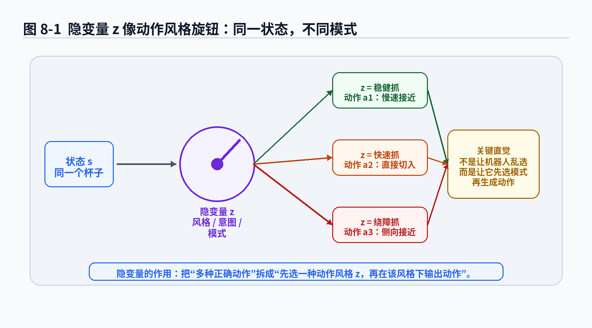
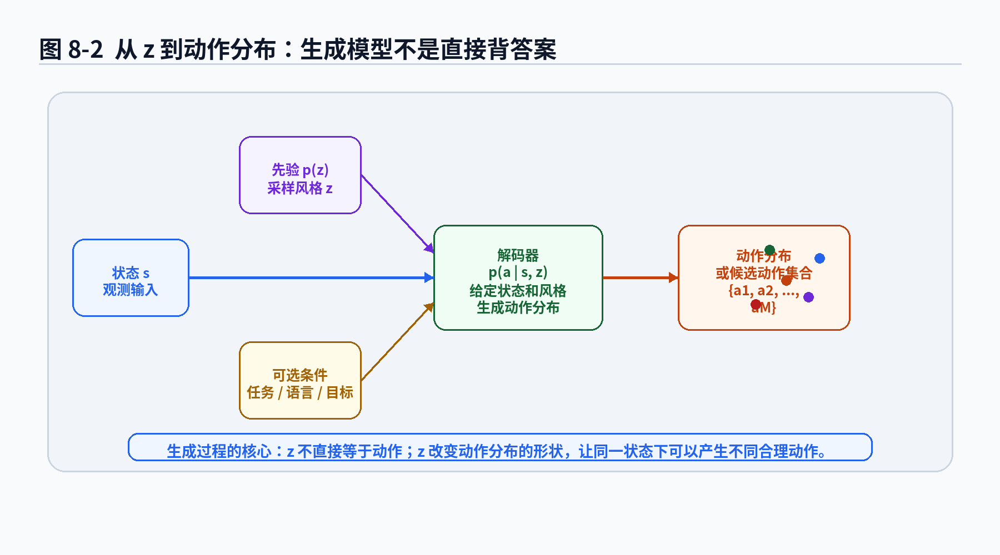
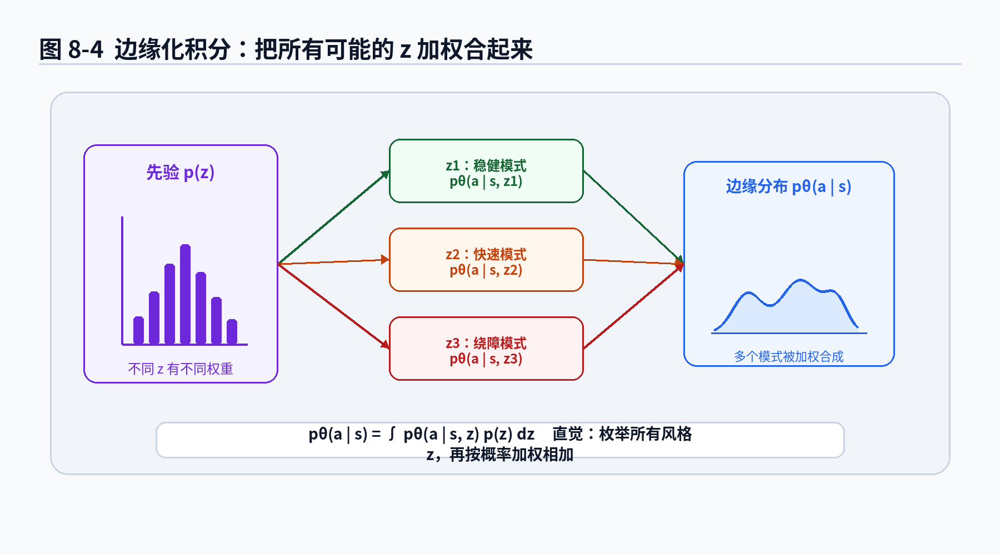
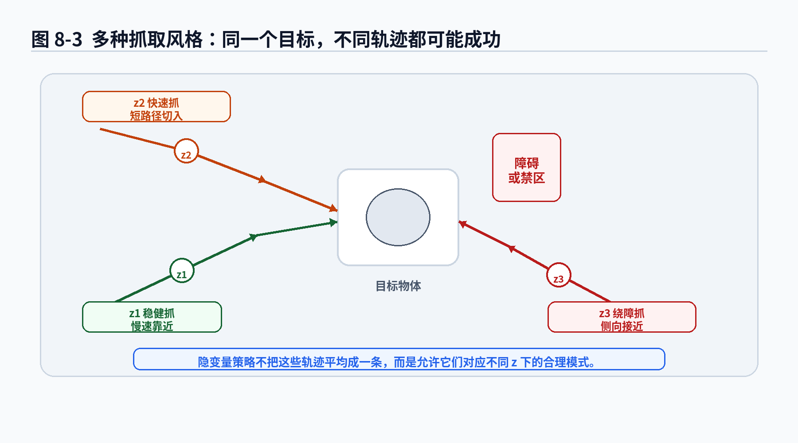

# 第8章 隐变量策略：给机器人一个“动作风格旋钮”

> **统一公式编号说明**：本章（或本附录）中的展示公式统一采用按章节编号的方式。章节正文使用“（章号.序号）”，附录使用“（附录字母.序号）”。


> 本章继续遵守 v2.0 总控文档：公式先讲动机，再拆符号，再讲直觉和工程含义。第 7 章我们已经承认“同一个状态下，正确动作可能不止一个”。本章要进一步问：如果正确动作有多种，能不能给这些动作背后的模式起一个名字？这个名字不一定能被人直接标注出来，它可以藏在模型内部，我们把它叫作隐变量 \\(z\\)。

---

## 1. 本章开场：同一个杯子，为什么有人左抓、有人右抓？

上一章我们讲到一个很容易把机器人坑惨的问题：多模态动作。

同一个杯子，可以左抓，也可以右抓；同一个障碍物，可以左绕，也可以右绕；同一个泊车状态，有人喜欢一把入库，有人喜欢多把修正。它们不一定谁对谁错，而是对应不同的动作模式。

如果我们仍然用一个确定性策略 \\(a=f_\theta(s)\\) 去学这些动作，模型很可能学出一个平均动作。平均动作在考试分数上可能还行，在机器人里经常像一个两边都想讨好、最后谁都没讨好的中间派：左抓和右抓平均一下，夹爪可能正好怼到杯子正中间；左绕和右绕平均一下，移动机器人可能正好向障碍物致敬；激进泊车和保守泊车平均一下，车辆可能变成“看起来很冷静，实际上很迷茫”。

第 7 章给出的一个解决方向是：不要只让策略输出一个动作，而是让它输出动作分布。

但这里还有一个更深的问题：

> 多模态动作到底从哪里来？

很多时候，多模态不是动作空间里凭空长出来的蘑菇，而是因为示教数据背后有不同的“风格、意图、策略模式、任务偏好”。

比如：

- 抓杯子时，专家 A 喜欢从左侧抓，专家 B 喜欢从右侧抓；
- 绕障时，有的人喜欢左绕，有的人喜欢右绕；
- 双臂操作时，有的人先用左手固定再用右手操作，有的人反过来；
- 自动驾驶中，有的专家更保守，有的专家更激进；
- 泊车中，有的司机喜欢大角度一把切入，有的司机喜欢小角度多次修正。

这些差异可以看成一个隐藏在动作背后的变量。我们在数据中通常看不到它的名字，但它确实影响动作。

这个隐藏变量，就是本章的主角：

<div class="math-block">
\[
z \tag{8.1}\]
</div>

你可以先把它理解成一个“动作风格旋钮”。

当 \\(z\\) 指向“稳健抓”，同一个状态下策略生成慢一点、保守一点的动作；当 \\(z\\) 指向“快速抓”，策略生成更直接、更激进的动作；当 \\(z\\) 指向“绕障抓”，策略会绕开某个禁区再接近目标。

这不是让机器人变得玄学，而是给多种合理动作一个数学容器。

---

## 2. 本章要解决的核心问题

本章围绕 8 个问题展开：

1. 什么是隐变量 \\(z\\)？为什么它被称为“隐”的？
2. 为什么多模态动作可以通过隐变量表达？
3. 什么是先验 \\(p(z)\\)？它和“随机选一种风格”有什么关系？
4. 什么是条件生成模型 \\(p_\theta(a\mid s,z)\\)？
5. 为什么最终动作分布要写成边缘化积分：

<div class="math-block">
\[
p_\theta(a\mid s)=\int p_\theta(a\mid s,z)p(z)dz \tag{8.2}\]
</div>

6. posterior \\(p(z\mid s,a)\\) 在直觉上表示什么？为什么训练时它很重要？
7. 隐变量应该每一步重新采样，还是一整段轨迹保持一致？
8. 隐变量策略在工程上有什么风险？

本章你会看到这些公式：

<div class="math-block">
\[
z\sim p(z) \tag{8.3}\]
</div>

<div class="math-block">
\[
a\sim p_\theta(a\mid s,z) \tag{8.4}\]
</div>

<div class="math-block">
\[
p_\theta(a\mid s)=\int p_\theta(a\mid s,z)p(z)dz \tag{8.5}\]
</div>

<div class="math-block">
\[
p_\theta(z\mid s,a)=\frac{p_\theta(a\mid s,z)p(z)}{p_\theta(a\mid s)} \tag{8.6}\]
</div>

<div class="math-block">
\[
\mathcal L(\theta)=-\mathbb E_{(s,a)\sim\mathcal D}\left[\log p_\theta(a\mid s)\right] \tag{8.7}\]
</div>

看起来符号不少，但主线很简单：

> 先让模型在内部选择一种隐藏模式 \\(z\\)，再在这个模式下生成动作 \\(a\\)。如果看不到 \\(z\\)，就把所有可能的 \\(z\\) 加权合起来。

---


### 主线定位与统一例子

为了让本章不变成孤立知识点，读本章时请始终把公式落回两个统一例子：

- **二维点机器人跟随专家轨迹**：状态可写成位置/速度，动作可写成二维控制量，适合观察状态分布、轨迹分布和误差累积。
- **机械臂末端运动/抓取轨迹模仿**：观测包含图像或本体状态，动作包含末端位姿增量或关节控制量，适合理解连续动作、多模态动作、动作块和实机闭环。

- **承接前文**：承接第7章的多模态动作问题。
- **本章推进**：用隐变量 z 表示“未观测到的动作风格/意图/模式”。
- **铺垫后文**：为第9章 CVAE 的 encoder、decoder 与 ELBO 推导做准备。
- **公式阅读抓手**：边缘化 z 不是把动作平均掉，而是把多个潜在模式合成一个动作分布。
- **建议同步回看**：附录 B、G。

## 3. 直觉解释：隐变量不是魔法，是“未被标注的原因”

### 3.1 什么叫“隐”？

“隐变量”这个名字听起来有点像侦探小说里的幕后黑手。其实它的意思很朴素：

> 数据中没有直接给出，但它影响了我们观察到的结果。

在模仿学习里，我们通常看到的是：

<div class="math-block">
\[
(s,a) \tag{8.8}\]
</div>

也就是状态和专家动作。

但专家为什么在这个状态下选择这个动作？数据不一定告诉你。

比如同样是看到桌上的杯子，专家选择左抓。为什么？可能因为：

- 他习惯左侧接近；
- 右侧有障碍物；
- 这次任务要求避开某个区域；
- 上一步动作已经让机械臂更靠左；
- 操作者只是手滑了一点，但结果仍然成功。

这些因素有些能从状态 \\(s\\) 里看出来，有些看不出来，有些甚至是示教者个人习惯。对模型来说，它们都可能表现为一个隐藏变量 \\(z\\)。

### 3.2 隐变量像“风格旋钮”

如果把策略看成一个会做饭的师傅，状态 \\(s\\) 是食材，动作 \\(a\\) 是最后端上来的菜，那么 \\(z\\) 像口味选择：清淡、重辣、少油、快炒、慢炖。

同样的食材，不同口味会做出不同菜。不是哪一个一定错，而是它们来自不同模式。

机器人里也一样：

- \\(z=\text{left-grasp}\\)：从左侧接近目标；
- \\(z=\text{right-grasp}\\)：从右侧接近目标；
- \\(z=\text{slow-safe}\\)：动作慢一点，离障碍物远一点；
- \\(z=\text{fast-direct}\\)：动作快一点，路径短一点；
- \\(z=\text{correction}\\)：当前阶段以修正误差为主。

当然，真实模型里的 \\(z\\) 不一定有这么清楚的人类名字。它可能只是一个向量，比如：

<div class="math-block">
\[
z\in\mathbb R^d \tag{8.9}\]
</div>

模型自己在这个向量空间里组织动作模式。我们希望它学出有用的结构，但不能保证每一维都能翻译成人话。很多 latent space 就像公司内部黑话：大家都在用，但解释起来需要开会。



**图8-1 说明**：
- 同一个状态 \\(s\\) 下，不同隐变量 \\(z\\) 对应不同动作风格；
- \\(z\\) 不是动作本身，而是影响动作生成的隐藏模式；
- 隐变量策略的目标不是把多种动作平均掉，而是保留多种可执行模式。

### 3.3 隐变量为什么比“直接输出多个动作头”更一般？

一种简单做法是让网络输出多个候选动作头：

<div class="math-block">
\[
a^{(1)},a^{(2)},\dots,a^{(K)} \tag{8.10}\]
</div>

这当然有用。比如一个抓取网络输出 10 个抓姿候选，再由评分器选择。

但隐变量模型更一般，因为它不一定只输出固定 \\(K\\) 个模式。\\(z\\) 可以是离散的，也可以是连续的。连续隐变量可以表达风格之间的平滑变化：从很保守到比较保守，从慢速到快速，从左侧接近到斜左接近。

你可以把“多动作头”看成有限几个档位，把连续隐变量看成可旋转的旋钮。

---

## 4. 数学建模：从“一个动作分布”拆成“多个隐藏模式”

### 4.1 没有隐变量时：直接建模动作分布

第 7 章中，我们把概率策略写成：

<div class="math-block">
\[
a\sim \pi_\theta(a\mid s) \tag{8.11}\]
</div>

或者写成生成模型的记号：

<div class="math-block">
\[
a\sim p_\theta(a\mid s) \tag{8.12}\]
</div>

这表示给定状态 \\(s\\)，模型直接给出动作 \\(a\\) 的条件分布。

如果动作分布是单峰的，比如某个状态下专家动作都集中在一个小范围里，这样写就够了。单个高斯策略、多层感知机输出均值和方差，都可以处理。

但如果动作分布有多个峰，比如左抓和右抓，那么直接用一个简单分布表达就容易吃力。

于是我们引入 \\(z\\)。

### 4.2 有隐变量时：先采样风格，再生成动作

隐变量策略的生成过程可以写成两步：

<div class="math-block">
\[
z\sim p(z) \tag{8.13}\]
</div>

<div class="math-block">
\[
a\sim p_\theta(a\mid s,z) \tag{8.14}\]
</div>

这两行公式非常重要。

第一行表示：先从某个先验分布 \\(p(z)\\) 中抽取一个隐藏模式 \\(z\\)。

第二行表示：给定状态 \\(s\\) 和隐藏模式 \\(z\\)，再生成动作 \\(a\\)。

### 公式拆解：\\(z\sim p(z),\;a\sim p_\theta(a\mid s,z)\\)

**1. 这个公式要解决什么问题？**

它要解决“同一个状态下动作可能有多个模式”的问题。我们不再让 \\(s\\) 直接决定全部动作分布，而是在 \\(s\\) 之外增加一个模式变量 \\(z\\)。

如果 \\(s\\) 表示“杯子在桌上”，那么 \\(z\\) 可以控制“从左侧抓”还是“从右侧抓”。

**2. 符号解释**

- \\(z\\)：隐变量，表示动作背后的模式、风格、意图或未观测因素；
- \\(p(z)\\)：先验分布，表示在没有看到具体动作之前，我们认为不同模式出现的概率；
- \\(z\sim p(z)\\)：从先验分布中采样一个模式；
- \\(s\\)：当前状态或观测特征；
- \\(p_\theta(a\mid s,z)\\)：给定状态和隐变量时的动作生成分布；
- \\(a\sim p_\theta(a\mid s,z)\\)：在选定模式 \\(z\\) 下生成动作。

**3. 直觉理解**

这就像做任务前先选一个“策略档位”：

1. 先选风格：稳健抓、快速抓、绕障抓；
2. 再根据当前状态输出具体控制量。

风格决定大方向，状态决定细节。

**4. 机器人 / 自动驾驶案例**

机械臂抓取中，\\(z\\) 可以决定抓取方向；自动驾驶绕障中，\\(z\\) 可以决定左绕还是右绕；泊车中，\\(z\\) 可以决定一把入库还是多把修正。

同一个 \\(s\\) 下，如果选择不同 \\(z\\)，动作分布就会移动到不同区域。

**5. 常见误解**

误解一：\\(z\\) 是人工标注的类别。

不一定。\\(z\\) 可以有人工语义，也可以完全由模型学习。很多 CVAE 或 diffusion 类方法中的 latent 并没有人工标签。

误解二：采样 \\(z\\) 就等于随机乱动。

不是。\\(z\\) 控制的是模式选择，而不是绕过任务约束胡乱生成动作。真正部署时，还可以对采样结果做安全筛选。

误解三：有了 \\(z\\)，多模态问题就自动解决。

也不是。模型可能忽略 \\(z\\)，也可能所有 \\(z\\) 都生成差不多的动作，这叫模式没有被有效利用。高级结构不等于高级结果，工程里最不缺的就是“看起来像论文，跑起来像玄学”的模型。



**图8-2 说明**：
- 隐变量策略通常先从 \\(p(z)\\) 采样模式，再通过 \\(p_\theta(a\mid s,z)\\) 生成动作；
- \\(z\\) 不直接替代状态，状态仍然决定当前任务细节；
- 同一个状态配合不同 \\(z\\)，可以生成多个候选动作。

---

## 5. 先验、后验和边缘分布：三个容易混的概率对象

隐变量一出现，概率符号马上变多。为了不让读者在 \\(p\\) 的海洋里原地溺水，我们先把三个核心对象说清楚：

1. 先验：\\(p(z)\\)；
2. 条件生成分布：\\(p_\theta(a\mid s,z)\\)；
3. 边缘动作分布：\\(p_\theta(a\mid s)\\)。

后面还会出现 posterior：\\(p_\theta(z\mid s,a)\\)。

### 5.1 先验 \\(p(z)\\)：还没看动作时，对风格的默认想法

先验 \\(p(z)\\) 表示：在给定具体动作之前，隐变量 \\(z\\) 可能取什么值。

常见选择包括：

<div class="math-block">
\[
z\sim\mathcal N(0,I) \tag{8.15}\]
</div>

或者离散形式：

<div class="math-block">
\[
p(z=k)=\alpha_k,
\quad k=1,2,\dots,K \tag{8.16}\]
</div>

### 公式拆解：\\(z\sim\mathcal N(0,I)\\)

**1. 这个公式要解决什么问题？**

如果 \\(z\\) 是连续向量，我们需要规定从哪里采样它。最常见的做法是让 \\(z\\) 来自标准高斯分布。

**2. 符号解释**

- \\(z\\)：隐变量向量；
- \\(\mathcal N(0,I)\\)：均值为 0、协方差为单位矩阵的高斯分布；
- \\(0\\)：表示每个维度平均值为 0；
- \\(I\\)：单位矩阵，表示各维度方差为 1，且默认没有相关性。

**3. 直觉理解**

这相当于说：在没有其他信息时，我们从一个规整、好采样、好优化的空间里拿一个随机向量作为风格编码。

它不像人类写的“左抓”“右抓”标签，而是模型内部的风格坐标。

**4. 工程含义**

标准高斯先验有两个好处：

- 采样方便；
- 后续和 CVAE 的 KL 正则很好配合。

但它也有问题：模型是否真的把不同区域的 \\(z\\) 用成不同动作模式，需要训练目标和网络结构共同保证。

**5. 常见误解**

标准高斯先验不代表真实动作风格一定服从高斯。它更多是一种建模选择，是为了让 latent space 可采样、可优化、可正则化。

### 5.2 条件生成分布 \\(p_\theta(a\mid s,z)\\)：选定风格后的动作分布

\\(p_\theta(a\mid s,z)\\) 表示：在状态 \\(s\\) 和隐变量 \\(z\\) 都给定时，动作 \\(a\\) 的概率分布。

如果 \\(z\\) 固定为“左抓模式”，那么这个分布应该主要覆盖左抓动作附近；如果 \\(z\\) 固定为“右抓模式”，分布应该移动到右抓动作附近。

这就是隐变量模型的核心：

> 多模态不是让一个分布硬撑所有峰，而是让不同 \\(z\\) 负责不同模式。

### 5.3 边缘分布 \\(p_\theta(a\mid s)\\)：看不到 z 时的总动作分布

真实训练数据中，我们通常只有 \\((s,a)\\)，没有 \\(z\\)。那模型最终应该如何给动作 \\(a\\) 分配概率？

答案是：把所有可能的 \\(z\\) 都考虑进去。

这就得到本章最重要的公式：

<div class="math-block">
\[
p_\theta(a\mid s)
=
\int p_\theta(a\mid s,z)p(z)dz \tag{8.17}\]
</div>

### 公式拆解：边缘化积分 \\(p_\theta(a\mid s)=\int p_\theta(a\mid s,z)p(z)dz\\)

**1. 这个公式要解决什么问题？**

训练数据里没有告诉我们当前动作来自哪个隐变量 \\(z\\)。我们不能只选一个 \\(z\\) 来解释动作，而要把所有可能的 \\(z\\) 都加权考虑。

这个公式解决的问题是：

> 当隐藏模式不可见时，如何计算给定状态下动作的总概率？

**2. 符号解释**

- \\(p_\theta(a\mid s)\\)：给定状态 \\(s\\) 时，模型认为动作 \\(a\\) 出现的总概率或概率密度；
- \\(p_\theta(a\mid s,z)\\)：在某个隐藏模式 \\(z\\) 下动作 \\(a\\) 的概率；
- \\(p(z)\\)：隐藏模式 \\(z\\) 的先验概率；
- \\(\int \cdot dz\\)：对所有可能的连续 \\(z\\) 做积分，也就是把所有模式的贡献加起来；
- \\(\theta\\)：生成模型参数。

**3. 直觉理解**

假设有三种风格：稳健抓、快速抓、绕障抓。一个动作 \\(a\\) 的总概率，不是只看其中一种风格，而是：

```text
总概率 = 稳健抓解释这个动作的能力 × 稳健抓出现概率
       + 快速抓解释这个动作的能力 × 快速抓出现概率
       + 绕障抓解释这个动作的能力 × 绕障抓出现概率
```

连续 \\(z\\) 的积分，就是把这个“加权求和”推广到无限多种可能风格。

**4. 机器人 / 自动驾驶案例**

在抓取任务中，一个专家动作可能是左抓，也可能是右抓。模型不知道示教者心里选的是哪种风格，所以它把所有风格都试着解释一遍。如果某个 \\(z\\) 下 \\(p_\theta(a\mid s,z)\\) 很高，同时 \\(p(z)\\) 也不低，那么这个 \\(z\\) 就对总概率贡献大。

在自动驾驶绕障中也是一样。左绕动作应该由“左绕模式”的 \\(z\\) 给出高概率，右绕动作应该由“右绕模式”的 \\(z\\) 给出高概率。

**5. 常见误解**

误解一：积分只是数学形式，工程上不重要。

不是。这个积分正是 CVAE、VAE、很多生成模型训练困难的来源。因为它通常算不出来，需要近似。

误解二：边缘化就是把动作平均掉。

不是。边缘化是在概率上把不同模式加权合起来，它可以保留多峰分布；动作平均是把多个动作点揉成一个点。前者是“多种可能性并存”，后者可能是“大家一起变坏”。

误解三：\\(p_\theta(a\mid s)\\) 一定容易计算。

很多隐变量模型中，\\(p_\theta(a\mid s)\\) 需要对 \\(z\\) 积分，这个积分没有闭式解。第 9 章 CVAE 就是在处理这个难题。



**图8-4 说明**：
- 每个 \\(z\\) 对应一个条件动作分布 \\(p_\theta(a\mid s,z)\\)；
- 边缘分布 \\(p_\theta(a\mid s)\\) 是所有 \\(z\\) 的贡献按 \\(p(z)\\) 加权后的结果；
- 边缘化不是把动作坐标取平均，而是把概率分布合成起来，因此可以表达多峰结构。

### 5.4 离散隐变量版本：积分变求和

如果 \\(z\\) 是离散模式，比如 \\(z\in\{1,2,\dots,K\}\\)，那么边缘化积分会变成求和：

<div class="math-block">
\[
p_\theta(a\mid s)
=
\sum_{k=1}^{K}p_\theta(a\mid s,z=k)p(z=k) \tag{8.18}\]
</div>

这个公式和第 7 章的 mixture distribution 非常接近。区别在于，本章更强调 \\(z\\) 是一个隐藏原因或模式变量。

### 公式拆解：离散隐变量的边缘化求和

**1. 这个公式要解决什么问题？**

当隐藏模式只有有限几类时，我们不需要积分，只需要把每一类模式的贡献加起来。

**2. 符号解释**

- \\(K\\)：隐藏模式数量；
- \\(z=k\\)：第 \\(k\\) 个隐藏模式；
- \\(p(z=k)\\)：第 \\(k\\) 个模式出现的概率；
- \\(p_\theta(a\mid s,z=k)\\)：第 \\(k\\) 个模式下动作 \\(a\\) 的概率；
- \\(\sum_{k=1}^{K}\\)：对所有模式求和。

**3. 直觉理解**

如果有 3 个模式，动作总概率就是 3 个模式解释能力的加权和。谁更能解释这个动作，谁贡献更大。

**4. 工程含义**

离散隐变量适合动作模式比较清楚的任务，比如左绕 / 右绕、左手主导 / 右手主导、保守 / 激进。它的好处是可解释性强；坏处是模式数量需要设计，模式边界可能僵硬。

**5. 常见误解**

不要以为离散模式越多越好。模式太多可能导致每个模式数据不足，训练出来像一群都没转正的实习生：每个都懂一点，但没有一个真正可靠。

---

## 6. Posterior：如果已经看到了动作，反推它可能来自哪个 z

前面讲的是生成方向：

<div class="math-block">
\[
z \rightarrow a \tag{8.19}\]
</div>

但训练时，我们看到的是专家动作 \\(a\\)。这时自然会问：

> 这个动作到底可能来自哪个 \\(z\\)？

这个问题对应 posterior：

<div class="math-block">
\[
p_\theta(z\mid s,a) \tag{8.20}\]
</div>

它表示：在已经知道状态 \\(s\\) 和动作 \\(a\\) 的情况下，隐变量 \\(z\\) 的概率分布。

根据贝叶斯公式，可以写成：

<div class="math-block">
\[
p_\theta(z\mid s,a)
=
\frac{p_\theta(a\mid s,z)p(z)}{p_\theta(a\mid s)} \tag{8.21}\]
</div>

### 公式拆解：posterior \\(p_\theta(z\mid s,a)\\)

**1. 这个公式要解决什么问题？**

它要回答：给定一个专家动作，我们应该认为它更像是哪个隐藏模式生成的？

比如看到机械臂从杯子左侧接近，我们会猜它更可能来自“左抓模式”而不是“右抓模式”。

**2. 符号解释**

- \\(p_\theta(z\mid s,a)\\)：给定状态和动作后，隐变量的后验分布；
- \\(p_\theta(a\mid s,z)\\)：某个 \\(z\\) 下生成该动作的概率；
- \\(p(z)\\)：该 \\(z\\) 的先验概率；
- \\(p_\theta(a\mid s)\\)：所有 \\(z\\) 合起来生成该动作的总概率，起归一化作用。

**3. 直觉理解**

posterior 像是在做“反向侦查”：

```text
我已经看到动作了。
这个动作更像哪个风格的人做出来的？
```

如果某个 \\(z\\) 既常见，又能很好解释当前动作，那么它的 posterior 就高。

**4. 机器人 / 自动驾驶案例**

在双臂示教数据中，如果某段动作明显是左手先固定、右手再操作，那么 posterior 应该更偏向“左手固定优先”模式。

在泊车数据中，如果动作序列表现为大角度快速切入，那么 posterior 可能更偏向“激进一把入库”模式。

**5. 常见误解**

posterior 不是人为打标签。它是模型根据概率关系推断出来的隐藏模式分布。

更重要的是，真实模型中这个 posterior 往往很难精确计算。第 9 章 CVAE 会引入 encoder \\(q_\phi(z\mid x,a)\\) 去近似它。这里先埋个伏笔：CVAE 的 encoder 不是装饰品，它就是为了在训练时“根据答案反推隐藏风格”。

---

## 7. 训练目标：最大化专家动作的边缘概率

既然我们希望模型能够解释专家动作，那么自然的训练目标仍然是最大似然：

<div class="math-block">
\[
\theta^*
=
\arg\max_\theta
\sum_{i=1}^{N}
\log p_\theta(a_i\mid s_i) \tag{8.22}\]
</div>

对应的负对数似然损失是：

<div class="math-block">
\[
\mathcal L(\theta)
=
-
\mathbb E_{(s,a)\sim\mathcal D}
\left[
\log p_\theta(a\mid s)
\right] \tag{8.23}\]
</div>

把边缘化公式代进去：

<div class="math-block">
\[
\mathcal L(\theta)
=
-
\mathbb E_{(s,a)\sim\mathcal D}
\left[
\log
\int p_\theta(a\mid s,z)p(z)dz
\right] \tag{8.24}\]
</div>

### 公式拆解：隐变量策略的负对数似然

**1. 这个公式要解决什么问题？**

它要训练一个带隐变量的动作生成模型，让专家动作在模型的边缘动作分布中拥有高概率。

注意，这里不是要求某一个固定 \\(z\\) 解释所有动作，而是允许不同动作由不同 \\(z\\) 解释。

**2. 符号解释**

- \\(\mathcal L(\theta)\\)：模型训练损失；
- \\((s,a)\sim\mathcal D\\)：从专家数据集中采样状态—动作对；
- \\(p_\theta(a\mid s)\\)：给定状态时动作的边缘概率；
- \\(\log p_\theta(a\mid s)\\)：专家动作的对数概率；
- 前面的负号：把最大化对数概率转成最小化损失；
- \\(\int p_\theta(a\mid s,z)p(z)dz\\)：对所有隐变量模式做加权。

**3. 直觉理解**

模型训练时会问：

> 我能不能通过某些隐藏风格，把专家动作解释得更合理？

如果左抓动作可以由左抓 \\(z\\) 解释，右抓动作可以由右抓 \\(z\\) 解释，那么总似然就会上升。

**4. 工程含义**

这个目标看起来非常自然，但工程上有一个大坑：积分往往算不出来。

如果 \\(z\\) 是低维离散变量，求和还可以；如果 \\(z\\) 是连续高维向量，直接积分就很困难。你可以采样近似，但训练方差、模式覆盖、posterior 估计都会变成问题。

这正是 CVAE、VAE、扩散模型等生成模型不断登场的原因：不是大家喜欢把事情搞复杂，而是多模态动作这口锅，简单 MSE 背不动。

**5. 常见误解**

误解一：隐变量模型训练目标和 BC 完全不同。

从最大似然角度看，它仍然在做 BC，只不过把动作分布建模得更丰富。它不是放弃模仿，而是更认真地模仿多种合理动作。

误解二：只要 NLL 低，闭环就一定好。

第 6 章已经提醒过：open-loop 概率或 loss 不等于 closed-loop 成功。隐变量模型同样需要 rollout 评估、安全筛选和任务成功率验证。

---

## 8. 近似计算：算不动积分时怎么办？

边缘化积分很漂亮，但漂亮不代表好算。

<div class="math-block">
\[
p_\theta(a\mid s)=\int p_\theta(a\mid s,z)p(z)dz \tag{8.25}\]
</div>

如果 \\(z\\) 是连续高维变量，直接积分通常不可行。一个朴素办法是 Monte Carlo 采样：

<div class="math-block">
\[
z^{(1)},z^{(2)},\dots,z^{(M)}\sim p(z) \tag{8.26}\]
</div>

然后用采样平均近似：

<div class="math-block">
\[
p_\theta(a\mid s)
\approx
\frac{1}{M}
\sum_{m=1}^{M}
p_\theta(a\mid s,z^{(m)}) \tag{8.27}\]
</div>

### 公式拆解：Monte Carlo 近似边缘化

**1. 这个公式要解决什么问题？**

当积分算不出来时，我们用随机采样来近似“对所有 \\(z\\) 加权平均”。

**2. 符号解释**

- \\(M\\)：采样次数；
- \\(z^{(m)}\\)：第 \\(m\\) 次从先验 \\(p(z)\\) 采样得到的隐变量；
- \\(p_\theta(a\mid s,z^{(m)})\\)：第 \\(m\\) 个隐变量下专家动作的概率；
- \\(\frac{1}{M}\sum_{m=1}^{M}\\)：对多个采样结果求平均。

**3. 直觉理解**

如果无法枚举所有风格，就随机抽一些风格来试试。抽到的风格越多，近似越可能接近真实积分。

**4. 工程含义**

采样近似简单，但可能效率不高。尤其当能解释当前动作的 \\(z\\) 很少时，直接从先验采样可能经常抽不到关键模式。

这就像你想找一个会修自动泊车 bug 的工程师，却在全公司随机抽人。抽很多次也许能抽到，但更合理的做法是先去感知、规控、仿真组找。CVAE 的 encoder 就是在做更聪明的“找人”。

**5. 常见误解**

Monte Carlo 采样不是免费午餐。采样数越多，计算越贵；采样数太少，估计不稳定。部署时如果每一步都要采很多 \\(z\\)，实时性可能扛不住。

---

## 9. 隐变量应该按 step 采样，还是按 trajectory 采样？

这是一个非常工程的问题，也非常容易被忽略。

### 9.1 每一步都采样 \\(z_t\\)

一种写法是：

<div class="math-block">
\[
z_t\sim p(z) \tag{8.28}\]
</div>

<div class="math-block">
\[
a_t\sim p_\theta(a_t\mid s_t,z_t) \tag{8.29}\]
</div>

这表示每个时间步重新选择一个隐藏风格。

对于某些任务，这可以增加灵活性。比如一个移动机器人在不同路段可能需要不同绕障方式。

但对很多连续操作任务来说，每一步都换风格会很危险。机械臂上一秒选择左抓，下一秒选择右抓，再下一秒又想稳健抓，轨迹可能像开会时不断改需求的产品经理：每一句都好像有道理，合起来谁也落不了地。

### 9.2 一整段轨迹共享一个 \\(z\\)

另一种写法是：

<div class="math-block">
\[
z\sim p(z) \tag{8.30}\]
</div>

<div class="math-block">
\[
a_t\sim p_\theta(a_t\mid s_t,z),
\quad t=0,1,\dots,T \tag{8.31}\]
</div>

这里 \\(z\\) 在整段轨迹中保持不变。它表示整段任务的风格或高层意图。

比如：

- 这一段抓取选择左侧接近；
- 这一段泊车选择保守多把修正；
- 这一段双臂操作选择左手主导。

这通常更适合需要长时间一致性的任务。

### 公式拆解：trajectory-level latent

公式：

<div class="math-block">
\[
z\sim p(z),
\quad
\tau\sim p_\theta(\tau\mid z) \tag{8.32}\]
</div>

其中：

<div class="math-block">
\[
p_\theta(\tau\mid z)
=
p(s_0)
\prod_{t=0}^{T}
\pi_\theta(a_t\mid s_t,z)
P(s_{t+1}\mid s_t,a_t) \tag{8.33}\]
</div>

**1. 这个公式要解决什么问题？**

它要描述：如果整段轨迹共享一个隐藏风格 \\(z\\)，那么这个 \\(z\\) 如何影响整条轨迹的生成。

**2. 符号解释**

- \\(\tau\\)：轨迹，包含状态和动作序列；
- \\(p(s_0)\\)：初始状态分布；
- \\(\pi_\theta(a_t\mid s_t,z)\\)：在状态 \\(s_t\\) 和轨迹级风格 \\(z\\) 下选择动作；
- \\(P(s_{t+1}\mid s_t,a_t)\\)：环境状态转移概率；
- \\(\prod_{t=0}^{T}\\)：把每个时间步的生成概率连乘起来。

**3. 直觉理解**

先选一个整段任务的风格，然后每一步动作都受这个风格影响。这样轨迹更一致，不容易上一秒向左、下一秒向右、再下一秒开始怀疑人生。

**4. 工程含义**

对于 ACT、Diffusion Policy 或长时序模仿学习来说，latent 经常不只是单步动作的随机因素，而是整段动作 chunk 或轨迹片段的风格变量。

尤其在双臂操作、装配、折衣服、开抽屉这类任务中，短时间内动作模式保持一致非常重要。

**5. 常见误解**

不要把 trajectory-level latent 理解成永远不变。一个长任务可以分成多个阶段，每个阶段有自己的 \\(z\\)。关键是 \\(z\\) 的时间尺度要和任务结构匹配。



**图8-3 说明**：
- 同一个目标物体可以对应多条成功轨迹；
- 不同 \\(z\\) 可以表示不同接近方式或抓取风格；
- 对连续操作任务，保持风格一致通常比每一步随机切换更重要。

---

## 10. 算法流程：隐变量策略如何训练和推理？

这一章我们不展开 CVAE 的完整训练细节，因为第 9 章会专门讲。但在这里，可以先给出一个抽象流程。

### 10.1 训练阶段的抽象流程

训练数据：

<div class="math-block">
\[
\mathcal D=\{(s_i,a_i)\}_{i=1}^{N} \tag{8.34}\]
</div>

目标：学习一个生成分布 \\(p_\theta(a\mid s,z)\\)，让边缘分布 \\(p_\theta(a\mid s)\\) 能覆盖专家动作。

抽象流程如下：

1. 取一个专家样本 \\((s_i,a_i)\\)；
2. 采样或推断一个可能的隐变量 \\(z\\)；
3. 用 \\(p_\theta(a_i\mid s_i,z)\\) 计算专家动作概率；
4. 更新模型参数，让专家动作概率变高；
5. 同时避免所有 \\(z\\) 都坍缩成同一种动作模式。

这里第 2 步最关键。如果只是从先验随机采样，可能效率低；如果用 encoder 根据 \\((s_i,a_i)\\) 推断 \\(z\\)，就进入 CVAE 的世界。

### 10.2 推理阶段的抽象流程

推理时，我们没有专家动作 \\(a\\)，只有当前状态或观测 \\(s\\)。流程是：

1. 从先验 \\(p(z)\\) 中采样一个或多个 \\(z\\)；
2. 对每个 \\(z\\)，生成候选动作 \\(a\sim p_\theta(a\mid s,z)\\)；
3. 如果任务允许随机性，可以采样执行；
4. 如果任务需要安全可靠，生成多个候选后由代价函数、安全约束、碰撞检测或控制器筛选；
5. 将选中的动作交给低层控制器执行。

工程上，真实系统里很少允许策略“随便采一个动作就上机”。更常见的做法是：

<div class="math-block">
\[
z^{(1)},\dots,z^{(M)}\sim p(z) \tag{8.35}\]
</div>

<div class="math-block">
\[
a^{(m)}\sim p_\theta(a\mid s,z^{(m)}) \tag{8.36}\]
</div>

<div class="math-block">
\[
a^*=
\arg\min_{a^{(m)}}
C_{\mathrm{safe}}(s,a^{(m)}) \tag{8.37}\]
</div>

这里 \\(C_{\mathrm{safe}}\\) 可以包含碰撞风险、关节限位、速度约束、任务代价、轨迹平滑性等。

---

## 11. Python 风格伪代码

下面给一个非常简化的伪代码，目的是帮助你理解隐变量策略的训练和推理接口，而不是提供可直接跑论文结果的代码。

```python
# 伪代码：latent-conditioned behavior cloning

class LatentPolicy:
    def __init__(self, state_encoder, z_dim, decoder):
        self.state_encoder = state_encoder
        self.z_dim = z_dim
        self.decoder = decoder

    def sample_prior(self, batch_size):
        # z ~ N(0, I)
        return randn(batch_size, self.z_dim)

    def action_dist(self, state, z):
        # p_theta(a | s, z)
        h = self.state_encoder(state)
        return self.decoder(h, z)


def train_step(policy, batch):
    state, expert_action = batch

    # 最朴素的写法：从先验采样 z
    # 真实 CVAE 中通常会用 encoder 根据 state 和 expert_action 推断 z
    z = policy.sample_prior(batch_size=len(state))

    dist = policy.action_dist(state, z)
    nll = -dist.log_prob(expert_action)

    loss = nll.mean()
    loss.backward()
    optimizer.step()


def inference(policy, state, num_candidates=16):
    candidates = []
    for _ in range(num_candidates):
        z = policy.sample_prior(batch_size=1)
        dist = policy.action_dist(state, z)
        action = dist.sample()
        candidates.append(action)

    # 不建议真实系统里盲采样直接执行
    # 通常需要安全代价、碰撞检测或控制器筛选
    action = select_by_safety_cost(state, candidates)
    return action
```

这段伪代码背后的重点是：

- \\(z\\) 是额外输入，不是输出动作；
- decoder 学的是 \\(p_\theta(a\mid s,z)\\)；
- 推理时可以生成多个候选动作；
- 安全筛选仍然重要。

如果你觉得这段训练代码有点“粗糙”，你的感觉是对的。因为从先验随机采样 \\(z\\) 往往不能高效解释专家动作。第 9 章 CVAE 会加入 encoder，让训练阶段能够根据专家动作推断更合适的 \\(z\\)。

---

## 12. 工程实践案例

### 12.1 机械臂抓取：稳健抓、快速抓、绕障抓

在工业抓取或桌面抓取中，同一个物体可能有多种合理抓法。

假设目标是抓取一个圆柱形工件：

- 稳健抓：先移动到物体上方，慢速下探，再闭合夹爪；
- 快速抓：从当前位姿直接切入，路径短、节拍快；
- 绕障抓：附近有其他工件或夹具，需要从侧面绕开。

如果所有示教混在一起，用确定性 MSE 策略可能学出一个中间轨迹。中间轨迹看起来平均误差不大，但可能刚好经过夹具边缘。

隐变量策略可以让不同 \\(z\\) 对应不同抓取风格。推理时，系统可以生成多个候选轨迹，再用碰撞检测、抓取质量评分和节拍要求筛选。

这时 \\(z\\) 的工程意义就非常清楚：

> 它不是为了让机器人随机，而是为了保留多种可执行方案。

### 12.2 双臂操作：不同人类示教风格

双臂任务中，示教风格差异更明显。

比如拉拉链，有的人左手先固定布料，右手拉；有的人右手调整位置，左手辅助；有的人动作很慢但稳定，有的人动作快但接触误差大。

如果只做单步动作回归，模型可能把不同风格揉在一起，导致两只手互相等待、互相抢任务，最后像两个没有沟通过的实习生一起搬桌子。

隐变量可以表示：

- 左手主导；
- 右手主导；
- 慢速稳定；
- 快速直接；
- 先固定再操作；
- 先探索接触再发力。

这也是为什么现代双臂模仿学习方法常常会引入 latent、action chunk、sequence model。因为双臂操作不是单帧动作题，而是有风格、有阶段、有协调关系的序列决策题。

### 12.3 自动驾驶与泊车：保守和激进不是简单噪声

自动驾驶中，不同驾驶员的风格差异非常明显。有的人跟车距离大、变道慢；有的人更激进、间隙接受度高。

泊车里也一样。有的人喜欢大角度切入，有的人喜欢多次修正。只看某一帧动作，很容易觉得数据噪声很大。但从轨迹角度看，它们可能是不同风格下的成功策略。

这里隐变量可以表达：

- 保守驾驶；
- 激进驾驶；
- 舒适优先；
- 效率优先；
- 大角度切入；
- 小角度修正。

当然，在车辆控制里，不能因为模型能采样多种风格，就随便上路试。驾驶风格可以多样，但安全边界必须统一。车辆不是聊天机器人，不能说“这次我换个风格试试”。

---

## 13. 方法边界与工程风险

### 13.1 风险一：隐变量可能被模型忽略

最常见的问题之一是：你给了模型 \\(z\\)，但模型不用。

这种情况叫 latent collapse 或 posterior collapse 的一种表现。模型发现只靠 \\(s\\) 就能把训练 loss 降下来，于是 \\(z\\) 变成摆设。

表现包括：

- 不同 \\(z\\) 生成的动作几乎一样；
- latent space 中插值没有明显风格变化；
- 多次采样候选动作缺乏多样性；
- 训练 loss 还可以，但闭环仍然输出平均动作。

工程排查时，不要只看 loss。要固定同一个状态，采样多个 \\(z\\)，观察动作是否真的有可解释、多样且可执行的变化。

### 13.2 风险二：隐变量学到的是数据脏模式

隐变量会努力解释数据差异。但数据差异不一定都是合理风格。

它也可能学到：

- 某个操作者标定有偏；
- 某批数据时间戳延迟；
- 某个相机外参错误；
- 某些失败轨迹混入成功数据；
- 某个控制器版本输出尺度不一致。

如果不清洗数据，\\(z\\) 可能很认真地把这些脏东西编码成“风格”。这就像公司把流程混乱解释成企业文化，听起来有历史沉淀，实际上只是没人负责。

### 13.3 风险三：多样性和安全性存在张力

隐变量鼓励多样性，但真实机器人需要安全。多样性越强，越要验证分布尾部。

尤其要检查：

- 采样 \\(z\\) 是否会生成碰撞动作；
- 极端 \\(z\\) 是否导致关节越界；
- 不同 \\(z\\) 的动作是否都满足控制器约束；
- 候选筛选是否足够可靠；
- 模型是否在训练分布外生成奇怪动作。

在实机部署中，隐变量策略最好和安全约束、轨迹优化、碰撞检测、规则 fallback 一起使用。

### 13.4 风险四：z 的时间尺度选错

如果每一步都随机采样 \\(z_t\\)，动作可能不连贯；如果一整段任务只用一个 \\(z\\)，又可能缺乏阶段切换能力。

正确做法取决于任务：

- 单步抓姿候选：step-level \\(z\\) 可以接受；
- 连续抓取接近：短轨迹片段共享 \\(z\\) 更合理；
- 长时程装配：可以按阶段切换 \\(z\\)；
- 自动泊车：一次入库过程中的风格应保持较强一致性。

### 13.5 风险五：可解释性不要过度承诺

虽然本章用“稳健抓”“快速抓”“左绕”“右绕”解释 \\(z\\)，但真实模型中的连续 latent 维度不一定能逐维解释。

不要轻易对外宣称：

> 这个维度表示速度，那个维度表示安全距离。

除非你做了系统的干预实验。否则这类说法很容易从技术解释变成玄学包装。

---

## 14. 常见误区

### 误区一：隐变量就是人为标注的动作类别

不一定。隐变量可以是人工定义的模式标签，也可以是模型自己学习的连续向量。CVAE 中的 \\(z\\) 通常不是人工标签。

### 误区二：隐变量越高维越好

高维 \\(z\\) 表达能力更强，但也更难训练、更难采样、更难解释。维度太高时，模型可能把噪声、数据脏模式和偶然差异都塞进去。

### 误区三：边缘化积分就是动作平均

边缘化是概率分布层面的加权合成，可以保留多峰；动作平均是坐标层面的折中，可能破坏可执行性。

### 误区四：多模态一定来自合理风格

不一定。多模态也可能来自数据质量问题。先做数据分析，再上模型。不要把外参错误包装成“模型发现了新的动作风格”。

### 误区五：只要能采样多个动作，策略就更强

多候选只有在候选质量高、筛选机制可靠、安全约束完整时才有价值。否则只是把一个错误动作变成一批错误动作，形式上更热闹，工程上更头疼。

---

## 15. 本章小结

本章完成了从“概率策略”到“隐变量策略”的过渡。

第 7 章告诉我们：一个状态下可能有多个正确动作，策略应该能表达动作分布。

本章进一步说明：这些多种动作背后，往往可以看成由一个隐藏模式 \\(z\\) 控制。于是策略可以写成：

<div class="math-block">
\[
z\sim p(z),
\quad
 a\sim p_\theta(a\mid s,z) \tag{8.38}\]
</div>

当 \\(z\\) 不可见时，我们通过边缘化得到总动作分布：

<div class="math-block">
\[
p_\theta(a\mid s)=\int p_\theta(a\mid s,z)p(z)dz \tag{8.39}\]
</div>

本章最重要的几句话是：

1. 隐变量不是魔法，而是对“未被标注的动作原因”的数学建模；
2. \\(z\\) 可以理解为动作风格、意图、模式或轨迹级偏好；
3. 边缘化不是动作平均，而是把不同模式的概率贡献加起来；
4. posterior \\(p(z\mid s,a)\\) 表示看到动作后反推它可能来自哪个隐藏模式；
5. 训练隐变量模型的难点在于边缘概率和 posterior 通常不好算；
6. CVAE 的 encoder 正是为了解决“训练时如何推断 \\(z\\)”这个问题；
7. 工程部署中，多样性必须接受安全筛选，不能让采样动作绕过控制约束。

下一章我们正式进入 CVAE。你会看到一个很有意思的结构：训练时 encoder 可以“偷看”专家动作来推断 \\(z\\)，但推理时专家动作没了，模型只能从 prior 采样。这就像学生训练时看了解析，考试时只能假装自己已经理解了。

---

## 16. 本章公式索引

| 公式 | 名称 | 作用 |
|---|---|---|
| \\(z\\) | 隐变量 | 表示动作背后的隐藏模式、风格或意图 |
| \\(z\in\mathbb R^d\\) | 连续隐变量 | 用向量表达连续动作风格空间 |
| \\(z\sim p(z)\\) | 从先验采样隐变量 | 推理或生成时先选择隐藏模式 |
| \\(z\sim\mathcal N(0,I)\\) | 标准高斯先验 | 常见连续 latent 先验 |
| \\(p(z=k)=\alpha_k\\) | 离散先验 | 表示有限个隐藏模式的概率 |
| \\(a\sim p_\theta(a\mid s,z)\\) | 条件动作生成 | 给定状态和隐藏模式生成动作 |
| \\(p_\theta(a\mid s,z)\\) | latent-conditioned policy | 隐变量条件下的动作分布 |
| \\(p_\theta(a\mid s)=\int p_\theta(a\mid s,z)p(z)dz\\) | 边缘动作分布 | 对所有连续 \\(z\\) 加权合成动作分布 |
| \\(p_\theta(a\mid s)=\sum_{k=1}^{K}p_\theta(a\mid s,z=k)p(z=k)\\) | 离散隐变量边缘化 | 对有限个模式求和 |
| \\(p_\theta(z\mid s,a)=\frac{p_\theta(a\mid s,z)p(z)}{p_\theta(a\mid s)}\\) | 后验分布 | 看到动作后反推可能的隐藏模式 |
| \\(\theta^*=\arg\max_\theta\sum_i\log p_\theta(a_i\mid s_i)\\) | 最大似然训练目标 | 让专家动作在边缘分布下概率更高 |
| \\(\mathcal L(\theta)=-\mathbb E_{(s,a)\sim\mathcal D}[\log p_\theta(a\mid s)]\\) | NLL 损失 | 隐变量策略的负对数似然形式 |
| \\(\mathcal L(\theta)=-\mathbb E[\log\int p_\theta(a\mid s,z)p(z)dz]\\) | 带边缘化的 NLL | 展示训练隐变量模型时的积分难点 |
| \\(p_\theta(a\mid s)\approx\frac{1}{M}\sum_{m=1}^{M}p_\theta(a\mid s,z^{(m)})\\) | Monte Carlo 近似 | 用采样近似边缘化积分 |
| \\(a^*=\arg\min_{a^{(m)}}C_{\mathrm{safe}}(s,a^{(m)})\\) | 候选动作安全筛选 | 从多个 latent 生成动作中选择可执行动作 |
| \\(p_\theta(\tau\mid z)=p(s_0)\prod_t\pi_\theta(a_t\mid s_t,z)P(s_{t+1}\mid s_t,a_t)\\) | 轨迹级 latent 模型 | 描述一个隐藏风格如何影响整段轨迹 |

---

## 17. 建议阅读的附录条目

建议配合阅读以下附录：

1. **附录 A：数学符号与公式阅读方法**
   重点复习 \\(\int\\)、\\(\sum\\)、\\(\prod\\)、\\(\arg\max\\)、条件符号 \\(\mid\\)、采样符号 \\(\sim\\)。

2. **附录 B：概率论最小生存包**
   重点阅读联合概率、条件概率、边缘概率、全概率公式、贝叶斯公式。本章的 \\(p_\theta(a\mid s)=\int p_\theta(a\mid s,z)p(z)dz\\) 依赖这些基础。

3. **附录 C：最大似然、负对数似然、交叉熵与 KL**
   重点阅读最大似然和 NLL。本章训练目标仍然是让专家动作概率变高。

4. **附录 D：高斯分布与连续变量基础**
   重点阅读标准高斯 \\(\mathcal N(0,I)\\)、协方差、连续概率密度。连续隐变量通常使用高斯先验。

5. **附录 F：MDP、策略与 rollout 基础**
   重点阅读 trajectory distribution。本章第 9 节的 trajectory-level latent 与 rollout 分布有关。

6. **附录 G：隐变量与生成模型基础**
   重点阅读 latent variable model、prior、posterior、marginal likelihood 和 Monte Carlo 近似。第 9 章 CVAE 会直接建立在这些概念上。

---

## 18. 思考题

1. 请举一个你熟悉的机器人任务，说明哪些动作差异可以被看成隐藏风格 \\(z\\)。
2. 为什么隐变量不是动作本身，而是影响动作生成的模式？请用抓取任务解释。
3. 用自己的话解释 \\(p(z)\\)、\\(p_\theta(a\mid s,z)\\)、\\(p_\theta(a\mid s)\\) 三者的区别。
4. 为什么边缘化积分不是把动作取平均？请结合“左绕 / 右绕”例子解释。
5. 如果 \\(z\\) 是离散变量，积分为什么会变成求和？这个形式和 mixture distribution 有什么关系？
6. posterior \\(p_\theta(z\mid s,a)\\) 在训练时有什么用？为什么推理时通常不能直接使用它？
7. 对机械臂插孔任务，你认为 \\(z\\) 应该每一步采样一次，还是一段轨迹共享一个？为什么？
8. 如果固定同一个状态，采样 20 个不同 \\(z\\)，模型输出动作几乎一样，你会怀疑什么问题？
9. 如果隐变量模型生成了很多候选动作，你会设计哪些安全筛选条件？至少列出 6 个。
10. 在自动泊车任务里，“保守”和“激进”能不能作为隐变量？如果可以，部署时必须增加哪些安全限制？

---

## 19. 本章配图清单

本章新增 4 张概念讲解图：

1. **图8-1 隐变量像动作风格旋钮**：解释同一状态下不同 \\(z\\) 对应不同动作模式；
2. **图8-2 从 \\(z\\) 到动作分布的生成过程**：展示先验采样、条件生成分布和候选动作；
3. **图8-3 多种抓取风格示意图**：说明多条成功轨迹不应该被简单平均；
4. **图8-4 边缘化积分的直观图解**：解释 \\(p_\theta(a\mid s)=\int p_\theta(a\mid s,z)p(z)dz\\) 的概率合成含义。

---
